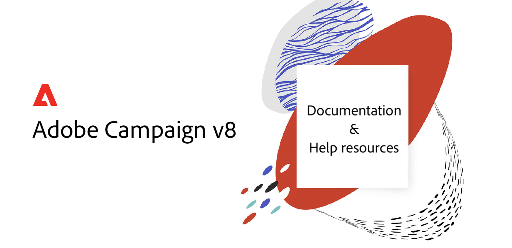

# Help Center {#campaign-documentation}

 

## What's New

* **[What is Adobe Campaign](start/get-started.md)** - Key capabilities and use cases

* **[Implementation guidelines](start/implement.md)**  - Learn how to start your implementation

* **[What's new in v8](start/whats-new.md)** - Discover Campaign v8 capabilities

* **[Implementation guidelines](start/implement.md)**  - Learn how to start your implementation

* **[From Classic to v8](start/capability-matrix.md)** - Transitioning from Campaign Classic to v8? Learn key differences

## Get started

* **[Connect to Campaign](start/connect.md)** - Install Campaign Client Console and connect

* **[Import your recipients](start/profiles.md)** - Learn how to import profiles in Campaign

* **[Create your first email](start/create-message.md)** - Discover steps to create and send an email

* **[Orchestrate marketing campaigns](start/campaigns.md)** - Use Campaign to plan, launch and measure campaigns across channels

## More resources

[Architecture](start/architecture.md)

[Speed and scale](start/whats-new.md)

[Measure and track](start/reporting.md)

[Integration with other solutions](start/integration.md)

[Find support](start/support.md)

## Control Panel

Manage settings and track usages of your instances through Campaign Control Panel. [Learn more](https://experienceleague.adobe.com/docs/control-panel/using/control-panel-home.html)
