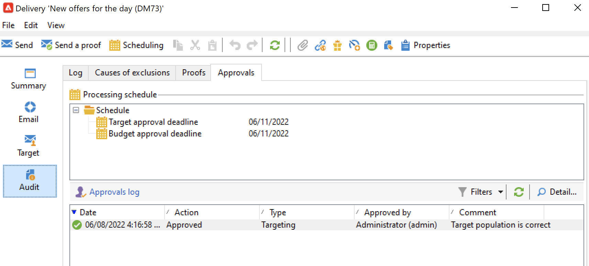
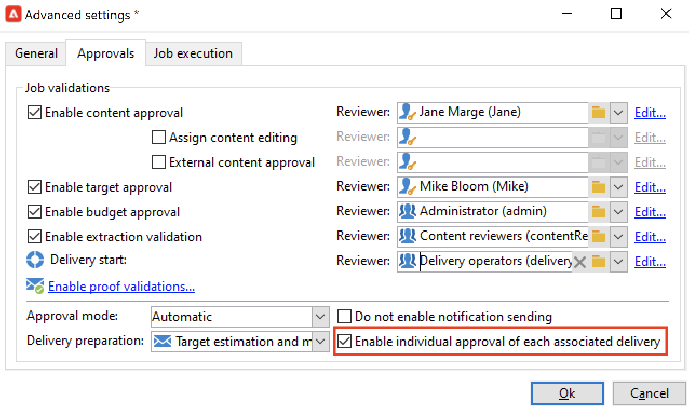
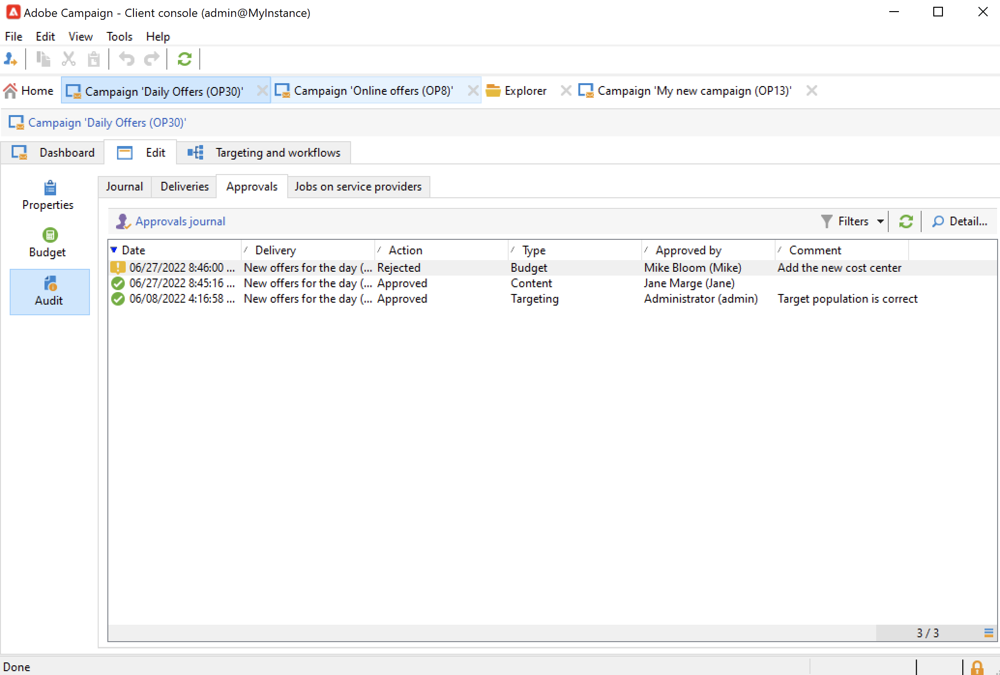

# Set up and manage the approval process {#approval-marketing-campaigns}

Methods and people involved in creating and approving marketing campaigns are specific to each organization. The campaign approval process involves coordinating multiple stakeholders: digital marketers, delivery managers, content managers, and external owners such as partners or suppliers.

With Adobe Campaign, you can set up an approval flow for your campaigns and notify operators when an action is required. You can define approvals for each steps of a delivery: targeting, content, budget, extraction, and proof sending. As your campaign deliveries move through the various validation steps, Adobe Campaigns compiles an history of modifications and sign-offs, including feedback, comments, change requests, and comments.

Notification messages are sent to the Adobe Campaign operators who are designated as reviewers to inform them of an approval request.

Operators can approve in several ways:

* From the notification message. The link in the email gets the operator to Campaign through a web browser. After connecting, the reviewer can choose to approve the content or not.
  

* From the campaign dashboard.
  

* From the delivery dashboard. 
  

Operators can access the campaign and the delivery from the approval window. They can also enter a comment.

Once an operator validates, the information is displayed in the campaign and delivery dashboards, and in the logs. 

The information is also available in the approval logs of the delivery, and in the approval journal of the campaign. These logs are accessed via the **[!UICONTROL Edit > Audit > Approvals]** tabs.

## Enable approvals{#enable-approvals}

Approval notifications are sent to the operators affected to each process for which approval was enabled.

They can be enabled for the campaign template, for each campaign individually, or for a delivery.

All jobs requiring approval are selected in the campaign template, through the  **[!UICONTROL Properties]** > **[!UICONTROL Advanced campaign parameters...]** > **[!UICONTROL Approvals]** tab. Reviewers or groups of reviewers are selected from this tab. They receive notifications, unless this option is not enabled. [Learn more](#approving-processes).

These settings can be overridden for each campaign created using this template, and individually for each delivery. Browse the **[!UICONTROL Properties]** button of the delivery, then the **[!UICONTROL Approvals]** tab.

In the following example, the delivery content will not require approvals:

>[!CAUTION]
>
>Check that the reviewers have the **appropriate permissions** for approving, and that their security zone is correctly defined. [Learn more](#selecting-reviewers).

The approval process for deliveries is detailed in [this section](#review-and-approve-deliveries).

## Select reviewers {#select-reviewers}

For each type of approval, the operators or operator groups in charge of approval are selected from the drop-down list in the delivery. More operators can be added using the **[!UICONTROL Edit...]** link. This window also lets you edit the approval deadline. By default, reviewers have three days starting from the submission date to approve a process. To add an automatic reminder, use the **[!UICONTROL Add a reminder]** link.

If no reviewer is specified, the campaign owner is responsible for approvals and receives the notifications. The campaign owner is specified in the **[!UICONTROL Edit > Properties]** tab of the campaign: 

All other Adobe Campaign operators with **[!UICONTROL Administrator]** rights can also approve jobs, but they do not receive notifications.  

>[!NOTE]
>
>By default, the campaign owner cannot carry out the approval or start the deliveries if approval operators have been defined. As an Adobe Campaign administrator, you can modify this behavior and allow the campaign owners to approve/start deliveries by creating the **NmsCampaign_Activate_OwnerConfirmation** option, set to **1**.

If a list of reviewers is defined, a job is approved when one reviewer has approved it. The approval link is then no longer available in the campaign and delivery dashboards. When the sending of notifications is enabled, if another reviewer clicks the approval link in the notification message, they are notified that another operator has already approved the job.

## Review and approve deliveries {#review-and-approve-deliveries}

For each campaign you can approve the delivery target, [delivery content](#approving-content) and costs. Adobe Campaign operators in charge of approval can be notified by email and can accept or reject approval from the console or via a web connection. [Learn more](#approving-processes).

For direct mail deliveries, Adobe Campaign operators can view the extraction file before it is sent to the router, and if necessary they can change the format and re-launch extraction. [Learn more](#approve-an-extraction-file).

When these validation phases are complete, the delivery can be launched. [Learn more](marketing-campaign-deliveries.md#starting-a-delivery).

>[!NOTE]
>
>Processes which require an approval are selected in the campaign template. [Learn more](marketing-campaign-templates.md).
>

### Steps to approve a delivery {#approving-processes}

The stages requiring approval appear on the campaign dashboard (via the console or the web interface). They also appear in the delivery tracking table and on the delivery dashboard.

For each delivery in the campaign, you can approve the following processes:

* **Targeting, content and budget**

  When the **[!UICONTROL Enable target approval]**, **[!UICONTROL Enable content approval]** or **[!UICONTROL Enable budget approval]** options are selected in the approval settings window, the related links are shown in the campaign and delivery dashboards.

  

  >[!NOTE]
  >
  >Budget approval is only available if target approval is enabled in the approval settings window. The link for budget approval is only displayed once the target has been analyzed. 
  
  If the **[!UICONTROL Assign content editing]** or **[!UICONTROL External content approval]** options are selected in the approval settings window, the dashboard will show the **[!UICONTROL Available content]** and **[!UICONTROL External content approval]** links.

  Content approval lets you access the proofs sent.

* **Extraction approval (direct mail delivery)**

  When **[!UICONTROL Enable extraction approval]** is selected in the approval settings window, the extracted file must be approved before the router can be notified.

  The **[!UICONTROL Approve file]** option is available on the campaign and delivery dashboards.

  

  You can preview the output file before validation. The extraction file preview shows a data sample only. The entire file is not loaded.

* **Approving associated deliveries**

  The **[!UICONTROL Enable individual approval of each associated delivery]** option is used for one primary delivery associated with secondary deliveries. By default, this option is not selected so that an overall approval of the main delivery can be performed. If this option is selected, each delivery must be approved individually.

  

>[!NOTE]
>
>In a targeting workflow, if an error linked to a configuration issue occurs during message preparation, the **[!UICONTROL Restart message preparation]** link is shown on the dashboard. Fix the error and use this link to restart message preparation while bypassing the targeting stage.

### Approve a content {#approve-content}

>[!CAUTION]
>
>To approve a content, a proof cycle is mandatory. Proofs let you approve the display of information, personalization data and check that links are working.
>
>The content approval functionalities detailed below relate to the proof delivery.

It is possible to configure a content approval cycle. To do this, select the **[!UICONTROL Enable content approval]** option in the approval settings window. The main steps of the content approval cycle are:

1. After creating a new delivery, the campaign manager clicks the **[!UICONTROL Submit content]** link on the campaign dashboard to start the content approval cycle. 

   >[!NOTE]
   >
   >If the **[!UICONTROL Enable the sending of proofs]** option (for email deliveries) or **[!UICONTROL Enable the sending and approval of proofs]** (for direct mail deliveries) options were selected in the approval settings window, proofs will be sent automatically.

1. A notification email is sent to the person responsible for content, who can choose whether to approve it or not:

    * via the notification email: the notification email contains a link to the proofs already sent, and possibly to a rendering of the message for the various webmails if the **Deliverability** add-on is enabled for this instance.

    * via the console or web interface, delivery tracking, the delivery dashboard or the campaign dashboard. This campaign dashboard lets you view the list of proofs that have been sent, by clicking the **[!UICONTROL Inbox rendering...]** link. To view their content, click the **[!UICONTROL Detail]** icon to the right of the list.

1. A notification email is sent to the person responsible for the campaign informing them of whether the content has been approved or not. The person responsible for the campaign can re-start the content approval cycle at any time. To do this, click the link on the **[!UICONTROL Content status]** line of the campaign dashboard (at delivery level), then click **[!UICONTROL Reset content approval to submit it again]**.

#### Assign content editing {#assign-content-editing}

This option lets you define someone in charge of content editing, such as a webmaster. If the **[!UICONTROL Assign content editing]** option is selected in the approval settings window, several approval steps are added between delivery creation and delivery of the notification email to the person in charge of content:

1. After creating a new delivery, the person responsible for the campaign clicks the **[!UICONTROL Submit content editing]** link in the campaign dashboard to start the content editing cycle. 

1. The person responsible for content editing will receive an email telling them that the content is available. 

1. They can then log on to the console, open the delivery and edit it using a simplified wizard to change the subject, HTML and text content, and send proofs.

   >[!NOTE]
   >
   >If the **[!UICONTROL Enable the sending of proofs]** option (for email deliveries) or **[!UICONTROL Enable the sending and approval of proofs]** (for direct mail deliveries) options were selected in the approval settings window, proofs will be sent automatically.

1. Once the person in charge of content editing has finished making any changes to the delivery content, they can make the content available.

   To do this, they can use:

    * the **[!UICONTROL Available content]** link in the Adobe Campaign console.
    * the link in the notification message.
      The operator can add a comment before submitting the content to the person in charge of the campaign.
      The notification message lets the reviewer approve or reject the content.
  
#### External content approval {#external-content-approval}

This option lets you define an external operator in charge of approving delivery rendering, such as brand communication consistency, rates, etc. When the **[!UICONTROL External content approval]** option is selected in the approval settings window, several approval steps are added between content approval and the delivery of the notification to the person in charge of the campaign:

1. The external content manager receives a notification email telling them that the content has been approved and requesting external approval.
1. The notification email contains links to the proofs sent, which lets you view delivery rendering, and a button for approving or rejecting the delivery content.

  These links are only available if one or more proofs have been sent. Otherwise, delivery rendering is only available via the console or the web interface.

### Approve an extraction file {#approve-an-extraction-file}

For offline deliveries, Adobe Campaign generates an extraction file which, depending on how it is set up, is sent to the router. Its content depends on the export template used.

When the content, targeting and budget have been approved, the delivery changes to **[!UICONTROL Extraction pending]** until the extraction workflow for the campaigns is launched. 

On the extraction request date, the extraction file is created and the delivery status changes to **[!UICONTROL File to approve]**. 

You can view the content of the extracted file (by clicking its name), approve it or, if necessary, change the format and re-launch the extraction using the links on the dashboard.

Once the file has been approved, you can send the notification email to the router. [Learn more](marketing-campaign-deliveries.md#start-an-offline-delivery).

## Approval modes {#approval-modes}

Jobs can be approved in the campaign dashboard, in delivery tracking tab, the delivery dashboard, or in the email notification sent to the reviewers.

### Approve in the dashboard {#approval-via-the-dashboard}

To approve a job via the console or the web interface, click the appropriate link on the campaign dashboard.

For example, once delivery analysis has been executed:

1. Select **[!UICONTROL Approve targeting]**.

  

1. In the popup window, check the information to be approved.
1. Select **[!UICONTROL Accept]** or **[!UICONTROL Reject]** and enter a comment if necessary. This comment will be displayed in the validation logs.
1. Confirm your choice with the **[!UICONTROL Target approval]** button.

  

If a process has already been approved by another operator, the approval link is not available.

If a process has been rejected, the information is displayed in the delivery dashboard as follows:

### Approve from the notification messages {#approval-via-notification-messages}

To approve a job from the [notification message](#notifications):

1. Click the link in the notification.
1. Log on to Adobe Campaign.
1. Check the information to be approved
1. Select **[!UICONTROL Accept]** or **[!UICONTROL Reject]** and enter a comment if necessary. 
1. Validate. Your choice and comment are displayed in the validation logs.

>[!NOTE]
>
>If warnings were raised during the process, a warning is displayed in the notification.

### Track the approval{#approval-tracking}

Approval logs are available in the user interface:

* In the campaign approval log, **[!UICONTROL Approvals]** sub-tab of the **[!UICONTROL Edit > Audit]** tab: 

  

* In the campaign delivery log, **[!UICONTROL Deliveries]** sub-tab of the **[!UICONTROL Edit > Audit]** tab:

  

* The approval status for each delivery can be viewed by clicking the **[!UICONTROL Hide/display logs]** option of the **[!UICONTROL Summary]** tab.

  

* This information can also be accessed via the **[!UICONTROL Audit > Approvals]** tab of each delivery:

  

>[!NOTE]
>
>Once an operator has approved or rejected a job, the other reviewers can no longer change it.

### Automatic/Manual approvals {#automatic-and-manual-approval}

When creating a targeting workflow, if approval is automatic (default mode), Adobe Campaign displays the approval link or sends a notification as soon as an approval is required.

To choose the approval mode (manual or automatic), click the **[!UICONTROL Edit > Properties]** tab of the campaign or campaign template, then click **[!UICONTROL Advanced campaign parameters...]** and finally the **[!UICONTROL Approvals]** tab.
par

>[!NOTE]
>
>The approval mode applies to all deliveries of the campaign.

When a targeting workflow is being built, manual approval lets you avoid creating approval links or sending notifications automatically. The campaign dashboard then offers a **[!UICONTROL Submit targeting for approval]** link to launch the approval process manually.

A confirmation message lets you authorize approvals on the jobs selected for this delivery.

The approval buttons are then displayed on the campaign dashboard (for this delivery), on the delivery dashboard and in delivery tracking. If notifications are enabled, they will be sent in parallel.

This method of enabling approvals lets you work on targeting without sending spurious notifications to reviewers.

## Notifications {#notifications}

Notifications are specific email messages sent to reviewers to inform them that a process is pending approval. When the operator clicks the link in the message, an authentication page appears and, after logging in, the operator can view the information and approve or reject the job. A comment can also be entered in the approval window.

The content of notification emails can be personalized. See [Notification content](#notification-content).

### Enable/Disable Notification {#enabling-disabling-notification}

By default, notification messages are sent if the approval of the related job is enabled in the campaign template, the campaign, or the delivery. Notifications can, however, be disabled in order to authorize approvals from the console only.

To do this, edit the approval window of the campaign or campaign template ( **[!UICONTROL Edit > Properties]** > **[!UICONTROL Advanced campaign parameters...]** > **[!UICONTROL Approvals]** tab) and select **[!UICONTROL Do not enable notification sending]**.

### Notification content {#notification-content}

Notification content is defined in a specific template: **[!UICONTROL Notification of validations for the marketing campaign]**. This template is saved in the **[!UICONTROL Administration > Campaign management > Technical delivery templates]** folder of the Adobe Campaign tree.
