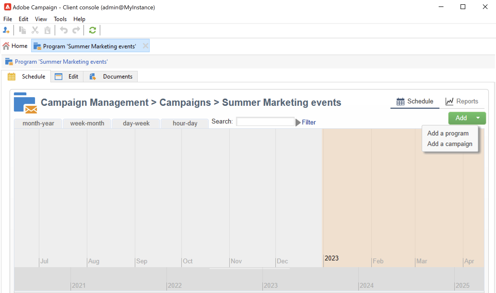

# Create programs and campaigns{#create-programs-and-campaigns}

Campaign orchestration components are found in the **[!UICONTROL Campaigns]** tab: here you can see an overview of the marketing programs and campaigns, and their associated elements. 

A marketing program is made up of campaigns, which are made up of deliveries, resources, etc. All the information concerning deliveries, budgets, reviewers and linked documents are grouped in the campaign.

 [Discover programs and campaigns in video](#video)

## Work with programs and plans{#work-with-plan-and-program}

### Create the plans and programs hierarchy {#create-plan-and-program}

Each campaign belongs to a program which belongs to a plan. All plans, programs and campaigns are available via the **[!UICONTROL Campaign calendar]** menu in the **Campaigns** tab.

Before starting building your campaigns and deliveries, configure your folder hierarchy for marketing plans and programs.

1. Click the **Explorer** icon on the home page.
1. Right-click the folder in which you want to create your plan.
1. Select **Add new folder > Campaign Management > Plan**.

   

1. Rename the plan.
1. Right-click the newly created plan and select **Properties...**.
1. In the **General** tab, modify the **Internal name** to avoid duplicates during package exports.

   

1. Click **Save**.
1. Right-click the newly created plan and select **Create a new 'Program' folder**. 

   

1. Repeat the above steps to rename your new program folder and its internal name.

### Configure a program {#edit-a-program}

When editing a program, use the tabs described below to browse and configure it.

* The **Schedule** tab displays the calendar of programs for a month, week or day depending on which tab you click in the calendar header. You can create a campaign, a program, or a task from this page. [Learn more](#campaign-calendar)

* The **Edit** tab lets you personalize the program: name, start and end dates, budget, linked documents, etc.

  

## Work with campaigns{#work-with-campaigns}

### Create a campaign {#create-a-campaign}

You can create a campaign via the list of campaigns. To display this view, select the **[!UICONTROL Campaigns]** menu in the **[!UICONTROL Campaigns]** dashboard, and click **[!UICONTROL Create]**.

The **[!UICONTROL Program]** field lets you select the program to which the campaign will be attached. This information is mandatory.

Campaigns can also be created via from the campaign or program calendar. [Learn more](#campaign-calendar) 

In the campaign creation window, select the campaign template and add a name and a description of the campaign. You can also specify the campaign start and end dates.

Click **[!UICONTROL OK]** to create the campaign. It is added to the program schedule, and to the list of campaigns.

You can then edit the campaign you have just created and define its parameters. To open and configure this campaign, you can:

1. Browse the campaign calendar and select the campaign you want to display, then click the **[!UICONTROL Open]** link.
1. Browse the **[!UICONTROL Schedule]** tab of the program, select the campaign and open it.
1. Browse the list of campaigns and click the name of the campaign to edit.

All these actions take you to the campaign dashboard.

Access the following sections to learn how to configure your campaign:

* [Add deliveries](marketing-campaign-deliveries.md)
* [Manage assets and documents](marketing-campaign-assets.md)
* [Build the target audience](marketing-campaign-target.md)
* [Set up the approval process](marketing-campaign-approval.md)
* [Manage stocks and budgets](providers--stocks-and-budgets.md)

### Edit campaign settings {#campaign-settings}

Campaigns are created via campaign templates. You can configure reusable templates for which some options are selected and other settings are already saved. 

For each campaign, the following capabilities are available:

* Reference documents and resources: you can associate documents with the campaign (brief, report, images, etc.). All document formats are supported. [Learn more](marketing-campaign-deliveries.md#manage-associated-documents). 
* Define costs: for each campaign, Adobe Campaign lets you define cost entries and cost calculation structures which can be used when creating the marketing campaign. For example: printing costs, use of an external agency, room rental, etc. [Learn more](providers--stocks-and-budgets.md#defining-cost-categories).
* Define objectives: you can define quantifiable objectives for a campaign, e.g. number of subscribers, business volume, etc. This information is later used in campaign reports.
* Manage seed addresses and control groups. [Learn more](marketing-campaign-deliveries.md#defining-a-control-group).
* Manage approvals: you can select the treatments to be approved and, if necessary, select the reviewing operators or groups of operators. [Learn more](marketing-campaign-approval.md#checking-and-approving-deliveries).

>[!NOTE]
>
>To access and update the campaign settings, browse to the **[!UICONTROL Advanced campaign parameters...]** link in the **[!UICONTROL Edit]** tab.

### Monitor a campaign {#monitor-a-campaign}

For each campaign, jobs, resources and deliveries are centralized in a the dashboard. This interface lets you manage and orchestrate marketing actions.

With Adobe Campaign, you can set up collaborative processes for the creation and approval of the various steps of your campaigns: approval of the budget, target, content, etc. This orchestration is detailed in [this section](marketing-campaign-approval.md).

>[!NOTE]
>
>Components available in a campaign depends on its template. Campaign template configuration is presented in [this section](marketing-campaign-templates.md#campaign-templates).

Once the campaign is achieved, use the **[!UICONTROL Reports]** link to access the campaign reports.

## Campaign calendar {#campaign-calendar}

The campaign calendar shows all programs, plans, campaigns and deliveries.

To edit a plan, program, campaign or delivery, browse to its name in the calendar and then use the **[!UICONTROL Open]** link. It is then displayed in a new tab, as shown below:

You can filter the information displayed in the campaign calendar. To do this, click the **[!UICONTROL Filter]** link and select the filtering criteria.

>[!NOTE]
>
>When you filter on a date, all campaigns with a start date that is later than the specified date and/or with an end date earlier than the specified date are displayed. Dates are selected using the calendars to the right of each field.

You can also use the **[!UICONTROL Search]** field to filter the displayed items.

The icons linked to each item let you view its status: finished, in progress, being edited, etc.

To filter the campaigns to display, click the **[!UICONTROL Filter]** link and select the status of campaigns to display.

As browsing the calendar, you can also create a program or a campaign.

When you create a campaign via the **[!UICONTROL Schedule]** tab of a program, the campaign is automatically linked to the concerned program. The **[!UICONTROL Program]** field is hidden in this case.

## Use the web interface {#use-the-web-interface-}

You can access the Adobe Campaign console screens via an internet browser to view all campaigns and deliveries as well as reports and information on the profiles in your database. This access does not enable record creation. Depending on operator rights, you may view and/or act on the data in the database. For example, you can approve campaign contents and targeting, re-start or stop a delivery, etc.

1. Log on as usual via https://`<your instance>:<port>/view/home`.
1. Use the menus to access the overviews.

   

In addition to navigating across campaigns and viewing them, you can perform these types of tasks:

* Monitor activity on an instance
* Take part in validation processes, for example, approve or reject a delivery content
* Perform other quick actions, for example, pause a workflow
* Access all the reporting features
* Take part in forum discussions

This table summarizes the actions that you can take on campaigns from a browser:

| Page | Action |
| --- | --- |
| List of campaigns, deliveries, offers, etc. | Delete a list item |
| Campaign | Cancel a campaign |
| Delivery | Approve the delivery content and target Submit the delivery content Confirm a delivery Pause and stop a delivery |
| Web application | Create a web application Edit the application content and properties Save the application content as a template Publish the application |
| Offer | Approve the offer content and eligibility Disable an online offer |
| Task | Finish a task Cancel a task |
| Marketing resources | Approve a resource Lock and unlock a resource |
| Campaign package | Submit a package for approval Approve or reject a package Cancel a package |
| Campaign order | Create an order Accept or reject an order |
| Stock | Delete a stock line |
| Offer simulation | Start and stop a simulation |
| Targeting workflow | Start, pause, and stop a workflow |
| Report | Save the current data in the report history |
| Forum | Add a discussion Reply to a message in a discussion Follow a discussion and unsubscribe from it |

### Manage approvals

Approvals of a target or a delivery content can be carried out via web access.

You can also use the link contained in the notification messages. For more on this, refer to [this section](marketing-campaign-approval.md#checking-and-approving-deliveries).

## Tutorial video {#video}

This video shows how to create a marketing plan, programs, and campaigns.

>[!VIDEO](https://video.tv.adobe.com/v/333810?quality=12)
