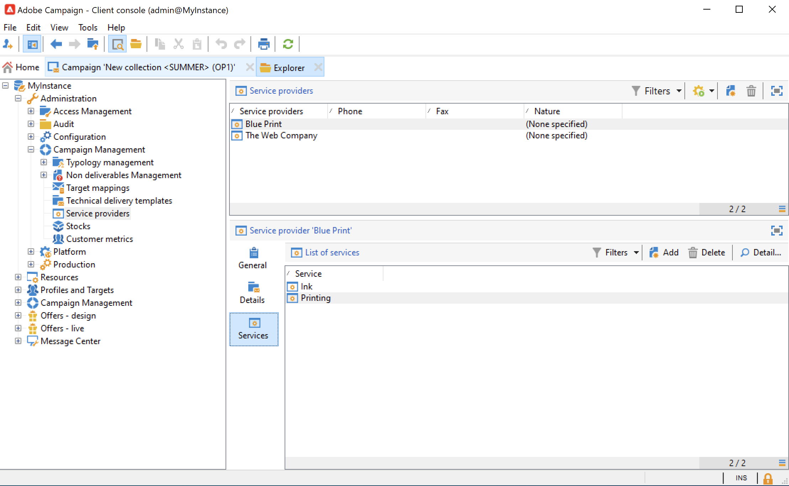

# Marketing campaign deliveries {#marketing-campaign-deliveries}

Orchestrate your cross channel deliveries in your campaigns: streamline your communications with Adobe Campaign through personalised emails, SMS, push notifications and in-app messages. You can use rich media like videos, emojis or GIFs, and integrate them directly. 

Deliveries can be created via the campaign dashboard, a campaign workflow or directly via the overview of deliveries. When created from a campaign, deliveries will be linked to this campaign and consolidated at the campaign level.

## Create deliveries {#create-deliveries}

You have two ways to add deliveries to your marketing campaigns:

* From the **[!UICONTROL Add a delivery]** link in the campaign dashboard.

  

  Once saved, the delivery is added to the campaign dashboard.
  
* From a campaign workflow, in the **[!UICONTROL Targeting and workflows]** tab, by adding the delivery. 

  

  Once the workflow is started, the delivery is added to the campaign dashboard.

Learn how to set up and execute the delivery approval flow [in this page](marketing-campaign-approval.md).

## Start a delivery {#start-a-delivery}

A delivery can be sent once all approvals have been granted. The delivery execution process depends on the channel. 

* For email or mobile channel deliveries, refer to [this section](#start-an-online-delivery)

* For direct mail deliveries, refer  to [this section](#start-an-offline-delivery)

### Start an email or mobile delivery {#start-an-online-delivery}

Once all approval requests have been granted, the delivery status changes to **[!UICONTROL Pending confirmation]** and can be started. Reviewers who can start the delivery are notified that a delivery is ready to be started.

The information also appears on the campaign dashboard. The **[!UICONTROL Confirm delivery]** link lets you start the delivery.

Confirming the delivery is restricted to Administrators, and to the operator or group of operators explicitly mentioned in the delivery or campaign properties. If no operator is designed, Administrators and the campaign owner can approve.

However, you can also allow the campaign owner to confirm the send, even if specific reviewers were defined in the delivery or campaign properties. To do this, as an Administrator, create the **NmsCampaign_Activate_OwnerConfirmation** option and set it to **1**. The options are managed from the **[!UICONTROL Administration]** > **[!UICONTROL Platform]** > **[!UICONTROL Options]** folder of Campaign explorer.

### Start a direct mail delivery {#start-an-offline-delivery}

Once all approvals have been granted, the delivery status changes to **[!UICONTROL Pending extraction]**. The extraction files are created via a dedicated [technical workflow](../workflow/technical-workflows.md) which, in a default configuration, starts automatically when a direct mail delivery is pending extraction. When a process is in progress, it is displayed in the dashboard and can be edited via its link.

Once the extraction workflow has been successfully executed, the extraction file must be approved (provided that extraction file approval was selected in the delivery settings). [Learn more](marketing-campaign-approval.md#approving-an-extraction-file).

Follow the steps below to validate content and send the file to the provider:

1. Once the extraction file is approved, you can generate the proof of the router notification email. This email message is constructed based on a delivery template. It must be approved.
  
    This step is only available if the **[!UICONTROL Enable the sending and validation of proofs (Direct mail)]** option was enabled in **[!UICONTROL Approvals]** tab of the advanced campaign parameters.

    
  
1. Click the **[!UICONTROL Send a proof]** button to create the proofs.

    The proof target must be defined beforehand.

    You can create as many proofs as necessary. These are accessed via the **[!UICONTROL Direct mail...]** link of the delivery detail.

1. The delivery status changes to **[!UICONTROL To submit]**. Click the **[!UICONTROL Submit proofs]** button to start the approval process.

1. The delivery status changes to **[!UICONTROL Proof to validate]** and a button lets you accept or reject approval.

    You can either accept or reject this approval, or return to the extraction step.
    
1. Once the proof is approved, the extraction file is sent to the router and the delivery is finished.

### Budget and costs calculation {#compute-costs-and-stocks}

The file extraction launches two processes: budget calculation and stock calculation. The budget entries are updated.

* The **[!UICONTROL Budget]** tab lets you manage the budgets for the campaign. The total of the cost entries is shown in the **[!UICONTROL Calculated cost]** field of the campaign's main tab and the program it belongs to. The amounts are also reflected in the campaign budget.

  

  The real cost will eventually be calculated from information supplied by the router. Only messages actually sent are invoiced.

* Stocks are defined in the **[!UICONTROL Administration > Campaign management > Stocks]** node of the tree.

  

  Cost structures in the **[!UICONTROL Administration > Campaign management > Service providers]** node.

  

  Stock lines are visible in the stock section. To define the initial stock, open a stock line. The stock is decremented each time a delivery takes place. You can define an alert level and notifications.

  >[!NOTE]
  >
  >Learn more about budgets [in this section](providers-stocks-and-budgets.md).
