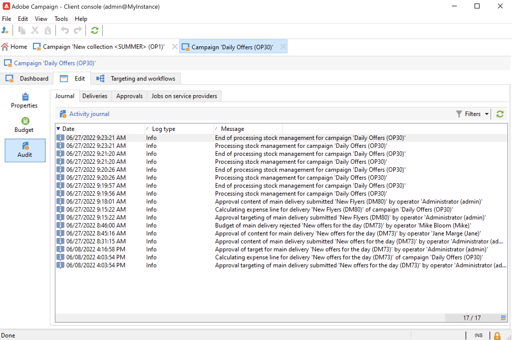
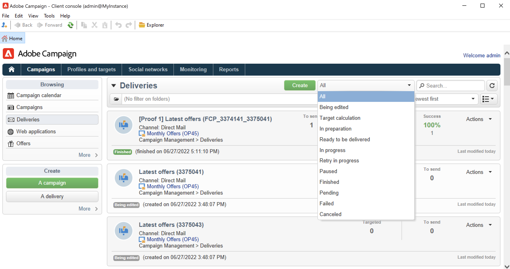

# Monitor marketing campaigns {#monitor-marketing-campaigns}

## Track a campaign {#tracking-a-campaign}

For each campaign, the **[!UICONTROL Tracking]** tab lets you view all jobs and their statuses. 

The following information is accessible via this sub-tab:

* The **[!UICONTROL Audit]** sub-tab shows activity journal. It contains the jobs executed on the campaign: workflow creation or start, approval, extraction, stock management, etc.

  

* The **[!UICONTROL Deliveries]** sub-tab contains all the deliveries of the campaign. They can be edited from this view. To do so, select the delivery and click the **[!UICONTROL Detail]** icon.

  
  
* The **[!UICONTROL Approvals]** sub-tab contains all the approval process for the campaign. You can check details and comments

* The workflows created to generate messages for service providers are displayed in the **[!UICONTROL Jobs on service providers]** sub-tab. Click the **[!UICONTROL Detail]** icon to display the selected workflow. 

## Track deliveries {#delivery-tracking}

The list of deliveries is available via the **[!UICONTROL Deliveries]** link of the Campaign node.

For each delivery, this list lets you access the key indicators: status, number of recipients targeted, linked campaigns, etc.

To check the status of a delivery, edit it and view its dashboard and tabs.

<!--
>[!NOTE]
>
>Information concerning delivery details is available in [this section](../../delivery/using/about-message-tracking.md) section.
--> 

## Track the execution {#execution-tracking}

You can check the status of deliveries by clicking the **[!UICONTROL Deliveries]**, which is accessible via the Adobe Campaign home page.

Details about processes executed in a campaign are collected in the **[!UICONTROL Edit > Audit]** tab of the campaign. You can view the list of deliveries in the campaign. [Learn more](#tracking-a-campaign).
