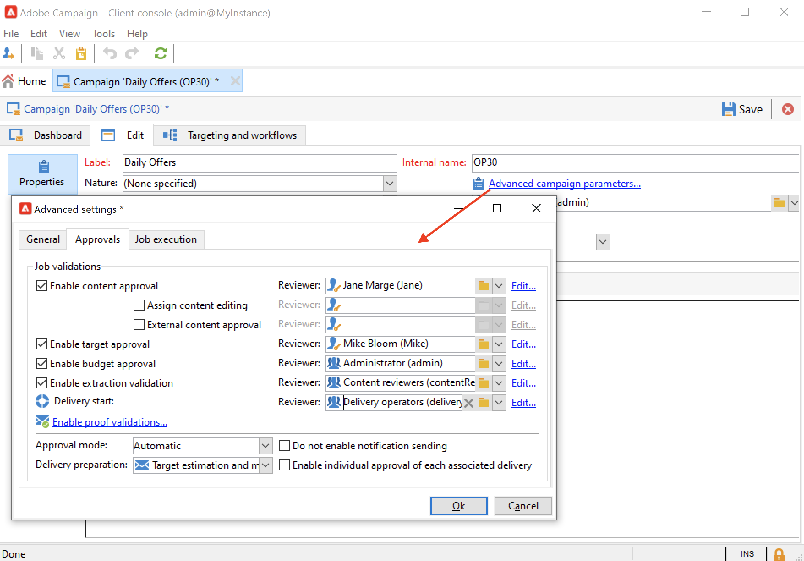

# Create and configure campaign templates {#campaign-templates}

All marketing campaigns are based on a template, which stores main characteristics and capabilities. Campaign comes with a built-in template to create campaigns. This template has all functionalities enabled: Documents, Seed addresses, Approvals, Delivery outlines, etc.

Available functionalities depend on your permissions, add-ons, and the configuration of your Adobe Campaign platform.

>[!NOTE]
>
>The tree is displayed when you click the **[!UICONTROL Explorer]** icon on the home page.

A built-in template is supplied in order to create a campaign for which no specific configuration has been defined. You can create and configure your campaign templates and then create campaigns from these templates.

## Create a campaign template {#create-a-campaign-template}

To create a campaign template, follow the steps below:

1. Open Campaign **Explorer**, and browse to **Resources > Templates > Campaign templates**.
1. Click **New** in the toolbar above the list of templates. 

  

  You can also **duplicate** the built-in template to re-use and adapt its configuration. To do this, right-click on the template and select **Duplicate**.

1. Enter the label of your new campaign template.
1. Click **Save** and reopen your template.
1. In the **Edit** tab, define the template properties.
1. Select **Advanced campaign parameters...** link to add a workflow to your campaign template.

   

1. Change the **Targeting and workflows** value to **Yes**., and confirm. Learn how to add functionalities in [this section](#typology-of-enabled-modules).
1. The **Targeting and workflows** tab is added to the template. Click **Add a workflow...**, enter a **Label** and click **Ok**.
1. Create your workflow according to your needs.

   

1. Click **Save**. Your template is now ready to be used to create a new campaign.

The various tabs and sub-tabs of the campaign template allow you to access its settings, described in [General configuration](#general-configuration).

## Select modules {#select-modules}

The **[!UICONTROL Advanced campaign parameters...]** link lets you enable and disable jobs for the campaigns based on this template. Select the capabilities you want to enable in the campaigns created based on this template.

If a functionality is not selected, the elements concerning the process (menus, icons, options, tabs, sub-tabs, etc.) do not appear in the interface of the template or in campaigns based on this template. The tabs to the left of the campaign details, and the available tabs, coincide with the functionalities selected in the template. For example, the **Expenses and objectives** functionality is not enabled, the corresponding **[!UICONTROL Budget]** tab do not show in campaigns based on this template.

Moreover, shortcuts to the configuration windows are added to the campaign dashboard. When a functionality is enabled, a direct link gives access to it from the campaign dashboard.

### Configuration samples

* For example, with the following settings:

  

  The campaign dashboard shows:

  

  Note that the **[!UICONTROL Targeting and workflows]** tab is missing.

  The following functionalities are available:

  

  Note that the **[!UICONTROL Budget]** tab is missing.

  The campaign advanced settings also reflect this configuration. 

  

  Note that the **[!UICONTROL Approvals]** tab is not available.

* With this configuration:
  

  The campaign dashboard shows:

  

  Note that the **[!UICONTROL Targeting and workflows]** tab is available but the **Add a document** link is missing.

  The following functionalities are available:

  

  Note that the **[!UICONTROL Budget]** tab is available.

  The campaign advanced settings also reflect this configuration. 

  

  Note that the **[!UICONTROL Approvals]** tab is available but the **[!UICONTROL Control population]** and **[!UICONTROL Seed addresses]** tabs are not enabled.

## Typology of modules {#typology-of-enabled-modules}

* **Control group**

  When this module is selected, an additional tab is added to the advanced settings of the template and the campaigns based on this template. The configuration can be defined via the template or individually for each campaign. Learn more about control groups in [this section](marketing-campaign-deliveries.md#defining-a-control-group).

  

* **Seed addresses**

  When this module is selected, an additional tab is added to the advanced settings of the template and the campaigns based on this template. The configuration can be defined via the template or individually for each campaign. 

  

* **Documents**

  When this module is selected, an additional tab is added to the **[!UICONTROL Edit]** tab of the template and the campaigns based on this template. Attached documents can be added from the template or individually for each campaign. Learn more about documents in [this section](marketing-campaign-deliveries.md#manage-associated-documents).

  

* **Delivery outline**

  When this module is selected, a **[!UICONTROL Delivery outlines]** sub-tab is added to the **[!UICONTROL Documents]** tab in order to define delivery outlines for the campaign. Learn more about delivery outlines in [this section](marketing-campaign-assets.md#delivery-outlines).

  

* **Targeting and workflows**

  When you select the **[!UICONTROL Targeting and workflows]** module, a tab is added to let you create one or more workflows for campaigns based on this template. Workflows can also be configured individually for each campaign based on this template.Learn more about campaign workflows in [this section](marketing-campaign-deliveries.md#build-the-main-target-in-a-workflow).

  

  When this module is enabled, a **[!UICONTROL Jobs]** tab is added to the advanced settings of the campaign to define the process execution sequence.

* **Approvals**

  If you enable the **[!UICONTROL Approvals]**, you can select the processes to approve and the operators in charge of approvals. Learn more about approvals in [this section](marketing-campaign-approval.md#select-reviewers).

  

  You can choose whether or not to enable process approval via the **[!UICONTROL Approvals]** tab of the templates advanced settings section.

* **Expenses and objectives**

  When this module is selected, a **[!UICONTROL Budget]** tab is added to the details of the template and campaigns based on this template so that the associated budget can be selected.

  

## Template properties {#template-properties}

When you create a campaign template, you need to enter the following information:

* Enter the **label** of the template: the label is mandatory and is the default label for all campaigns based on this template.
* Select the campaign **nature** from the drop-down list. The values available in this list are those saved in the **[!UICONTROL natureOp]** enumeration.

Learn how to access and configure your enumerations in [this page](../../v8/config/ui-settings.md#enumerations).

* Select the **type of campaign**: unique, recurring, or periodic. By default, campaign templates apply to unique campaigns. Recurring and periodic campaigns are detailed in [this section](recurring-periodic-campaigns.md).
* Specify the duration of the campaign, i.e. the number of days over which the campaign will take place. When creating a campaign based on this template, the campaign start and end dates will be populated automatically.

  If the campaign is recurrent, you must specify the campaign start and end dates directly in the template. 

* Specify the **related program** of the template: campaigns based on this template are linked to the selected program.

<!--
## Track campaign execution{#campaign-reverse-scheduling}

You can create a schedule for a campaign and track accomplishments, for instance to prepare an event schedule for a specific date. Campaign templates now let you calculate the start date of a task based on the end date of a campaign.

In the task configuration box, go to the **[!UICONTROL Implementation schedule]** area and check the **[!UICONTROL The start date is calculated based on the campaign end date]** box. (Here, "start date" is the task start date). Go to the **[!UICONTROL Start]** field and enter an interval: the task will start this long before the campaign end date. If you enter a period which is longer than the campaign is set to last, the task will begin before the campaign.

When you create a campaign using this template, the task start date will be calculated automatically. However, you can always change it later.-->
