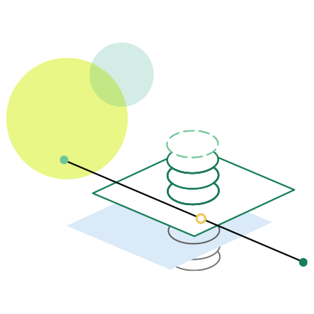

# Adobe Campaign Automation {#automation-home}

**[<< Back to Campaign v8 documentation](https://experienceleague.adobe.com/docs/campaign/campaign-v8/campaign-home.html)**

Communicating with your customers through multiple marketing channels can work for you or against you. When the different channels aren’t working together, there’s only noise and confusion. When they’re synchronized, they combine to give your customers a powerful and complementary experience with your brand.

Adobe Campaign makes it easy for you to get your channels in sync, with a single, easy-to-use interface for campaign orchestration. So, your online channels — like email, web, mobile, and social — match your offline channels, including direct mail, call center, in-store, and so on. It empowers you to give your customers a consistent and contextual experience in both digital and traditional channels. In short, Adobe Campaign makes it simple to deliver content to all the paths your customers may take — on any channel.

Visit the guides below and learn how to build automation with Adobe Campaign:

<table>
<tr>
  <td valign="bottom">
      
  </td>
  <td valign="bottom">
 

  
 
Visit the guides below and learn how to build automation with Adobe Campaign:

 
 
    <a href="workflow/about-workflows.md">Workflows</a>
    

    

    <a href="campaigns/set-up-campaigns.md">Campaign automation</a>
    

          
    

    <a href="campaign-opt/campaign-typologies.md">Campaign Optimization (add on)</a>
    

    

    <a href="distributed-marketing/about-distributed-marketing.md">Distributed Marketing (add on)</a>
    

     
  </td>
</table>