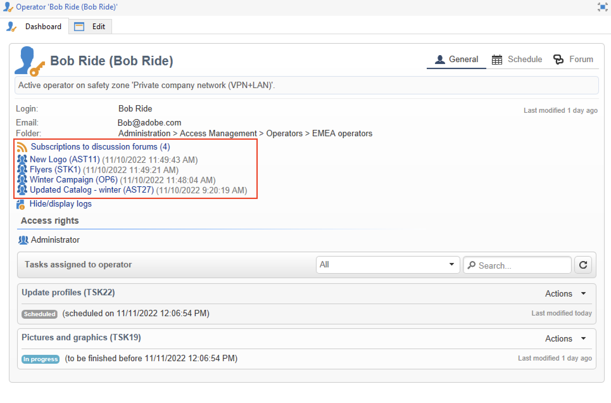

# Discussion forums{#discussion-forums}

Adobe Campaign operators can use discussion forums to share information. The following elements each have their own forum: plans, programs, campaigns, marketing resources, simulations, stocks. Each operator also has a personal forum. All discussions are public, even on personal forums.

Operators can subscribe to a forum to receive a notification email each time a message is posted.

## Access a forum {#accessing-a-forum}

To access a forum, browse to a dashboard and click the **[!UICONTROL Forum]** link in the upper right corner. 

Messages and their responses are shown from newest to oldest.

To start a new thread, click the **[!UICONTROL Add a discussion]** button in the top right-hand corner. The **[!UICONTROL Discussion forum]** box comes up (see below).

Enter your text in the **[!UICONTROL Message]** field and a discussion title in the **[!UICONTROL Subject]** field.

Operators who have already posted a message in this forum are notified by default. You can select an additional operator to notify. To notify several operators, select a group of operators.

You can add an attachment to the message, using the  **[!UICONTROL Browse...]** button. The attachment will also be included in the notification email. Attachments may only be sent individually: to send several files, you need to compress them in a .zip file.

>[!CAUTION]
>
>Once a message has been posted to the forum, it can no longer be changed or deleted.

## Post to the personal forum of an operator {#posting-to-the-personal-forum-of-an-operator}

You can post a message to the forum of an operator. Personal forums are public and all operators can see your message. The operator receives an email notification each time someone posts to their personal forum.

To access an operator's forum, you can:

* Browse to the **[!UICONTROL Administration > Access management > Operators]** folder of Campaign explorer, select the operator to open its dashboard, then click the **[!UICONTROL Forum]** link in the top right corner.
* Find the name of the operator in Adobe Campaign UI (via a message posted to the forum by this operator, a task being assigned to them) and click on it to access the operator dashboard.

## Subscribe to a forum {#subscribing-to-a-forum}

Subscribing to a forum lets you follow all discussions. Once subscribed, you receive an email notification each time a message is posted to the forum. 

To answer a message, click in the email body, then log in to the Adobe Campaign web interface. 

* To subscribe to a forum, click the **[!UICONTROL Follow discussions]** button in the top right hand section above the list of messages.

  The section goes blue and shows that you are subscribed to the forum.

* To unsubscribe from a forum, click the **[!UICONTROL Unsubscribe]** button.

* Your personal dashboard lists the forums which you are subscribed to. Click the **[!UICONTROL Subscription to discussion forums]** link to display the list, then click the item that interests you to access its forum.

  

## Troubleshoot notification delivery {#checking-notification-delivery}

If operators subscribed to a forum are not receiving notifications as expected:

* Check that email addresses are entered in the operator's profiles.
* Browse to the **[!UICONTROL Administration > Production > Technical workflows > Campaign processes]** folder of Campaign explorer and check the **[!UICONTROL Jobs in discussion forums]** workflow is started with no errors.
* Check the delivery logs:

    * On the Adobe Campaign home page, browse to **[!UICONTROL Campaigns > Navigation > Deliveries]**, then open the **[!UICONTROL Discussion forum notification]** delivery.
    * In Campaign explorer, browse to **[!UICONTROL Administration > Production > Objects created automatically > Technical deliveries > Workflow notifications]**, then click **[!UICONTROL Discussion forum notifications]**.

  In the **[!UICONTROL Discussion forum notifications]** box, the delivery logs are found in the **[!UICONTROL Edit > Delivery]** tab. You can also view the **[!UICONTROL Tracking > Log]** and the **[!UICONTROL Exclusion causes]** tabs.
