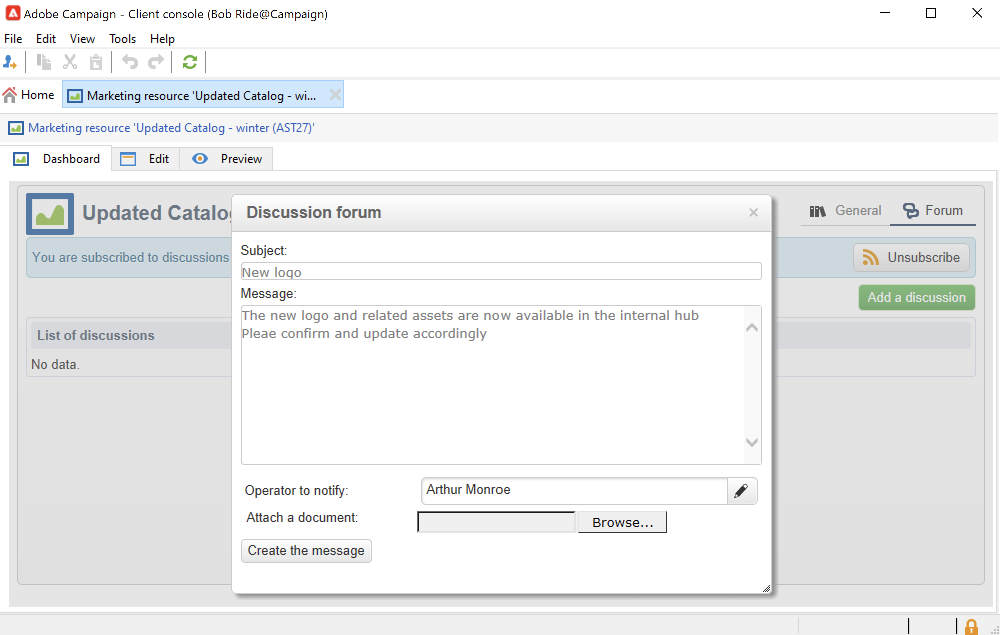

# Manage marketing resources{#managing-marketing-resources}

Use Adobe Campaign to manage and track the marketing resources involved in the campaign life cycle. These marketing resources can be a whitepaper, a data file, a logo, or any other asset related to a campaign.

For each marketing resource managed via Adobe Campaign, you can track its status and history at any time, and view the current version.

By default, marketing resources are stored in the **[!UICONTROL MRM > Marketing resources]** folder of Campaign explorer.

## Add a marketing resource {#adding-a-marketing-resource}

To add a marketing resource, follow the steps below:

1. Browse to the **[!UICONTROL Campaigns]** tab, and select **[!UICONTROL Marketing resouces]**.

1. Click the **[!UICONTROL Create]** button.
  
1. Drag and drop the file it in the Marketing resource window to upload it to Campaign server. You can also use the **[!UICONTROL Upload file to server...]** link.
   

When upload is complete, the resource is added to the list of available resources. 

## Manage marketing resources {#manage-marketing-resources}

Once uploaded, the marketing resource is available to all Adobe Campaign operators. They can view it, make a copy to modify it, or update the file on the server.

Use the **[!UICONTROL Assigned to]** drop-down list in the **[!UICONTROL Edit]** tab to select the operator who is responsible for the resource.

You can also select the operators or groups of operators in charge of the resource validation and resource publication. To access these options, click the  **[!UICONTROL Advanced parameters]** link.

These operators are notified by email when the resource validation process is launched.

If no reviewer is selected, the resource **[!UICONTROL cannot be]** subject to approval.

Use the **[!UICONTROL Audit]** tab to add a proof reader and define an availability date for the resource. Beyond this date, it will appear with **[!UICONTROL Late]** status. 

>[!NOTE]
>
>The **[!UICONTROL History]** tab contains the download and update log for the resource. The **[!UICONTROL Details]** button lets you view the selected version.
>
>The **[!UICONTROL Audit]** tab lets you monitor any actions carried out on the resource: approvals, approval refusals, related comments, or publications.

### Locking/unlocking a resource {#locking-unlocking-a-resource}

Once created, resources are available in the marketing resource dashboard, and operators can edit and modify them.

When an operator starts working on a resource, best practice is to lock it, to prevent other operators from modifying it at the same time. The resource is then reserved: it remains accessible, but cannot be published or updated on the server by another operator. 

A marketing resource can only be locked if it has not been approved.

To lock a resource, you must click the **[!UICONTROL Lock]** button in the resource dashboard.

When the resource has been updated, click the **[!UICONTROL Lock]** button in the resource dashboard to make available to all operators again.

A special message notifies any operators who try to access it:

The **[!UICONTROL Tracking]** tab indicates the name of the operator who locked the resource.

>[!NOTE]
>
>Only the operator who locked the resource and operators with Administrator rights are authorized to unlock a resource.

### Discussion forums {#discussion-forums}

For each resource, the **[!UICONTROL Forum]** tab lets participants share information.

Learn more in the [Discussion forums](discussion-forums.md) section.

### Approval process {#approval-process}

The expected availability date is displayed in the resource details, if it was specified in the **[!UICONTROL Tracking]** tab. Once this date is reached, you can execute the approval process using the **[!UICONTROL Submit for approval]** button in the resource dashboard. The resource status then changes to **[!UICONTROL Approval in progress]**.

To approve a resource, click the **[!UICONTROL Approve the resource]** button on its dashboard.

Authorized operators can then accept or reject approval. This action is possible either: via the email message sent (by clicking the link in the notification message) or via the client console (by clicking the **[!UICONTROL Approve]** ) button.

The approval window lets you enter a comment.

Browse to the **[!UICONTROL Tracking]** tab to check approvals.

>[!NOTE]
>
>In addition to the reviewer specified for each marketing resource, operators with administrator rights and the resource manager are authorized to approve a marketing resource.

### Publish a resource {#publishing-a-resource}

When approved, the marketing resource must be published. The publication process must be subject to specific implementation according to company requirements. This means that resources can be published on an extranet or any other server, specific information can be sent to an external service provider, etc.

To publish a resource, click the **[!UICONTROL Publish]** button in the editing zone of the marketing resource dashboard.

You can also automate the publishing of a resource via a workflow.

Publishing a resource means making it available for use (by another task, for instance). Publication as such varies depending on the nature of your resource: for a flyer, publishing can mean sending the file to a printer, for a web agency, it can mean publishing it to a website, etc.

In order for Adobe Campaign to publish, you need to create an adequate workflow and link it to the resource. To do this, open the **[!UICONTROL Advanced settings...]** box of the resource, then select the desired workflow in the **[!UICONTROL Post-processing]** field.

The workflow is executed:

* When the reviewer clicks the **[!UICONTROL Publish resource]** link (or, if no reviewer was defined, the person in charge of the resource).
* If the resource is managed via a marketing resource creation task, it will be executed when the task is set to **[!UICONTROL Finished]**, as long as the **[!UICONTROL Publish the marketing resource]** box is checked in the task. [Learn more](creating-and-managing-tasks.md#marketing-resource-creation-task))

If a workflow is not started immediately (if the workflow is stopped for instance), the status of the resource changes to **[!UICONTROL Pending publication]**. Once the workflow is started, the status of the resource changes to **[!UICONTROL Published]**. This status does not take into account possible errors in the publishing process. Check the status of your workflow to make sure it has executed properly.

## Link a resource to a campaign {#linking-a-resource-to-a-campaign}

### Reference a marketing resource {#referencing-a-marketing-resource}

Marketing resources can be associated with campaigns, provided that this feature was selected in the [campaign template](../campaigns/marketing-campaign-templates.md).

Browse to the **[!UICONTROL Edit > Documents > Resources]** tab in the campaign dashboard, then click **[!UICONTROL Add]** to select the resource concerned.

You can filter resources by status, nature or type, or apply a personalized filter.

Use the **[!UICONTROL Details]** button to edit and preview the resource.

### Add a marketing resource to a delivery outline {#adding-a-marketing-resource-to-a-delivery-outline}

Marketing resources can be associated with deliveries via delivery outlines.

Learn more about delivery outlines in [this section](../campaigns/marketing-campaign-deliveries.md).

To do this, right click on a delivery outline and select **New > Resource**.

Enter the name of the asset and select it from the **Marketing resource** drop-down list.

## Stock management {#stock-management}

You can associate a marketing resource with one or more stocks in order to manage your supplies and to display a warning on the dashboard in the event of insufficient stock.

To associate a marketing resource with a stock, follow the steps below:

1. Edit a stock or create a new stock. Learn more about stocks in [this section](../campaigns/providers--stocks-and-budgets.md#stock-management).

1. Add a stock line, and select the corresponding marketing resource.

    

    You can edit the selected resource via the **[!UICONTROL Edit the link]** icon located to the right of the resource once it has been selected.

1. Specify the initial stock and the alert stock, and then save.

The stock is indicated in the marketing resource **Stocks** tab.
