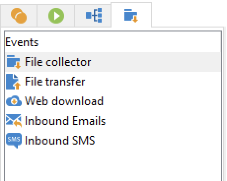

# Workflow activities{#wf-activities}

Workflow activities are grouped by category, in four different tabs.

Depending on your permissions, your implementation, and the context in which the workflow is designed, available activities may differ. 

For example, the workflows created in a campaign have a specific **Deliveries** tab, with all channels. This tab is not available in [technical workflow](technical-workflows.md).

Technical workflows have a specific **Events** tab which is not available in [campaign workflows](campaign-workflows.md).

All activities are detailed in the sections below:

* [Targeting activities](targeting-activities.md)
* [Flow control activities](flow-control-activities.md)
* [Actions activities](action-activities.md)
* [Event activities](event-activities.md)
* [Campaign workflow specific activities](../campaigns/marketing-campaign-deliveries.md)
