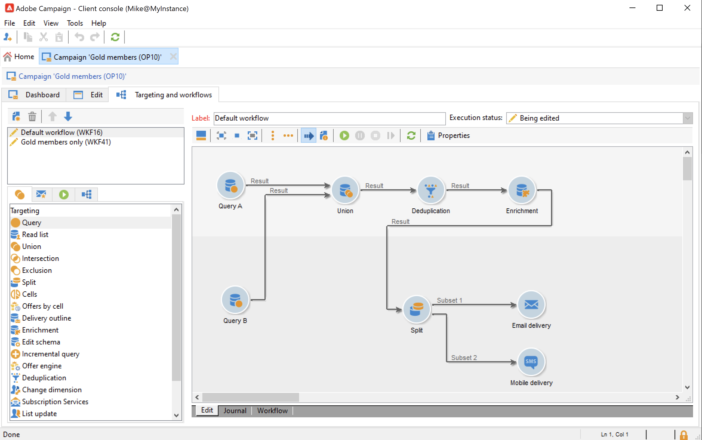

# Campaign workflows {#campaign-workflows}

For each campaign, you can create workflows to be executed from the **[!UICONTROL Targeting and workflows]** tab. These workflows are specific to the campaign.

This tab contains the same activities as for all workflows. [Learn more](#implementation-steps-)

In addition to targeting campaigns, campaign workflows enable you to create and configure deliveries entirely for all available channels. Once created in the workflow, these deliveries are available from the dashboard of the campaign.  

All campaign workflows are centralized under the **[!UICONTROL Administration > Production > Objects created automatically > Campaign workflows]** node.

Campaign workflows and implementation examples are detailed in [this section](../campaigns/marketing-campaign-target.md).
