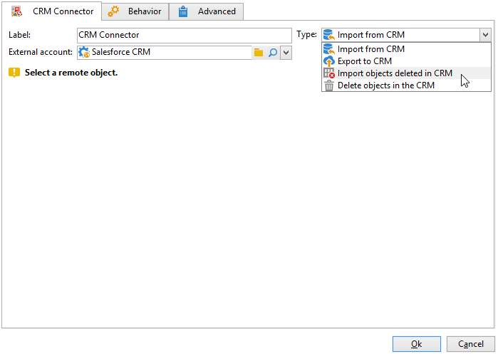

# CRM Connector{#crm-connector}

The **CRM connector** activity lets you configure the data synchronization between Adobe Campaign and a CRM system.

With this activity, you can:

* Import from the CRM
* Export to CRM
* Import objects deleted in the CRM
* Delete objects in the CRM

Select the external account that matches the CRM that you want to configure synchronization with, then select the object to be synchronized (accounts, opportunities, contacts, etc.).

For more information on CRM connectors in Adobe Campaign, refer to [this section](https://experienceleague.adobe.com/docs/campaign/campaign-v8/connect/ac-crm/crm.html){target="_blank"}.
