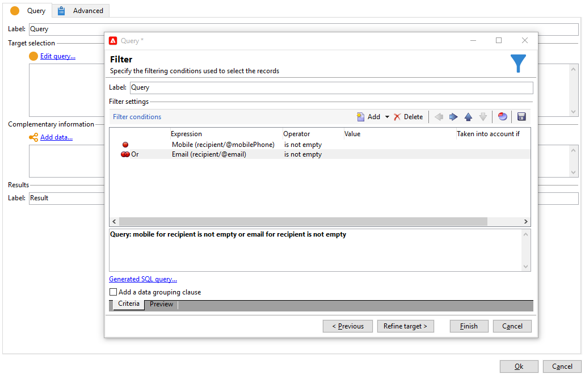
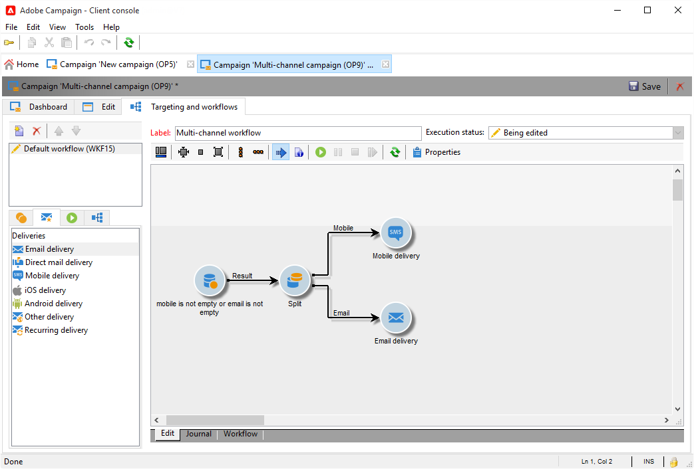
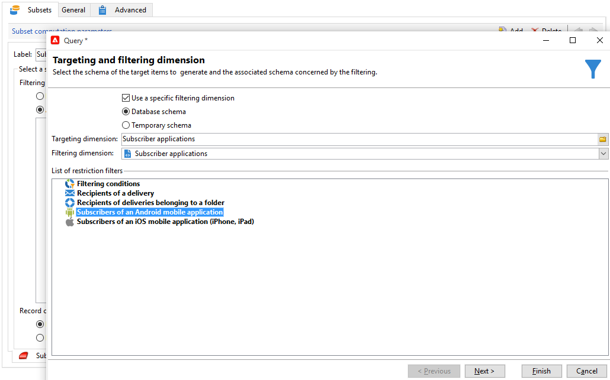

# Cross-channel deliveries{#cross-channel-deliveries}

Cross-channel deliveries are available in the **[!UICONTROL Deliveries]** tab of [campaign workflow](campaign-workflows.md) activities.

Select the template on which you want to base your delivery and define its content.

You can specify a target for your delivery upstream of the workflow using the different targeting activities.

In the example below, learn how to create a workflow to send an email or an SMS for push notification subscribers then a push notification one week later. To do this:

1. Create a campaign.
1. In the **[!UICONTROL Targeting and workflows]** tab of your campaign, add a **[!UICONTROL Query]** activity.
1. Configure your query: select the recipients who are subscribed to push notifications as the target dimension.

   >[!NOTE]
   >
   >For the push notifications, use the **subscriber applications** target dimension.

   

1. Add the filter conditions to your query. In this case, we will select recipients who have a mobile number or email address.

   

1. Add a **[!UICONTROL Split]** activity to your workflow to divide recipients who have a mobile number and those who have an email address.
1. In the **[!UICONTROL Delivery]** tab, select a delivery for each of your targets.

   Create your delivery in the same way as with a classic delivery wizard by double-clicking the delivery activity in your workflow.

   

1. Add and configure a **[!UICONTROL Wait]** activity in order for the recipients not to receive too many deliveries at once.
1. Add a **[!UICONTROL Split]** activity to divide subscribers of an iOS or Android mobile applications.

   Select a service for each of the operating systems. 

   

1. Select and configure a mobile application delivery for each of the operating systems.

   
