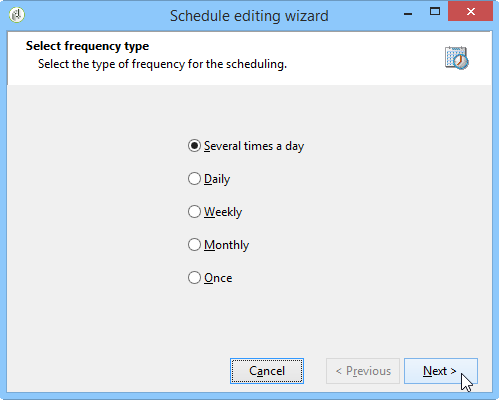

# Scheduler {#scheduler}

The **Scheduler** is a persistent task that activates its transition at the times specified by its schedule.

The **[!UICONTROL Scheduler]** activity should be considered as a scheduled start. The activity positioning rules within the chart are the same as for the **[!UICONTROL Start]** activity. This activity must not have an inbound transition.

## Best practices {#best-practices}

**Restart workflow after changing scheduler timing** - When changing the scheduled time of the **[!UICONTROL Scheduler]** activity, it is important to restart the workflow. This ensures that the workflow will execute at the updated times. Without restarting, the workflow will continue to execute according to the old schedule.

**Limit Scheduler frequency** - Avoid scheduling workflows to run more frequently than every 15 minutes. Running them more often can degrade system performance and result in database congestion.

**Use one Scheduler per branch** - Each branch of your workflow should only have one **[!UICONTROL Scheduler]** activity. For more information on best practices for using activities in workflows, refer to the [Workflow best practices page](workflow-best-practices.md#using-activities).

**Prevent workflow concurrent executions** - If a workflow is triggered by a scheduler, be mindful that multiple instances of the workflow could be running at the same time. For example, if a scheduler triggers the workflow every hour, but the workflow execution takes more than an hour, you could end up with overlapping executions.To avoid this, consider setting up checks to prevent multiple simultaneous executions. [Learn how to prevent simultaneous multiple workflow executions](monitor-workflow-execution.md#preventing-simultaneous-multiple-executions).

**Account for delayed transitions** - Transitions triggered by the scheduler might be delayed if the workflow is executing long-running tasks (like imports), or if the wfserver module has been stopped temporarily. To mitigate this, restrict the activation times of the scheduler to ensure tasks run within a defined time window.

## Configuring the Scheduler activity {#configuring-scheduler-activity}

The scheduler defines the activation schedule of the transition. To configure it, double-click the graphical object, then click **[!UICONTROL Change...]** 

A wizard lets you define the frequency and validity period of the activity. The configuration steps are as follows:

1. Select the activation frequency and click **[!UICONTROL Next]**.

   

1. Give the activation times and days. The parameters for this step depend on the frequency selected in the previous step. If you choose to launch the activity several times a day, the configuration options will be as follows:

   

1. Define the validity period of the schedule, or specify how many times it will be executed.

   

1. Check the configuration and click **[!UICONTROL Finish]** to save.

   
