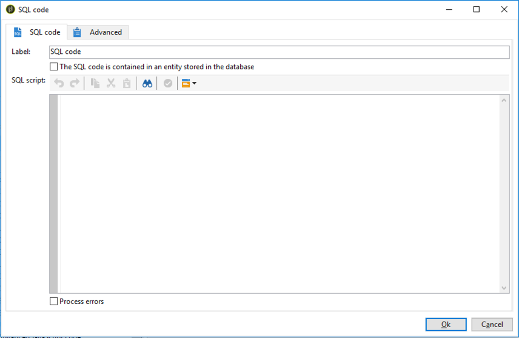

# SQL code and JavaScript code{#sql-code-and-javascript-code}

## SQL code {#sql-code}

An **[!UICONTROL SQL code]** activity executes an SQL script. The script is a JST template.

   

* **[!UICONTROL Script]**

  The central area of the editor contains the script to be executed. This script is a JST template and can therefore be configured according to the workflow context.

* **[!UICONTROL Processing errors]**

  Refer to [Processing errors](monitor-workflow-execution.md#processing-errors).

### Important notes {#postgresql-sensitive-sql}

From 8.9.1, the **[!UICONTROL SQL code]** and **[!UICONTROL SQL Data Management]** workflow activities have been improved to better protect PostgreSQL databases and keep your workflows running smoothly when custom SQL is executed from Campaign. Here are some best practices to follow in case of errors.

Options are available under **[!UICONTROL Administration]** > **[!UICONTROL Platform]** > **[!UICONTROL Options]**.

#### Solution 1 {#postgresql-sensitive-sql-solution-1}

Set `XtkSecurity_FeatureFlag_SqlSensitive` to `0`. The feature is deactivated.

#### Solution 2 {#postgresql-sensitive-sql-solution-2}

Modify `XtkSecurity_SqlSensitive_Methods`. You can change `<method name="TRUNCATE" action="block"/>` to `<method name="TRUNCATE" action="warn"/>`

Other methods such as VACUUM FULL, REINDEX, CREATE INDEX, DROP INDEX are also blocked by default in order to protect the database integrity. Be cautious if you want to set them to warn instead of block. Those methods can have a severe impact on database performance when running.

## JavaScript code and Advanced JavaScript code {#javascript-code}

**[!UICONTROL JavaScript code]** and **[!UICONTROL Advanced JavaScript code]** activities execute a JavaScript script in the context of a workflow. For more on scripting, refer to these sections:

* [JavaScript scripts and templates](javascript-scripts-and-templates.md)
* [Examples of JavaScript code in workflows](javascript-in-workflows.md)

### Execution delay {#exec-delay}

Starting 20.2 release, an execution delay has been added to the **[!UICONTROL JavaScript code]** and **[!UICONTROL Advanced JavaScript code]** activities. By default, the execution phase cannot exceed 1 hour. After this delay, the process will be aborted with an error message and the activity execution will fail.

You can change this delay in the **[!UICONTROL Stop execution after]** field available in these activities.

To ignore this limit, you need to set the value to **0**.

### JavaScript code {#js-code-desc}


* **[!UICONTROL Script]**: The central area of the editor contains the script to be executed.

* **[!UICONTROL Process errors]**: Refer to [Processing errors](monitor-workflow-execution.md#processing-errors).

### Advanced JavaScript code {#adv-js-code-desc}


* **[!UICONTROL First call]**: The first zone of the editor contains the script to execute during the first call.
* **[!UICONTROL Next calls]**: The second zone of the editor contains the script to execute during the next calls.
* **[!UICONTROL Transitions]**: You can define several activity output transitions.
* **[!UICONTROL Schedule]**: The **[!UICONTROL Schedule]** tab lets you schedule when to trigger the activity.

Advanced JavaScript is a persistent task and is periodically recalled if it has not been marked as completed. To terminate the task and prevent future recalls, you must use the **task.setCompleted()** method in the **[!UICONTROL Next calls]** section:

```
task.postEvent(task.transitionByName("ok")); // to transition to Ok branch
task.setCompleted();

return 0;
```
