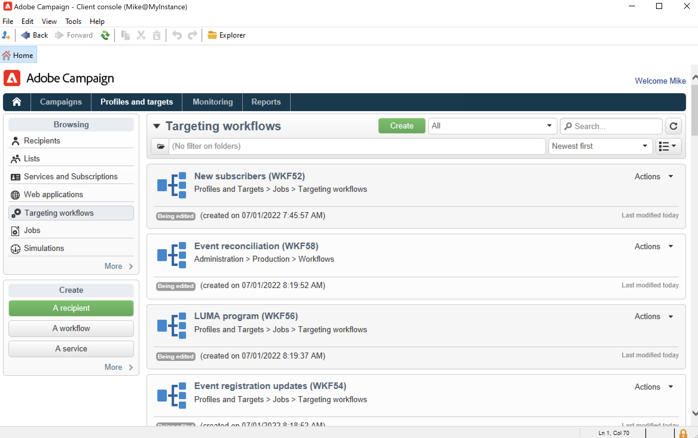
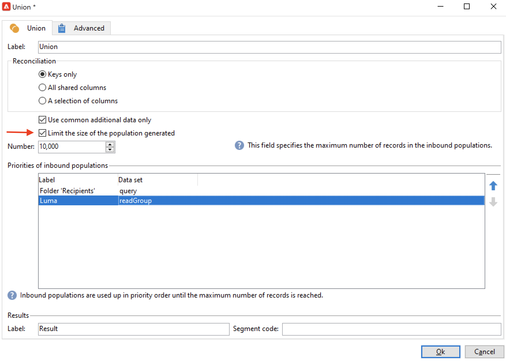
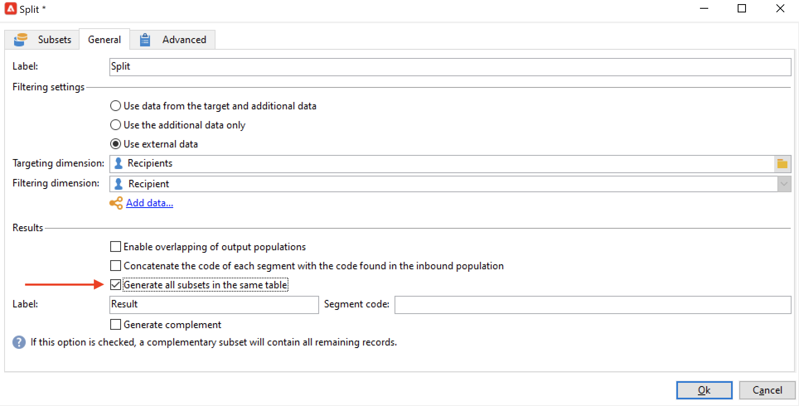

# Create a targeting workflow{#target-data}

Workflow can be used to query the database and segment your data. Campaign workflow module is a powerfull tool to perform data management activities, extract, enrich and transform data, manage audiences, and refine populations.

Targeting workflows enable you to build several delivery targets. You can create queries, define unions or exclusions based on specific criteria, add scheduling, thanks to workflow activities. The result of this targeting can be transferred automatically to a list which can serve as the target of delivery actions

In addition to these activities, Data Management options let you manipulate data and access advanced functions to satisfy complex targeting issues. For more on this, refer to [Data Management](targeting-workflows.md#data-management).

All these activities can be found in the first workflow tab.

>[!NOTE]
>
>Targeting activities are detailed in [this section](activities.md).

Targeting workflows can be created and edited via the **[!UICONTROL Profiles and Targets > Jobs > Targeting workflows]** node of the Adobe Campaign tree or via the **[!UICONTROL Profiles and Targets > Targeting workflows]** menu of the home page.

Targeting workflows within the framework of a campaign are stored with all campaign workflows.

## Key steps to create a targeting workflow {#implementation-steps-}

Steps to create a targeting workflow are detailed in these sections:

1. **Identify** data in the database -  See [Create queries](#create-queries)
1. **Prepare** data to meet delivery needs - See [Enrich and modify data](#enrich-and-modify-data)
1. **Use** data to perform updates or within a delivery - See [Update the database](use-workflow-data.md#update-the-database)

The results of all enrichments and all handlings carried out during targeting are stored and accessible in personalization fields, in particular for use when creating personalized messages. For more on this, refer to [Target data](use-workflow-data.md#target-data).

## Targeting and filtering dimensions {#targeting-and-filtering-dimensions}

During data segmentation operations, the targeting key is mapped to a filtering dimension. The targeting dimension lets you define the population targeted by the operation: recipients, contract beneficiaries, operator, subscribers, etc. The filtering dimension lets you select the population based on certain criteria: contract holders, newsletter subscribers, etc.

For example, to select clients who have had a life-insurance policy for over 5 years, select the following targeting dimension: **Clients** and the following filtering dimension: **Contract holder**. You can then define the filtering conditions within the query activity

During the targeting dimension selection stage, only compatible filtering dimensions are offered in the interface.

These two dimensions must be related. Thus, the content of the **[!UICONTROL Filtering dimension]** list depends on the targeting dimension specified in the first field.

For example, for recipients (**recipient**), the following filtering dimensions will be available:

While for **Visitors**, the list will contain the following filtering dimensions:

## Create queries {#create-queries}

### Work with additional data {#select-data}

A **[!UICONTROL Query]** activity lets you select basic data to build the target population. For more on this, refer to [this section](query.md#create-a-query).

You can also use the following activities to query and refine data from the database: [Incremental query](incremental-query.md), [Read list](read-list.md).

It is possible to collect additional data to be forwarded and processed throughout the workflow's life cycle. For more on this, refer to [Add data](query.md#add-data) and [Edit additional data](#edit-additional-data).

### Edit additional data {#edit-additional-data}

Once additional data has been added, you can edit it or use it to refine the target defined in the query activity.

The **[!UICONTROL Edit additional data...]** link lets you view the added data and modify it or add to it.

To add data to the previously defined output columns, select it in the list of available fields. To create a new output column, click the **[!UICONTROL Add]** icon, then select the field and click **[!UICONTROL Edit expression]**.

Click the **Advanced selection** button.

Define a calculation mode for the field to be added, such as an aggregate for example.

The **[!UICONTROL Add a sub-item]** option lets you attach computed data to the collection. This lets you select the additional data from the collection or define aggregate calculations on collection elements. 

The sub-elements will be represented in the sub-tree of the collection they are mapped to.

Collections are shown in the **[!UICONTROL Collections]** sub-tab. You can filter the collected elements by clicking the **[!UICONTROL Detail]** icon of the selected collection. The filter wizard lets you select the collected data and specify the filtering conditions to be applied to the data in the collection.

### Refine a target using additional data {#refine-the-target-using-additional-data}

The additional data collected can enable you to refine data filtering in the database. To do this, click the **[!UICONTROL Refine the target using additional data...]** link: this lets you over-filter on the added data.

### Homogenize data {#homogenize-data}

In **[!UICONTROL Union]** or **[!UICONTROL Intersection]** type activities, you can choose to keep only shared additional data to keep the data consistent. In this case, the temporary output worktable of this activity will contain only the additional data found in all inbound sets.

### Reconcile with additional data {#reconciliation-with-additional-data}

During the data reconciliation phases (**[!UICONTROL Union]**, **[!UICONTROL Intersection]**, etc. activities), you can select the columns to be used for data reconciliation from the additional columns. To do this, configure a reconciliation on a selection of columns and specify the main set. Then select the columns in the lower column of the window, as shown in the following example:

Select an expression and confirm. 

### Create subsets {#create-subsets}

The **[!UICONTROL Split]** activity lets you create subsets on criteria defined via extraction queries. For each subset, when you edit a filter condition on the population, you will then access the standard query activity which lets you define the target segmentation conditions.

You can split a target into several subsets using only additional data as filtering conditions, or in addition to target data. You can also use external data if you have purchased the **Federated Data Access** option.

For more on this, refer to [this section](#create-subsets-using-the-split-activity).

## Segment data {#segment-data}

### Combine several targets (Union) {#combine-several-targets--union-}

The union activity lets you combine the result of several activities within one transition. Sets do not necessarily have to be homogeneous.

The following data reconciliation options are available:

* **[!UICONTROL Keys only]**

  This option can be used if input populations are homogeneous.

* **[!UICONTROL All columns in common]**

  This option lets you reconcile data based on all the columns common to the target's various populations.

  Adobe Campaign identifies columns based on their name. A tolerance threshold is accepted: for example, an 'Email' column can be recognized as identical to an '@email' column.

* **[!UICONTROL A selection of columns]**

  Select this option to define the list of columns which data reconciliation will be applied to.

  Start by selecting the main set (the one which contains the source data), then the columns to be used for the join.

  

  >[!CAUTION]
  >
  >During data reconciliation, populations are not deduplicated.

  You can restrict the population size to a given number of records. To do this, click the appropriate option and specify the number of records to be kept.

  Also, specify the priority of inbound populations: the lower section of the window lists the inbound transitions of the union activity and lets you sort them using the blue arrows to the right of the window.

  The records will be taken first from the population of the first inbound transition in the list, then, if the maximum hasn't been reached, they will be taken from the population of the second inbound transition, etc.

  

### Extract joint data (Intersection) {#extract-joint-data--intersection-}

The intersection lets you recover only the lines shared by the populations of inbound transitions. This activity must be configured like the union activity.

Furthermore, it is possible to keep only a selection of columns, or only the columns shared by the inbound population.

The intersection activity is detailed in the [Intersection](intersection.md) section.

### Exclude a population (Exclusion) {#exclude-a-population--exclusion-}

The exclusion activity lets you exclude the elements of a target from a different target population. The output targeting dimension of this activity will be that of the main set.

When necessary, it is possible to manipulate inbound tables. Indeed, to exclude a target from another dimension, this target has to be returned to the same targeting dimension as the main target. To do this click the **[!UICONTROL Add]** button and specify the dimension change conditions.

Data reconciliation is carried out either via an identifier, changing axis, or a join.

### Create subsets using the Split activity {#create-subsets-using-the-split-activity}

The **[!UICONTROL Split]** activity is a standard activity which lets you create as many sets as necessary via one or several filtering dimensions, as well as generating either one output transition per subset or a unique transition.

The additional data conveyed by the inbound transition can be used in the filtering criteria.

To configure it, you first need to select criteria:

1. In your workflow, drag and drop a **[!UICONTROL Split]** activity.
1. In the **[!UICONTROL General]** tab, select the desired option: **[!UICONTROL Use data from the target and additional data]**, **[!UICONTROL Use the additional data only]** or **[!UICONTROL Use external data]**.
1. If the **[!UICONTROL Use data from the target and additional data]** option is selected, the targeting dimension lets you use all the data conveyed by the inbound transition.

   

   When subsets are created, the aforementioned filtering parameters are used.

   To define filtering conditions, choose the **[!UICONTROL Add a filtering condition on the inbound population]** option and click the **[!UICONTROL Edit...]** link. Then specify the filtering conditions for creating this subset.

   

   An example showing how to use filtering conditions in the **[!UICONTROL Split]** activity to segment the target into different populations is described in [this section](cross-channel-delivery-workflow.md).

   The **[!UICONTROL Label]** field lets you give the newly created subset a name, which will match the outbound transition.

   You can also assign a segment code to the subset to identify it and use it to target its population.

   If necessary, you can change the targeting and filtering dimensions individually for each subset you want to create. To do this, edit the subset's filtering condition and check the **[!UICONTROL Use a specific filtering dimension]** option.

   

1. If the **[!UICONTROL Use the additional data only]** option is selected, only additional data is offered for subset filtering.

1. If the **Federated Data Access** option is enabled, the **[!UICONTROL Use external data]** lets you process data in an external database which is already configured, or create a new connection to a database.

Then, we need to add new subsets:

1. Click the **[!UICONTROL Add]** button and define the filtering conditions. 

   

1. Define the filtering dimension in the **[!UICONTROL General]** tab of the activity (see above).It applies to all subsets by default. 

   

1. If necessary, you can change the filtering dimension for each subset individually. This lets you build a set for all Gold card holders, one for all recipients who clicked in the latest newsletter and a third for people aged 18 to 25 who made an in-store purchase within the last 30 days, all using the same split activity. To do this, select the **[!UICONTROL Use a specific filtering dimension]** option and select the data filtering context.

Once subsets have been created, by default the split activity shows as many output transitions as there are subsets:

You can group all these subsets into a single output transition. In this case, the link to the respective subsets will be visible in the segment code, for example. To do this, select the **[!UICONTROL Generate all subsets in the same table]** option.

For example, you can place a single delivery activity and personalize the delivery content based on the segment code of each recipient set.

Subsets can also be created using the **[!UICONTROL Cells]** activity. For more on this, refer to the [Cells](cells.md) section.

### Use targeted data {#using-targeted-data}

Once the data has been identified and prepared, it can be used in the following contexts:

* You can update the data in the database following data manipulation in the various workflow stages.

  For more on this, [Update data](update-data.md).

* You can also refresh the content of existing lists.

  For more on this, refer to [List update](list-update.md).

* You can prepare or start deliveries in the workflow directly.

  For more on this, refer to [Delivery](delivery.md), [Delivery control](delivery-control.md) and [Continuous delivery](continuous-delivery.md).

## Data Management {#data-management}

In Adobe Campaign, the Data Management combines a set of activities for solving complex targeting issues by offering more efficient and flexible tools. This lets you implement consistent management of all communications with a contact using information related to their contracts, subscriptions, reactivity to deliveries, etc. Data Management lets you track the data life cycle during segmentation operations, in particular:

* Simplifying and optimizing targeting processes, by including data that is not modeled in the datamart (creating new tables: local extension to each targeting workflow depending on configuration).
* Keeping and conveying buffer calculations, especially during target construction phases or for database administration.
* Accessing external bases (optional): heterogeneous databases taken into account during the targeting process.

In order to implement these operations, Adobe Campaign offers:

* Data collection activities: [File transfer](file-transfer.md), [Data loading (file)](data-loading-file.md), [Data loading (RDBMS)](data-loading-rdbms.md), [Update data](update-data.md). This first step of collecting data prepares the data to allow it to be processed in other activities. Several parameters need to be monitored in order to ensure that the workflow executes correctly and gives the expected results. For example, when you import data, the primary key (Pkey) for this data must be unique for each record.
* Targeting activities having been enriched with Data Management options: [Query](query.md), [Union](union.md), [Intersection](intersection.md), [Split](split.md). This lets you configure a union or an intersection between data from several different targeting dimensions, as long as data reconciliation is possible.
* Data transformation activities: [Enrichment](enrichment.md), [Change dimension](change-dimension.md).

>[!CAUTION]
>
>When two workflows are linked, deleting a source table element does not mean that all the data linked to it is deleted.
>  
>For example, deleting a recipient via a workflow will not result in all of the recipient's delivery history being deleted. However, deleting a recipient directly in the 'Recipients' folder will indeed result in all data linked with this recipient being deleted.

### Enrich and modify data {#enrich-and-modify-data}

In addition to the targeting dimension, the filtering dimension lets you specify the nature of the collected data. Refer to [this section](targeting-workflows.md#targeting-and-filtering-dimensions).

The identified and collected data can be enriched, aggregated and manipulated to optimize target construction. To do this, in addition to the data manipulation activities detailed in [this section](#segmen-data), use the following:

* The **[!UICONTROL Enrichment]** activity lets you momentarily add columns to a schema, as well as add information to certain elements. It is detailed in the [Enrichment](enrichment.md) section of the repository of activities.
* The **[!UICONTROL Edit schema]** activity lets you modify the structure of a schema. It is detailed in the [Edit schema](edit-schema.md) section of the repository of activities.
* The **[!UICONTROL Change dimension]** activity lets you change the targeting dimension during the target construction cycle. It is detailed in the [Change dimension](change-dimension.md) section.
