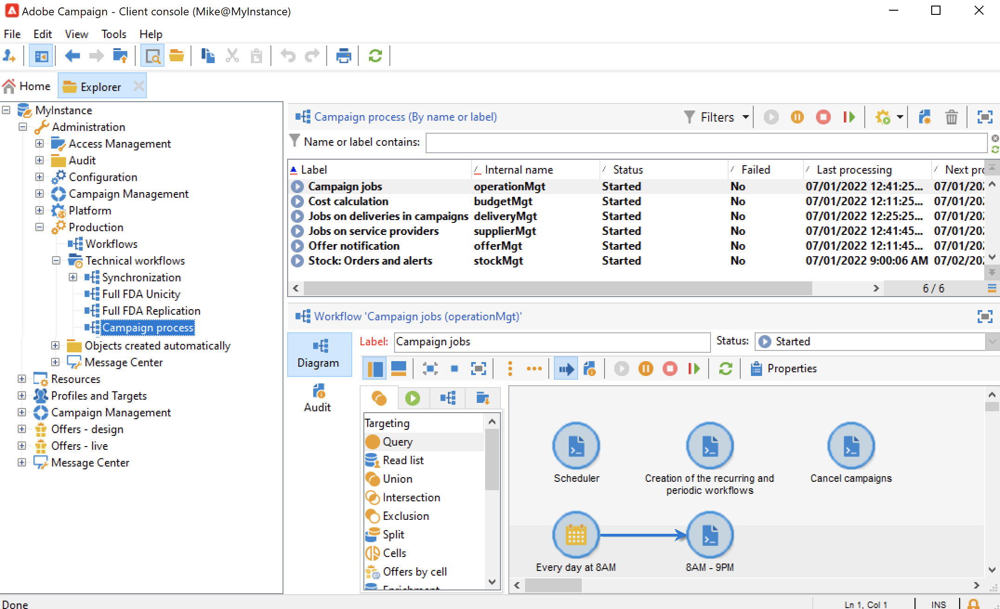

# Technical workflows{#about-technical-workflows}

Adobe Campaign comes with a set of built-in technical workflows. They control operations and jobs scheduled for periodic execution on the server. Technical workflows execute maintenance operations on your Campaign database, manage tracking data on deliveries, and also set up provisional processes on deliveries. 

By default, technical workflows are available in a sub-folder of the following node: **[!UICONTROL Administration]** > **[!UICONTROL Production]** > **[!UICONTROL Technical workflows]**.

{width="50%" align="left" zoomable="yes"}

>[!NOTE]
>
>* The list of technical workflows installed with each module is available in a [this section](#list-technical-workflows).
>
>* Technical workflows related to the Message Center add-on are stored by default in the **[!UICONTROL Administration]** > **[!UICONTROL Production]** > **[!UICONTROL Message Center]** > **[!UICONTROL Technical workflows]** node.

The **[!UICONTROL Campaign process]** subfolder centralizes the workflows required for executing processes within the campaigns: task notification, stock management, cost calculation, etc.

## Manage and create technical workflows {#manage-tech-workflows}

Campaign technical workflows can only be started and modified by operators with **Administration** permissions. Learn how to monitor technical workflows in this [dedicated section](monitor-technical-workflows.md).

You can create custom technical workflows in the **[!UICONTROL Administration > Production > Technical workflows]** node of the tree structure. Native templates are available for creating technical workflows. They can be configured to suit your needs. However, this process is reserved for expert users. The activities available in technical workflows are the same as for targeting workflows. [Learn more](targeting-workflows.md).

## Built-in technical workflows {#list-technical-workflows}

The workflows detailed in this page are installed with the Adobe Campaign built-in packages. These packages, and associated technical workflows, depend on your license agreement and add-ons. 

|Technical workflow|Package|Description|
|------|--------|-----------|
|**Alias cleansing** (aliasCleansing)|Installed by default|This workflow standardizes enumeration values. It is triggered every day at 3am by default.|
|**Billing** (billing)|Installed by default|This workflow sends the system activity report to the 'billing' operator by email. It is triggered the 25th of every month on the Marketing instance.|
|**Campaign jobs** (operationMgt)|Installed by default|This workflow manages the jobs for marketing campaigns (launches targeting, file extraction, etc.). It also creates workflows related to recurring and periodic campaigns.|
|**Collect data for HeatMap service** (collectDataHeatMapService)|Installed by default|This workflow retrieves data required by the HeatMap service.|
|**Collect privacy requests** (collectPrivacyRequests)|Privacy Data Protection Regulation|This workflow generates the recipient's data stored in Adobe Campaign and makes it available for download in the privacy request's screen.|
|**Cost calculation** (budgetMgt)|Installed by default|This workflow starts the calculation of expense and cost lines on the budgets, plans, programs, campaigns, deliveries and tasks.|
|**Database cleanup** (cleanup)|Installed by default|This workflow is the database maintenance workflow: it makes different calculations from the statistics and processes, and deletes obsolete data from the database according to the defined configuration in the deployment assistant. It is triggered every day at 4am by default.|
|**Delete blocked LINE users** (deleteBlockedLineUsersV2)|LINE channel|This workflow ensures that the LINE V2 users' data is deleted after they have blocked the LINE official account for 180 days.|
|**Delete privacy requests data** (deletePrivacyRequestsData)|Privacy Data Protection Regulation|This workflow deletes the recipient's data stored in Adobe Campaign.|
|**Delivery indicators** (deliveryIndicators)|Installed by default|This workflow updates delivery tracking indicators for a delivery. This workflow is triggered every hour by default.|
|**Deploy FFDA immediately** (ffdaDeploy)|Installed by default on [Campaign Enterprise (FFDA) deployments](../../v8/architecture/enterprise-deployment.md) only|Performs an immediate deployment to the Cloud database. [Learn more on data replication](../../v8/architecture/replication.md)|
|**Distributed marketing processes** (centralLocalMgt)|Central/local Marketing (Distributed Marketing)|This workflow starts processing related to using the distributed marketing module. It launches the creation of local campaigns and manages notifications related to orders and campaign package availability.|
|**Event purge** (webAnalyticsPurgeWebEvents)|Web Analytics connectors|This workflow lets you delete every event from the database field according to the period configured in the Lifespan field.|
|**Export audiences to the Adobe Experience Cloud** (exportSharedAudience)|Integration with Adobe Experience Cloud|This workflow exports audiences as shared audiences/segments. These audiences can be used in the different Adobe Experience Cloud solutions that you use.|
|**Forecasting** (forecasting)|Installed by default|This workflow analyzes deliveries saved in the provisional calendar (creates provisional logs). It is triggered every day at 1am by default.|
|**Full aggregate calculation (propositionrcp cube)** (agg_nmspropositionrcp_full)|Offer engine (interaction)|This workflow updates the Full aggregate for the Offer proposition cube. It is triggered every day at 6am by default. This aggregate captures the following dimensions: Channel, Delivery, Marketing Offer and Date. The Offer proposition cube is then used to generate reports based on offers. Learn more about cubes in  [this section](../../v8/reporting/gs-cubes.md).|
|**Identification of converted contacts** (webAnalyticsFindConverted)|Web Analytics connectors|This workflow indexes site visitors that have completed their purchase after a re-marketing campaign. The data recovered by this workflow can be accessed in the Re-marketing efficiency report (Refer to this page).|
|**Import audiences from the Adobe Experience Cloud** (importSharedAudience)|Integration with Adobe Experience Cloud|This workflow allows you to import audiences/segments from different Adobe Experience Cloud solutions into Adobe Campaign.|
|**Jobs on deliveries in campaigns** (deliveryMgt)|Installed by default|This workflow triggers the approved deliveries and starts post-processing the service provider for an external delivery. It also sends approval notifications and reminders.|
|**Jobs on service providers** (supplierMgt)|Installed by default|This workflow starts processing the provider (email to the router and post-processing) once deliveries have been approved.|
|**MID to LineUserID migration** (MIDToUserIDMigration)|LINE channel|This workflow generates the LINE V2 users' ID for migration from LINE V1 to LINE V2.|
|**Message Center &lt;external_account_name&gt;** (mcSynch_&lt;external_account_name&gt;)|Transactional message control (Message Center - Control)|This workflow: <ul><li>recovers the list of events processed by the operation(s).</li><li>synchronizes with the NmsBroadLogMsg table in order to recover delivery message qualifications.</li><li>recovers event delivery logs as soon as synchronization with the NmsBroadLogMsg table has been completed.</li><li>synchronizes with the NmsTrackingUrl table in order to recover the tracking for delivery URLs.</li><li>recovers event tracking URLs as soon as synchronization with the NmsTrackingUrl table has been completed.</li><li>lets you recover all email addresses placed in quarantine every three hours after a delivery has been sent.</li></ul>|
|**MessageCenter full aggregate calculation** (agg_messageCenter_full)|Transactional message control (Message Center - Control)|This workflow updates the Full aggregate for the Message center cube. It is triggered every day at 3am by default. This aggregate captures the following dimensions: Channel, Date, Status and Event type. The Message center cube is then used to generate reports based on events. You can learn more about cubes in  |
|**Mid-sourcing (delivery counters)** (defaultMidSourcingDlv)|Transfer to Mid-sourcing|This workflow collects count information for deliveries on the mid-sourcing server. Count information includes general delivery indicators such as number of deliveries sent, etc. Tracking information such as opens are not included. It is triggered every ten minutes by default.|
|**Mid-sourcing (delivery logs)** (defaultMidSourcingLog)|Transfer to Mid-sourcing|This workflow collects delivery logs on the mid-sourcing server. It is triggered every hour by default.|
|**NMAC opt-out management** (mobileAppOptOutMgt)|Mobile App Channel (Push)|This workflow updates notification unsubscriptions on mobile devices. It is triggered every 6 hours between 1am and midnight.|
|**Offer notification** (offerMgt)|Installed by default|This workflow deploys approved offers onto the online environment, as well as every category contained in the offer catalog.|
|**Paused workflows cleanup** (cleanupPausedWorkflows)|Installed by default|This workflow analyzes paused workflows that have severity set to normal and triggers warnings and notifications when they have been paused for too long. After a month, paused technical workflows are stopped unconditionally. By default, it is triggered every Monday at 5 am. For more information, refer to [Handling of paused workflows](monitor-workflow-execution.md#handling-of-paused-workflows).|
|**Privacy request cleanup** (cleanupPrivacyRequests)|Privacy Data Protection Regulation|This workflow erases the access request files that are older than 90 days.|
|**Processing batch events** (batchEventsProcessing)|Transactional message execution (Message Center - Execution)|This workflow lets you put batch events into a queue before associating them with a message template.|
|**Processing real time events** (rtEventsProcessing)|Transactional message execution (Message Center - Execution)|This workflow lets you put real-time events into a queue before associating them with a message template.|
|**Proposition synchronization** (propositionSynch)|Control of offer engine with execution instance|This workflow synchronizes propositions between the marketing instance and the execution instance used for interactions.|
|**Recovery of web events** (webAnalyticsGetWebEvents)|Web Analytics connectors|Every hour, this workflow downloads segments on internet user behavior on a given site, puts them into the Adobe Campaign database and launches the re-marketing workflow.|
|**Replicate FFDA data immediately** (ffdaReplicate)|Installed by default on [Campaign Enterprise (FFDA) deployments](../../v8/architecture/enterprise-deployment.md) only|Replicates the XS data for a given external account. [Learn more on data replication](../../v8/architecture/replication.md)|
|**Replicate nmsDelivery queue** (ffdaReplicateQueueDelivery)|Installed by default on [Campaign Enterprise (FFDA) deployments](../../v8/architecture/enterprise-deployment.md) only|Queue for the `nms:delivery` table. [Learn more on data replication](../../v8/architecture/replication.md)|
|**Replicate nmsDlvExclusion queue** (ffdaReplicateQueueDlvExclusion)|Installed by default on [Campaign Enterprise (FFDA) deployments](../../v8/architecture/enterprise-deployment.md) only|Queue for the `nms:dlvExclusion` table. [Learn more on data replication](../../v8/architecture/replication.md)| 
|**Replicate nmsDlvMidRemoteIdRel queue** (ffdaReplicateQueueDlvMidRemoteIdRel)|Installed by default on [Campaign Enterprise (FFDA) deployments](../../v8/architecture/enterprise-deployment.md) only|Queue for the `nms:dlvRemoteIdRel` table. [Learn more on data replication](../../v8/architecture/replication.md)|
|**Replicate nmsTrackingUrl queue** (ffdaReplicateQueueTrackingUrl) **Replicate nmsTrackingUrl queue in concurrency** (ffdaReplicateQueueTrackingUrl_2)|Installed by default on [Campaign Enterprise (FFDA) deployments](../../v8/architecture/enterprise-deployment.md) only|Queues in concurrency for the `nms:trackingUrl` table, utilizing two workflows to improve efficiency by processing requests based on different priorities. [Learn more on data replication](../../v8/architecture/replication.md)|
|**Replicate Reference tables** (ffdaReplicateReferenceTables)|Installed by default on [Campaign Enterprise (FFDA) deployments](../../v8/architecture/enterprise-deployment.md) only|Performs automatic replication of built-in tables that need to be present on Campaign local database (PostgreSQL) and Cloud database ([!DNL Snowflake]). It is scheduled to execute every hour, daily. If **lastModified** field exists, replication happens incrementally, otherwise the whole table is replicated. [Learn more on data replication](../../v8/architecture/replication.md)|
|**Replicate Staging data** (ffdaReplicateStagingData)|Installed by default on [Campaign Enterprise (FFDA) deployments](../../v8/architecture/enterprise-deployment.md) only|Replicates staging data for unitary calls. It is scheduled to execute every hour, daily. [Learn more on data replication](../../v8/architecture/replication.md)|
|**Reporting aggregates** (reportingAggregates)|Delivery|This workflow updates aggregates used in reports. It is triggered every day at 2am by default.|
|**Sending of indicators and campaign attributes** (webAnalyticsSendMetrics)|Web Analytics connectors|This workflow lets you send email campaign indicators from Adobe Campaign to Adobe Experience Cloud Suite via the Adobe&reg; Analytics connector. The indicators concerned are as follows: Sent (iSent), Total count of opens (iTotalRecipientOpen), Total number of recipients who clicked (iTotalRecipientClick), Errors (iError), Opt-Out (opt-out) (iOptOut).|
|**Stock: Orders and alerts** (stockMgt)|Installed by default|This workflow launches stock calculation on the order lines and manages warning alerts thresholds.|
|**Sync Mobile apps from Adobe Experience Platform Data Collection** (syncWithLaunch)|Installed by default, starting v8.5|This workflow will automatically sync mobile properties to Adobe Campaign from Data collection.|
|**Tracking** (tracking)|Installed by default|This workflow performs the recovery and consolidation of tracking information. It also assures the recalculation of tracking and delivery statistics, especially those used by Message Center archiving workflows. By default, it is triggered once per hour.|
|**Update event status** (updateEventsStatus)|Transactional message execution (Message Center - Execution)|This workflow lets you assign a status to an event. Event statuses are as follows:<ul><li>Pending: the event is in a queue. No message template has yet been associated to it.</li><li>Pending delivery: the event is in a queue, a message template has been associated to it and is currently being processed by the delivery.</li><li>Sent: this status is copied from the delivery logs. It means that the delivery has been sent.</li><li>Ignored by the delivery: this status is copied from the delivery logs. It means that the delivery has been ignored.</li><li>Delivery error: this status is copied from the delivery logs. It means that the delivery has failed.</li><li>Event not covered: the event has failed to be associated with a message template. The event will not be reprocessed.</li></ul>|
|**Update for deliverability** (deliverabilityUpdate)|Installed by default|Once the Deliverability monitoring (Email Deliverability) package is installed, this workflow runs nightly and manages the bounce emails qualification rules, as well as the list of domains and MXs. This requires the HTTPS port to be open on the platform.|
|**Update unsubscriptions** (ffdaUnsuscribe)|Installed by default on [Campaign Enterprise (FFDA) deployments](../../v8/architecture/enterprise-deployment.md) only|This workflow handles unsubscribes received back as bounce mails (through usage of `<mailto>` List-Unsubscribe method). It runs daily, every 1h, only on marketing instances with an Enterprise (FFDA) deployment.  The workflow checks broadlogs from a certain time range (last processing time and current time) that are marked as unsubscription bounces by the inMail module (mark set in iFlags column of NmsBroadLog table) and processes an unsubscription depending on whether the service of the broadlog is set or not:<ul><li>If the serviceId is 0 (not defined), the recipient will be denylisted.</li><li>If the serviceId is not 0 (linked to an existing service), the recipient will be unsubscribed from that service.</li></ul> Note: This workflow only handles bounce unsubscribes; unsubscribes done via opt-out link and One-Click unsubscribtion (URL method) are handled separately outside of this workflow.|
