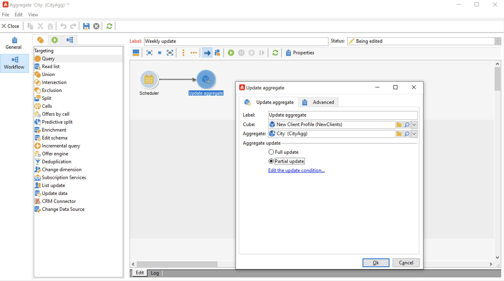

# Update aggregate{#update-aggregate}

Aggregates defined in [cubes](../../v8/reporting/gs-cubes.md) for reporting purposes can be updated with a specific activity. A **[!UICONTROL Workflow]** tab is available when configuring the aggregate.

Learn more about cubes and aggregates in [this section](../../v8/reporting/customize-cubes.md#calculate-and-use-aggregates).

To update an aggregate, edit the **[!UICONTROL Update aggregate]** activity and select the cube and aggregate to update.

You can configure a **Full update** or a **Partial update**.

By default, a full update is executed out during each calculation. To enable a partial update, select the option and define the update conditions.

A good practice is to add a **[!UICONTROL Scheduler]** activity to set up the frequency of calculation updates.
