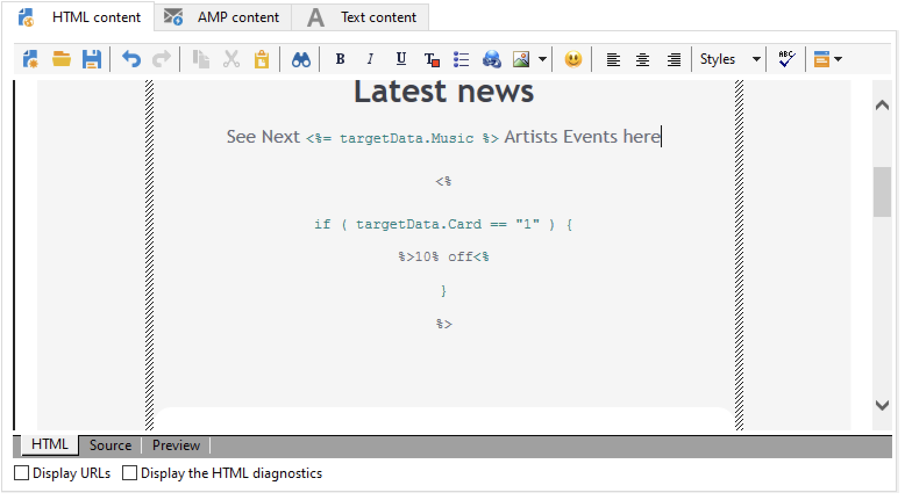

# Use workflow data{#how-to-use-workflow-data}

You can use workflow activities to perform multiple tasks. Find below samples of usage to update the database by creating lists, manage subscriptions, send messages via a workflow, or enrich your deliveries and their audiences.

A set of workflow use cases is available in [this section](workflow-use-cases.md).

## Data life cycle {#data-life-cycle}

### Workflow temporary work table {#work-table}

In workflows, data transported from one activity to another is stored in a temporary work table.

This data can be displayed and analyzed by right-clicking the appropriate transition. 


To do this, select the relevant menu:

* **[!UICONTROL Display the target...]**

  This menu displays the available data on the target population.

  

  You can access the structure of the work table in the **[!UICONTROL Schema]** tab.

  

  For more on this, refer to [this section](monitor-workflow-execution.md#worktables-and-workflow-schema).

* **[!UICONTROL Analyze target...]**

  Use this menu to access the descriptive analysis wizard which lets you generate statistics and reports on the transition data.

  Learn how to use the descriptive analysis wizard in [Campaign Classic v7 documentation](https://experienceleague.adobe.com/docs/campaign-classic/using/reporting/analyzing-populations/about-descriptive-analysis.html){target="_blank"}.

The target data is purged as the workflow is executed. Only the last work table is accessible. You can configure the workflow so that all work tables remain accessible: check the **[!UICONTROL Keep the result of interim populations between two executions]** option in the workflow properties.


>[!CAUTION]
>
>This option must **never** be checked in a **production** workflow. This option is used to analyze the results and is designed only for testing purposes and hence must be used only on development or staging environments.


### Leverage target data {#target-data}

The data stored in the workflow temporary work table is available for personalization tasks. Data can be used in the [personalization fields](../../v8/send/personalization-fields.md).

This lets you use data collected via a list in a delivery for example. To do this, use the following syntax:

```
%= targetData.FIELD %
```

**[!UICONTROL Target extension]** (targetData) type personalization elements are not available for targeting workflows. The delivery target has to be built in the workflow and specified in the inbound transition of the delivery.

In the following example, you are collecting a list of information on customers, to be used in a personalized email. Apply the following steps:

1. Create a workflow to collect information, reconcile it with the data already in the database, then start a delivery. 

   

1. In our example, the file content is as follows:

   ```
   Music,First name,Last name,Account,CD/DVD,Card
   Pop,David,BLAIR,4323,CD,0
   Rock,Daniel,ARCARI,3222,DVD,1
   Disco,Uma,ALTON,0488,DVD,0
   Jazz,Paul,BOLES,6475,CD,1
   Jazz,David,BOUKHARI,0841,DVD,1
   [...]
   ```

   To load the file, configure the **[!UICONTROL Data loading (file)]** activity as below:

   

1. Configure the **[!UICONTROL Enrichment]** activity to reconcile the collected data with that already in the Adobe Campaign database. Here, the reconciliation key is the account number:

   

1. Then configure the **[!UICONTROL Delivery]**: it is created based on a template, and the recipients are specified by the inbound transition. 

   

   >[!CAUTION]
   >
   >Only data contained in the transition may be used to personalize the delivery. **targetData** type personalization fields are only available for the inbound population of the **[!UICONTROL Delivery]** activity.

1. In the delivery template, use the fields collected in the workflow.

   To do this, insert **[!UICONTROL Target extension]** type personalization fields.

   

   Here, we want to insert the customer's favorite music genre and media type (CD or DVD) as stated in the file collected by the workflow.

   As a plus, we are going to add a coupon for loyalty card holders, i.e. recipients for whom the 'Card' value equals 1.

   

   **[!UICONTROL Target extension]** (targetData) type data is inserted into deliveries using the same characteristics as all personalization fields. They may also be used in the subject, link labels, or the links themselves.


## Update the database {#update-the-database}

All collected data can be used to update the database, or in deliveries. For example, you can enrich message content personalization possibilities (include the number of contracts in the message, specify the average shopping cart over the last year, etc.) or detail population targeting (send a message to contract co-holders, target the 1,000 best subscribers to online services, etc.). This data can also be exported or archived in a list.

### Update lists  {#list-updates}

The data of the Adobe Campaign database and the existing lists can be updated using two dedicated activities:

* The **[!UICONTROL List update]** activity lets you store worktables in a datalist.

  You can select an existing list or create it. In this case, the name and possibly the record folder are computed.

  

  Refer to [List update](list-update.md).

* The **[!UICONTROL Update data]** activity performs a mass update of the fields in the database.

  For more on this, refer to [Update data](update-data.md).

### Manage subscriptions {#subscription-management}

To find out about subscribing and unsubscribing recipients to an information service via a workflow, refer to [Subscription Services](subscription-services.md).
