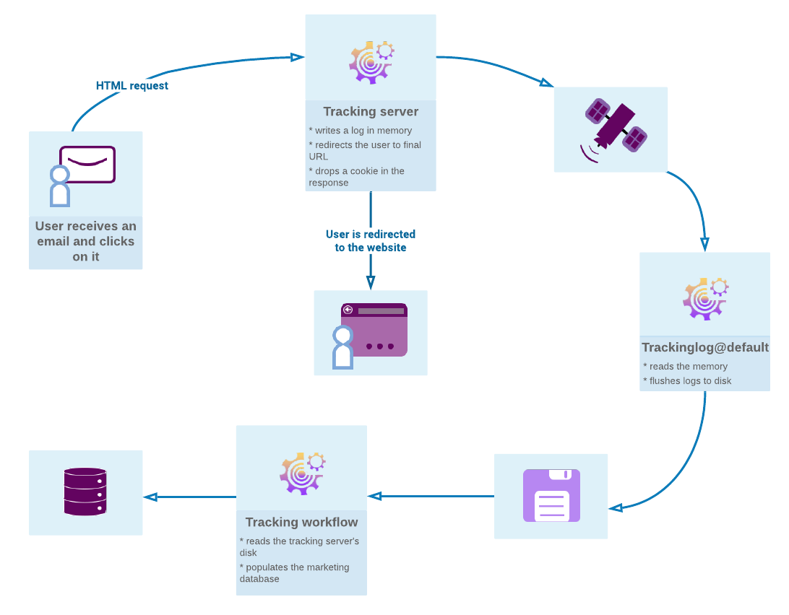

# Get started with message tracking {#get-started-tracking}

Use Adobe Campaign to track the messages sent and monitor the behavior of recipients: opening, clicks, subscriptions, unsubscription, etc.

This information is retrieved in the **[!UICONTROL Tracking]** tab of the profile of each recipient of the delivery. This tab presents all the URL links tracked and clicked by the recipient selected from the list. This is the accumulation of all URLs tracked in the deliveries that are still present in the delivery screen. The list can be configured and typically will contain: the URL clicked, the date and time of the click, and the document in which the URL was found.

The **Delivery dashboard** helps you monitor deliveries and issues encountered during the sending of messages.  [Learn more](delivery-dashboard.md).

The following diagram illustrates the tracking flow.

## Configure tracking {#configure-tracking}

**Operating principle**

Before using tracking, you need to first configure it for your instance. [Learn more](../../../v7/installation/using/deploying-an-instance.md#operating-principle)

**Tracking server**

To configure tracking, your instance must be declared and registered with the tracking server(s). As a Campaign hosted customer, Adobe owns tracking configuration. For Campaign Classic v7 on-premise customers, refer to [this section](../../../v7/installation/using/deploying-an-instance.md#tracking-server).

**Saving tracking**

Once tracking is configured and your URLs populated, the tracking server must be registered. As a Campaign hosted customer, Adobe owns tracking configuration. For Campaign Classic v7 on-premise customers, refer to [this section](../../../v7/installation/using/deploying-an-instance.md#saving-tracking)

## Message tracking {#message-tracking}

**Tracked links**

You can track the reception of messages and the activation of the links inserted in the message content to better understand the behavior of recipients. [Learn more](how-to-configure-tracked-links.md)

**URL tracking**

Tracking options can be configured by activating or deactivating tracked URLs. [Learn more](personalizing-url-tracking.md)

**Tracked link personalization**

Campaign Classic tracking capabilities allow you to add links in emails that can be personalized and that support tracking. [Learn more](tracking-personalized-links.md) 

**Tracking logs**

The Tracking technical workflow retrieves the tracking data once the delivery has been sent and tracking activated. This data can be found in the Tracking tab of your delivery. [Learn more](accessing-the-tracking-logs.md)

**Testing tracking**

Before sending your tracked messages, you can test the tracking on your mirror page, email logs and links. [Learn more](testing-tracking.md)

## Web application tracking {#web-application-tracking}

**Tracking a web application**

You can also track and measure visits on Web application pages with tracking tags. This functionality can be used for all Web application types such as forms and landing pages. [Learn more](../../web/using/tracking-a-web-application.md)

**Web application tracking opt-out**

The Web application tracking opt-out enables you to stop tracking web behaviors of end-users who opt-out of behavioral tracking. You can include the ability to display a banner into web applications or landing pages to allow users to opt-out. [Learn more](../../web/using/web-application-tracking-opt-out.md) 

## Tracking reports {#tracking-reports}

**Tracking statistics**

This report provides statistics on opens, clicks and transactions and lets you track the marketing impact of the delivery. [Learn more](../../reporting/using/delivery-reports.md#tracking-statistics)

**URLs and click streams**

This report shows the list of pages visited following a delivery. [Learn more](../../reporting/using/delivery-reports.md#urls-and-click-streams)

**Person/people and recipients**

Better understand the tracking difference between a person/people and a recipient in Adobe Campaign with this example. [Learn more](../../reporting/using/person-people-recipients.md)

**Tracking indicators**

This report combines the key indicators for tracking the behavior of recipients upon receiving the delivery such as open, click-through rates and click streams. [Learn more](../../reporting/using/delivery-reports.md#tracking-indicators)

**Indicator calculation**

The different tables give you the list of indicators used in the different reports and their calculation formula depending on the delivery type. [Learn more](../../reporting/using/indicator-calculation.md)

## Tracking troubleshooting {#tracking-troubleshooting}

The following troubleshooting tips will help you solve the most common issues happening when using tracking in Adobe Campaign Classic. For a more advanced troubleshooting, refer to [this section](tracking-troubleshooting.md).

* As a Campaign Classic v7 on-premise user, check that the trackinglogd process is running

    This process reads from the IIS/Web Server shared memory and writes the redirection logs.
    
    You can access it from the Homepage by selecting  the Monitoring tab in your instance. You can also execute the following command on the instance: `<user>@<instance>:~$ nlserver pdump`

    If the trackinglogd process doesn’t appear in the list, launch it with the following command on the instance: `<user>@<instance>:~$ nlserver start trackinglogd`

* Check that the **Tracking** technical workflow has been running recently.

    You can locate the **Tracking** technical workflow in the following folder: **Administration > Production > Technical workflows**.
