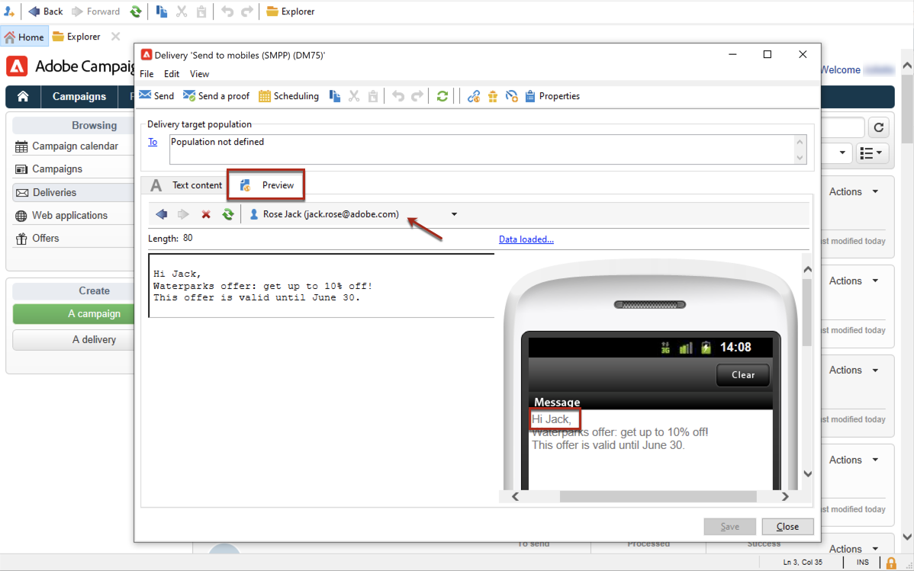

# Create and send SMS

Use Adobe Campaign to send personalized SMS messages.

## Configure SMS channel

To send to a mobile phone, you need:

* An external account specifying a connector and type of message.

* A delivery template in which this external account is referenced.

Learn how to configure an SMS channel in [this page](sms-set-up.md).

Before starting sending SMS:

* Make sure recipient profiles contain at least a mobile phone in their profile.
* Review the Adobe Campaign Classic [Delivery best practices](../delivery-best-practices.md).

In addition, you need to be familiar with the SMS protocol and settings. Walk through the connection set up between Adobe Campaign and an SMPP provider in [this document](sms-protocol.md).

## Create your first SMS delivery

1. To create a new delivery, browse to the **[!UICONTROL Campaigns]** tab, click **[!UICONTROL Deliveries]** and click the **[!UICONTROL Create]** button above the list of existing deliveries.

   

   For global information on how to create a delivery, refer to [this section](../communication-channels.md).

1. Select a delivery template referencing the relevant external account to send SMS deliveries.

   
    
    Learn how to create an SMPP external account in [this section](sms-set-up.md#creating-an-smpp-external-account).

    Learn how to create a delivery template to deliver to mobiles in [this section](sms-set-up.md#changing-the-delivery-template).

1. Identify your delivery with a label, code, and description.

1. Click **[!UICONTROL Continue]** to confirm and display the message configuration window.

1. Enter the content of the message in the **[!UICONTROL Text content]** section of the wizard, including personalization fields as needed.

   

1. Select the target population.

The key steps to create and design an SMS are detailed in Campaign Classic v7 documentation:

* Create an SMS

    [Learn how to create an SMS delivery](sms-create.md)

* Design the SMS content

    [Learn how to define the SMS content](sms-create.md#defining-the-sms-content)

* Select the audience of your email

   [Learn how to define the target population](../steps-defining-the-target-population.md)

<!-- 
Steps to define an audience are detailed on [this page](../start/audiences.md).
-->

## Test your SMS

To view the rendering of the message with its personalization, click **[!UICONTROL Preview]** and select a recipient.

   

To send a proof, refer to these sections:

* [Learn key steps to validate a delivery](../steps-validating-the-delivery.md)
* [Learn about seed addresses](../about-seed-addresses.md)

## Send and monitor SMS deliveries

The key steps to send and monitor an SMS are detailed in these pages:

* [Learn about the tools to send, monitor and track SMS](sms-send.md)

* [Learn about SMS Troubleshooting](troubleshooting-sms.md)
