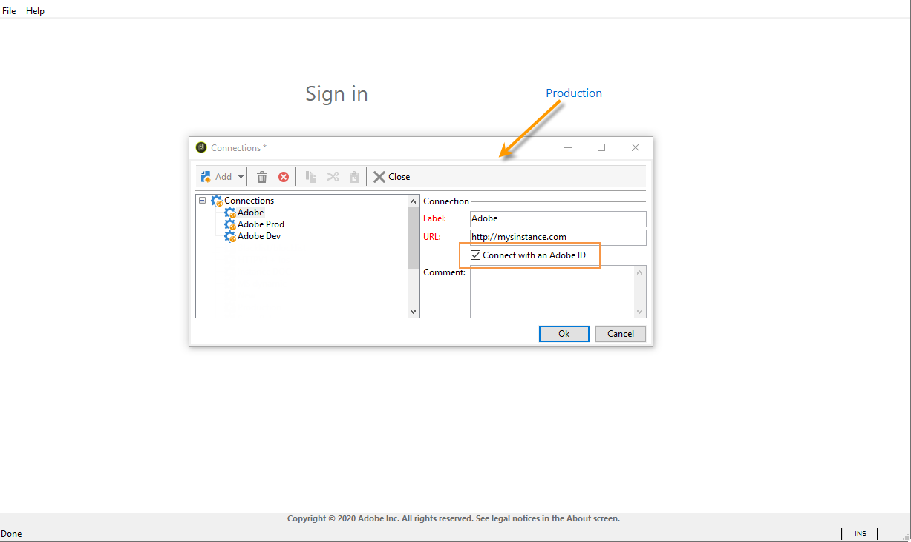
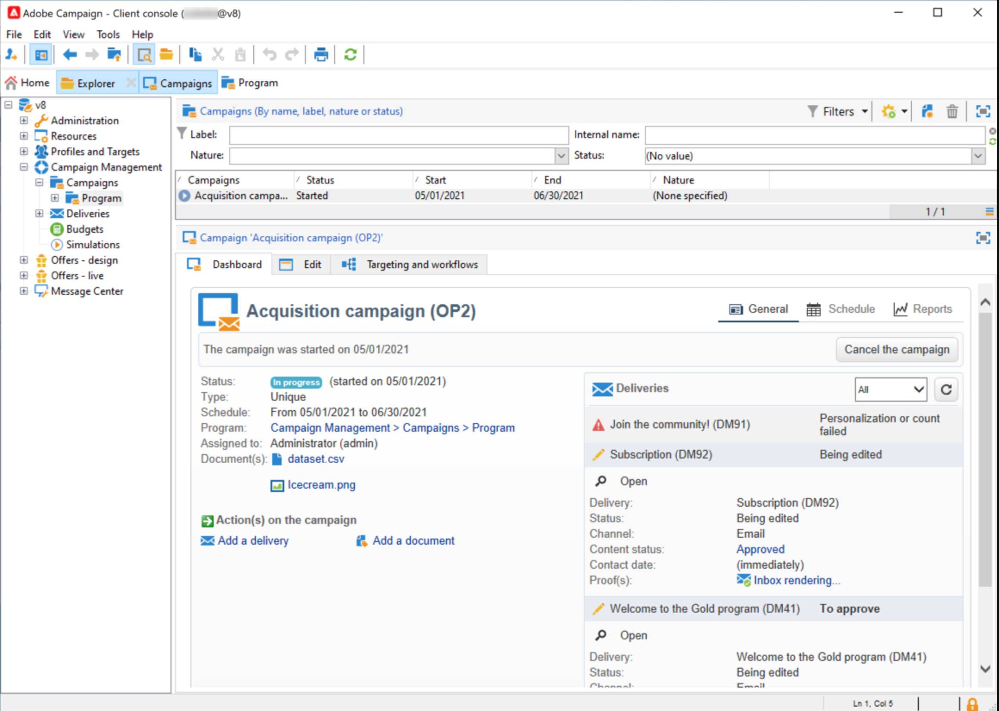
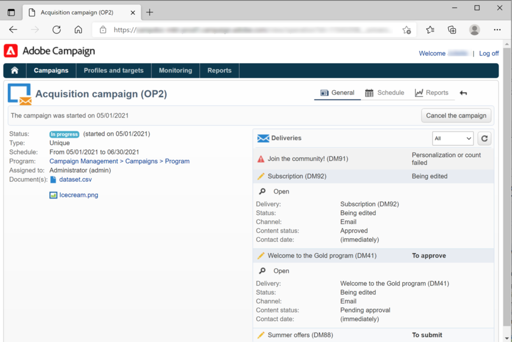
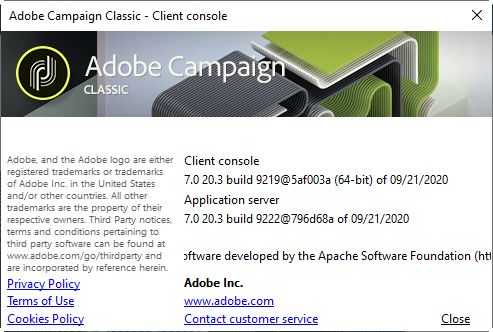
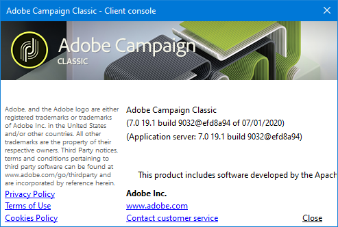

# Connect to Adobe Campaign{#launching-adobe-campaign}

Campaign Client Console is a rich client which enables you to connect to Campaign.

To connect to Adobe Campaign, you need to install the client console and enter your credentials.

## Prerequisites

Before starting to install the client console, you need to:

* Check your system and tools compatibility with Adobe Campaign in the **Compatibility matrix**
   
   For Campaign Classic v7 compatibility matrix, [refer to this page](../../../v7/rn/using/compatibility-matrix.md)

   For Campaign v8 compatibility matrix, [refer to this page](../../../v8/start/compatibility-matrix.md)

* Get your Campaign server URL
* Get your user credentials

The process to install or update the client console differs depending on your implementation  and your version of Adobe Campaign.

* As a Campaign Classic v7 or Campaign v8 **Managed Services (hosted) customer**, you have two options to install or update your client console(s):

   1. Adobe can deploy the console for you: once the console is available, users will be able to log in or, if Campaign is already installed, they will be prompted to download the latest client console version in a pop-up window. 

   1. You can download and install Campaign client console. [Learn more](#download-client).
   
* As a Campaign Classic v7 **hybrid or on-premise customer**, users need to download and install the client console to log in. [Learn more](#download-client).

## Download the client console {#download-client}

As an admin user, you can download Campaign client console by browsing to [Adobe Software Distribution](https://experience.adobe.com/#/downloads/content/software-distribution/en/campaign.html). 

The client console installation file is called `setup-client-7.X.XXXX.exe` for v7 or `setup-client-8.X.XXXX.exe` for v8, where X is the sub-version of Adobe Campaign and XXXX is the build number. [Learn more about Campaign versions](#getting-your-campaign-version).


>[!CAUTION]
>
>Admin access is required access to complete the update. If the users do not have admin rights, a system administrator will need to deploy the client console.

## Share the client console with end-users

Every Campaign user need to install the client console. You can make the client console installation program available to end-users via an HTML interface. 

To do this, [download the client console](#download-client), and:

1. Copy and paste the installation program into the Adobe Campaign installation folder (on the marketing server for hybrid installations), under /datakit/nl/eng/jsp.

1. Start Adobe Campaign server.

1. Share the URL with users so that they can download Campaign client console. The URL is:  `https://<your adobe campaign server>:<port number>/nl/jsp/logon.jsp`

Repeat these steps whenever a new version of the client console is available: users will be invited to download it when launching their client console.

**No longer ask this question option**

Adobe recommends leaving the option **[!UICONTROL No longer ask this question]** unselected to make sure that all users are alerted when a new version of the console is available.  If this option is selected the user will not be informed of new available versions.

If **[!UICONTROL No longer ask this question]**  has been selected, you can reset this prompt. Only system administrators comfortable with editing Windows Registry should make these changes:

1. Open Registry Editor using the **regedit** command from the **[!UICONTROL Start > Run]** menu.

1. Search for the node and expand it.

   ```
   \HKEY_CURRENT_USER\Software\Neolane\NL_6\nlclient
   ```

1. Delete the **confAdvisedUpgrade** entry and close Registry Editor.

>[!NOTE]
>
>If you are applying an updated console to an existing implementation, the users will automatically recieve a prompt to update their client console. If you are implementing Campaign for the first time, users will need to download the console. Please see below for details on both options


## Install the console{#download-the-client-console}

Users can install the console by following the steps below:

1. Access the URL to download Campaign client console. The URL is: `https://<your adobe campaign server>:<port number>/nl/jsp/logon.jsp`
1. Click the **[!UICONTROL Download]** link on the installation page.
1. Download and save the client setup file.
1. Execute the downloaded file on a computer on Windows: The installation starts up. The default installation path of the client console is **$PROGRAMFILES$/Adobe/Adobe Campaign `[version]` Client**.

## Tutorial video: install and setup the client console

This video shows how to install and setup the Adobe Campaign Client.

>[!VIDEO](https://video.tv.adobe.com/v/35124?quality=12)


## Start Adobe Campaign {#starting-adobe-campaign}

You can start Adobe Campaign by selecting **[!UICONTROL Start / All Programs / Adobe Campaign v.X / Adobe Campaign client console]**.

The client console connection window lets you select or configure existing databases and connect to them.

## Set up connections {#setting-up-connections}

Use the link on the top right to access connection settings.

In the **[!UICONTROL Connections]** window, click **[!UICONTROL Add > Connection]**.

You must then define the connection settings. To do this:

1. Enter a **[!UICONTROL Label]** to assign a name to your database connection.

1. Add the address of the application server in the **[!UICONTROL URL]** field. If you do not know the connection URL, contact the administrator.

1. Check **[!UICONTROL Connect with an Adobe ID]** for the operators to connect to the console using their Adobe ID (mandatory for Campaign v8). 

   

1. Click **[!UICONTROL OK]** to validate.

## Connect to Adobe Campaign {#connecting-to-adobe-campaign}

You can connect to Adobe Campaign using your Adobe ID or your Campaign login/password (Campaign Classic v7 only).

In both cases, enter your credentials and confirm. 

The first time you access the database, your credentials are given to you by your Adobe Campaign administrator. Once you are connected, you can change your password. To perform this:

* If you are not connecting with your Adobe ID, browse to the **[!UICONTROL Tools > Change password...]** menu and change your password.

* If you are connecting with your Adobe ID, reset your password from the connection window.

💡 Details on operators and connections are available in [this section](../../../common/access/using/access-management.md).

## Web access

Certain parts of the application can be accessed via a web browser using an HTML user interface: reporting, delivery approval, instance monitoring, and more. 

The Web access provides an interface that is similar to the console but with a reduced set of functionalities.

For example, for a given operator, a campaign will show up with the following options in the console:



Whereas with Web access, the options will mainly enable viewing:



Web access is also used to in the validation process: operators can click on the approval request email and connect to Campaign through their web browser to validate or reject a delivery content or budget.

## Get your Adobe Campaign version {#getting-your-campaign-version}

The **[!UICONTROL Help > About...]** menu lets you access the following information:

* **version** number for Campaign client console and application server
* **build** number for Campaign client console and application server
* a link to contact Adobe Customer Care
* links to Adobe Privacy Policy, Terms of Use and Cookies Policy



Whenever you reach out to Adobe Customer Care team, you need to provide the version number and build number of your Adobe Campaign client console and application server.

If you are running on [Campaign [!DNL Gold Standard] version](../../rn/using/gold-standard.md), you also need to share the SHA/1 characters which are displayed in the **[!UICONTROL About]** box. As an example, for Gold **Standard 10 release**, the build number will show **build 9032&#64;efd8a94**, as shown below:



Learn more about [!DNL Gold Standard] [in this article](../../rn/using/gs-overview.md)).

**Related topics**:

* [Adobe Campaign Help and Support options](../../support.md)
* [Adobe Campaign Software Distribution](https://experience.adobe.com/#/downloads/content/software-distribution/en/campaign.html)
* [Adobe Experience Cloud Support and Expert sessions](https://helpx.adobe.com/enterprise/admin-guide.html/enterprise/using/support-for-experience-cloud.ug.html)
