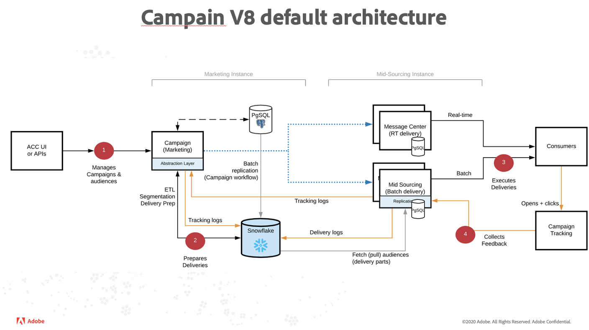

# Get Started with Campaign architecture{#gs-ac-archi}

## Mid-sourcing deployment{#mid-sourcing-deployment}

General communication between servers and processes is carried out according to the following schema:

 

* The execution and bounce management modules are disabled on the instance.

* The application is configured to perform message execution on a remote "mid-sourced" server that is driven using SOAP calls (over HTTP or HTTPS).

>[!NOTE]
>
> As an existing Campaign Classic user, note that all deliveries go through MID server. “Hybrid” is then the new Standard (and only) architecture.
> Internal routing is not available anymore and then the external account has been disabled accordingly.
>

TO BE CONTINUED...
