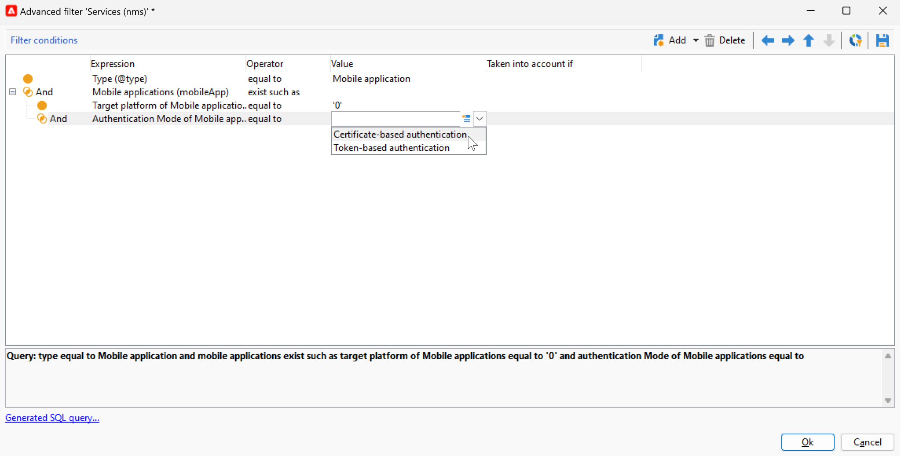

# Push Notification Channel changes {#push-upgrade}

You can use Campaign to send push notifications on iOs and Android devices. To perform this, Campaign relies on mobile application subscription services. 

Some important changes to the Android Firebase Cloud Messaging (FCM) service are released in 2024, and may impact your Adobe Campaign implementation. Your subscription services configuration for Android push messages may need to be updated to support this change.

In addition, Adobe highly recommends to move to the token-based connection to APNs rather than a certicate-based connection, which is more secure and scalable.

## Google Android Firebase Cloud Messaging (FCM) service {#fcm-push-upgrade}

### What changed? {#fcm-changes}

As part of Google's continual effort to improve its services, the legacy FCM APIs will be discontinued on **July 22, 2024**. Learn more about Firebase Cloud Messaging HTTP protocol in [Google Firebase documentation](https://firebase.google.com/docs/cloud-messaging/migrate-v1){target="_blank"}.

Adobe Campaign Classic v7 and Adobe Campaign v8 already support the latest APIs to send push notification messages. However, some old implementations still rely on the legacy APIs. These implementations must be updated.

### Are you impacted? {#fcm-impact}

If your current implementation supports subscription services connecting to FCM using the legacy APIs, you are impacted. Transition to the latest APIs is mandatory to avoid any service distruption. In that case, Adobe teams will reach out to you.

To check if you are impacted, you can filter your **Services and Subscriptions** as per the filter below:

* If any of your active push notification service uses the **HTTP (legacy)** API, your setup will be directly impacted by this change. You must review your current configurations and move to the newer APIs as described below.

* If your setup exclusively uses the **HTTP v1** API for Android push notifications, then you are already in compliance and no further action will be required on your part.

### How to update? {#fcm-transition-procedure}

#### Prerequisites {#fcm-transition-prerequisites}

* For Campaign Classic v7, the support of HTTP v1 has been added in 20.3.1 release. If your environment is running on an older version, a prerequisite for the transition to HTTP v1 is to upgrade your environment to the [latest Campaign Classic build](https://experienceleague.adobe.com/docs/campaign-classic/using/release-notes/latest-release.html){target="_blank"}. For Campaign v8, HTTP v1 is supported by all releases, and no upgrade is needed.

* The Android Firebase Admin SDK service's account JSON file is needed to have the mobile application moved to HTTP v1. Learn how to get this file in [Google Firebase documentation](https://firebase.google.com/docs/admin/setup#initialize-sdk){target="_blank"}.

* For Hybrid, Hosted and Managed Services deployments, in addition to the transition procedure below, contact Adobe to update your Real-Time (RT) execution server. The Mid-Sourcing server is not impacted.

* As a Campaign Classic v7 on-premise user, you must upgrade both the Marketing and Real-Time execution servers. The Mid-Sourcing server is not impacted.

#### Transition procedure {#fcm-transition-steps}

To move your environment to HTTP v1, follow these steps:

1. Browse to your list of **Services and Subscriptions**.
1. List all mobile applications using the **HTTP (legacy)** API version.
1. For each of these mobile applications, set the **API version** to **HTTP v1**.
1. Click the **[!UICONTROL Load project json file to extract project details...]** link to load directly your JSON key file.

   You can also enter manually the following details:
    
      * **[!UICONTROL Project Id]**
      * **[!UICONTROL Private Key]**
      * **[!UICONTROL Client Email]**

   

1. Click **[!UICONTROL Test the connection]** to check that your configuration is correct and that the marketing server has access to the FCM. Note that for Mid-Sourcing deployments, the **[!UICONTROL Test connection]** button cannot check if the server has access to the Android Firebase Cloud Messaging (FCM) service.
1. As an option, you can enrich a push message content with some **[!UICONTROL Application variables]** if needed. These are fully customizable and a part of the message payload sent to the mobile device. 
1. Click **[!UICONTROL Finish]** then **[!UICONTROL Save]**. 

   Below are the FCM payload names to further personalize your push notification. These options are detailed [here](#fcm-apps).

   | Message type | Configurable message element (FCM payload name) |  Configurable options (FCM payload name) |
   |:-:|:-:|:-:|
   | data message  | N/A  | validate_only  |
   | notification message |  title, body, android_channel_id, icon, sound, tag, color, click_action, image, ticker, sticky, visibility, notification_priority, notification_count   | validate_only |

1. Once transition HTTP v1 is done, you must update your **delivery templates** for Android push notifications to increase the number of batch messages. To do this, browse to your Android delivery template's properties and, in the **Delivery** tab, set the [Message Batch quantity](../../v8/send/configure-and-send.md#delivery-batch-quantity) to **256**. Apply this change to all Android delivery templates used for your Android deliveries, and to all your existing Android deliveries.

>[!NOTE]
>
>Once these changes are applied in all your server, all new Push notification deliveries to Android devices use the HTTP v1 API. Existing push deliveries in retry, in progress, and in use, still use the HTTP (legacy) API.

### What is the impact for my Android apps? {#fcm-apps}

There are no specific changes required to the Android Mobile applications' code and the notification behavior should not change.

However, with HTTP v1, you can further personalize your push notification with **[!UICONTROL HTTPV1 additional options]**.

You can:

* Use the **[!UICONTROL Ticker]** field to set the ticker text of your notification.
* Use the **[!UICONTROL Image]** field to set the image's URL to be displayed in your notification.
* Use the **[!UICONTROL Notification Count]** field to set the number of new unread information to display directly on the application icon.
* Set the **[!UICONTROL Sticky]** option to false so that the notification is automatically dismissed when the user clicks it. If set to true, the notification is still displayed even when the user clicks it.
* Set the **[!UICONTROL Notification Priority]** level of your notification to default, minimum, low or high. 
* Set the **[!UICONTROL Visibility]** level of your notification to public, private or secret. 

For more on the **[!UICONTROL HTTP v1 additional options]** and how to fill these fields, refer to [FCM documentation](https://firebase.google.com/docs/reference/fcm/rest/v1/projects.messages#androidnotification){target="_blank"}.

## Apple iOS Push Notification service (APNs) {#apns-push-upgrade}

### What changed? {#ios-changes}

As recommended by Apple, you should secure your communications with Apple Push Notification service (APNs) by using stateless authentication tokens.

Token-based authentication offers a stateless way to communicate with APNs. Stateless communication is faster than certificate-based communication because it doesn't require APNs to look up the certificate, or other information, related to your provider server. There are other advantages to using token-based authentication:

* You can use the same token from multiple provider servers.

* You can use one token to distribute notifications for all of your company's apps.

Learn more about Token-based connections to APNs in [Apple Developer documentation](https://developer.apple.com/documentation/usernotifications/establishing-a-token-based-connection-to-apns){target="_blank"}.

Adobe Campaign Classic v7 and Adobe Campaign v8 support both token-based and certificate-based connections. If your implementation relies on a certificate-based connection, Adobe highly recommends you to update it to a token-based connection.

### Are you impacted? {#ios-impact}

If your current implementation relies on certificate-based requests to connect to APNs, you are impacted. Transition to a token-based connection is recommended.

To check if you are impacted, you can filter your **Services and Subscriptions** as per the filter below:

* If any of your active push notification service uses the **Certificate-based authentication** mode (.p12), your current implementations should be reviewed and moved to a **Token-based authentication** mode (.p8) as described below.

* If your setup exclusively uses the **Token-based authentication** mode for iOS push notifications, then your implementation is already up-to-date and no further action will be required on your part.

### How to update? {#ios-transition-procedure}

#### Prerequisites {#ios-transition-prerequisites}

* For Campaign Classic v7, the support of **Token-based authentication** mode has been added in 20.2 release. If your environment is running on an older version, a prerequisite for this change is to upgrade your environment to the [latest Campaign Classic build](https://experienceleague.adobe.com/docs/campaign-classic/using/release-notes/latest-release.html){target="_blank"}. For Campaign v8, **Token-based authentication** mode is supported by all releases, and no upgrade is needed.

* You need an APNs authentication token signing key to generate the tokens that your server uses. You request this key from your Apple developer account, as explained in [Apple Developer documentation](https://developer.apple.com/documentation/usernotifications/establishing-a-token-based-connection-to-apns){target="_blank"}.

* For Hybrid, Hosted and Managed Services deployments, in addition to the transition procedure below, contact Adobe to update your Real-Time (RT) execution server. The Mid-Sourcing server is not impacted.

* As a Campaign Classic v7 on-premise user, you must upgrade both the Marketing and Real-Time execution servers. The Mid-Sourcing server is not impacted.

#### Transition procedure {#ios-transition-steps}

To move your iOS mobile applications to the Token-based authentication mode, follow these steps:

1. Browse to your list of **Services and Subscriptions**.
1. List all mobile applications using the **Certificate-based authentication** mode (.p12).
1. Edit each of these mobile applications, and browse to the **Certificate/Private key** tab.
1. From the **Authentication Mode** drop-down, select **Token-based authentication** mode (.p8).
1. Fill in the APNs connection settings **[!UICONTROL Key Id]**, **[!UICONTROL Team Id]** and **[!UICONTROL Bundle Id]** then select your p8 certificate by clicking **[!UICONTROL Enter the private key...]**. 

   

1. Click **[!UICONTROL Test the connection]** to check that your configuration is correct and that the server has access to APNs. Note that for Mid-Sourcing deployments, the **[!UICONTROL Test connection]** button cannot check if the server has access to APNs.
1. Click **[!UICONTROL Next]** to start configuring the production application and follow the same steps as detailed above.
1. Click **[!UICONTROL Finish]** then **[!UICONTROL Save]**. 

Your iOS application is now moved to the Token-based authentication mode.
