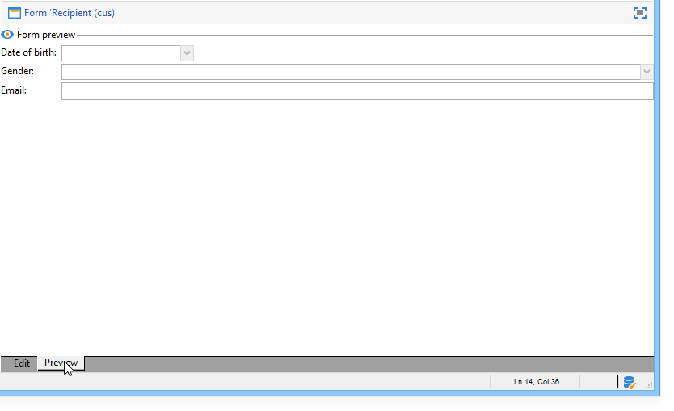

# Editing forms{#editing-forms}

The input form creation and configuration screen is accessible from the **[!UICONTROL Administration] > [!UICONTROL Configuration] > [!UICONTROL Input forms]** folder of the Adobe Campaign client console:

The editing zone lets you enter the XML content of the input form:

The preview generates a display of the input form:

