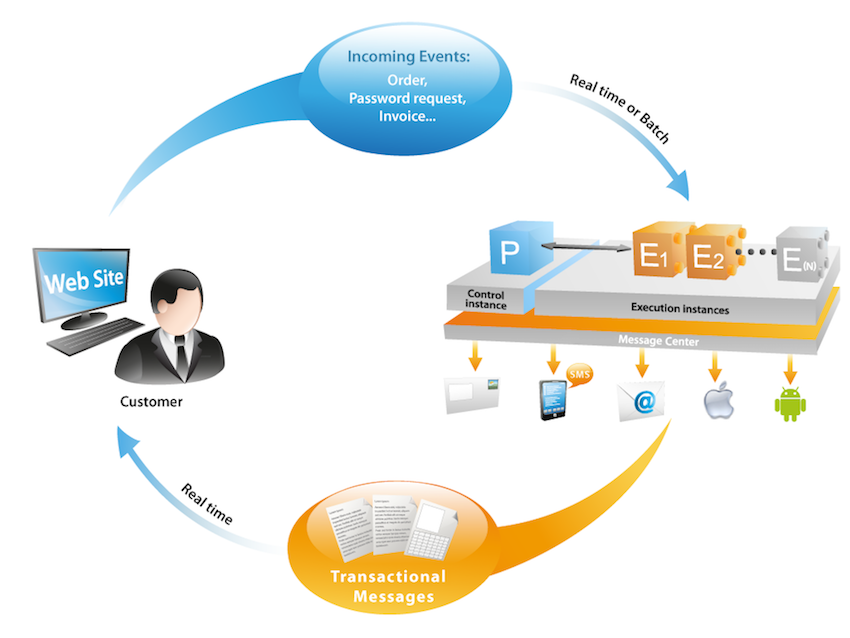

# Get Started with Campaign architecture{#gs-ac-archi}

## Environments {#environments}

Campaign is made available as individual instances with each instance representing a complete Campaign environment.

Two types of environments are available:

* **Production environment**: hosts the applications for the business practitioners.

* **Non-production environment**: used for various performance and quality tests before changes to the application are pushed to the production environment.

You can export and import packages from one environment to another.

 Learn more about packages in [Campaign Classic v7 documentation](https://experienceleague.adobe.com/docs/campaign-classic/using/getting-started/administration-basics/working-with-data-packages.html){target="_blank"}

## Deployment models{#ac-deployment}

Two deployment models are available:

* **Campaign FDA deployment**

    In its [FDA deployment](fda-deployment.md), [!DNL Adobe Campaign] v8 can be connected to [!DNL Snowflake] to access data through Federated Data Access capability: you can access and process external data and information stored in your [!DNL Snowflake] database without changing the structure of Adobe Campaign data. PostgreSQL is the primary database, and you can use Snowflake as the secondary database to extend then your data model and store your data into Snowflake. Subsequently, you can run ETL, segmentation and reports on a large data set with outstanding performances.

    >[!NOTE]
    >
    >In this deployment model, the [!DNL Snowflake] secondary database is available upon request only. To have your deployment updated with [!DNL Snowflake], contact your Adobe Technical Account Manager.
    >

* **Campaign Enterprise (FFDA) deployment**

    In the context of an [Enterprise (FFDA) deployment](enterprise-deployment.md), [!DNL Adobe Campaign] v8 works with two databases: a local [!DNL Campaign] database for the user interface real-time messaging and unitary queries and write through APIs, and a Cloud [!DNL Snowflake] database for campaign execution, batch queries and workflow execution.

    Campaign v8 Enterprise brings the concept of **Full Federated Data Access** (FFDA): all data is now remote on the Cloud Database. With this new architecture, Campaign v8 Enterprise (FFDA) deployment simplifies data management: no index is required on the Cloud Database. You just need to create the tables, copy the data and you can start. The Cloud database technology does not require specific maintenance to guarantee the level of performance.

## Split delivery execution {#split}

>[!AVAILABILITY]
>
>This feature is available to customers with multiple MID instances configurations only.

Depending on your Campaign v8 package, you are provisioned with a specific number of mid-sourcing instances in charge of executing deliveries. 

By default, the external accounts for all channels use an **[!UICONTROL Alternate]** routing mode, meaning that one delivery is sent from each mid instance at a time in an alternating way.

To ensure better performances both in terms of speed and scale, you can allow deliveries to be automatically splitted accross your mid-sourcing instances in order to be delivered faster to the recipients. This operation is transparent when executing the delivery from the marketing instance: once the delivery has been sent, all the logs are consolidated together, before being sent back to the marketing instance into a single delivery object.

To do this, additional external accounts with the **[!UICONTROL Split]** routing mode are created on provisioning for each channel:

* Split Delivery - Email (splitDeliveryEmail)
* Split Delivery - SMS (splitDeliverySMS)
* Split Delivery - iOS (splitDeliveryIOS)
* Split Delivery - Android (splitDeliveryAndroid)

 

>[!IMPORTANT]
>
>The split routing mode is enabled by default for the "Split Delivery - Email" account. For all the other channels external accounts, reach out to Customer Care to have the option enabled.
>
>By default, the threshold size value to split a delivery among multiple mids is 100K. You can change this value in the "NmsDelivery_MultiMidSplitThreshold" option in the **[!UICONTROL Administration]** / **[!UICONTROL Platform]** / **[!UICONTROL Options]** menu. 

In order to make split external accounts as the default account for sending out deliveries, you need to change the routing provider in your delivery templates. To do this, follow these steps:

1. Navigate to the **[!UICONTROL Resources]** / **[!UICONTROL Templates]** / **[!UICONTROL Delivery templates]** folder and open the desired delivery template. In this example, we want to edit the email delivery template.

     

1. Click the **[!UICONTROL Properties]** button and change the routing provider to the corresponding split delivery external account.

     

1. Save your changes. All deliveries sent using the template will now be using the split routing mode by default.

<!--In addition, you can select split external accounts as the default routing provider for all future delivery templates. To do this, change the value of the **[!UICONTROL xtkoption NmsBroadcast_DefaultProvider]** option to the name of the split account.

 -->

## Message Center architecture{#transac-msg-archi}

Transactional messaging (Message Center) is the Campaign module designed for managing trigger messages. 

 Learn how to send transactional messages in [this section](../send/transactional.md).

In response to an action of a customer on a website, an event is sent Campaign through a REST API, and the message template is populated with the information or data provided through the API call, and a transactional message is sent in real-time to the customer. These messages can be sent individually or in batches via email, SMS or push notifications. 

In this specific architecture, execution cell is separated from the control instance to ensure high availability and load management.

* The **Control instance** (or Marketing instance) is used by marketers and IT teams to create, configure and publish message templates. This instance also centralize event monitoring and history.
    
     Learn how to create and publish message templates in [this section](../send/transactional.md).

* The **Execution instance** retreives incoming events (password reset or orders from a website for example) and sends out personalized messages. There can be more than one execution instance to process messages via the load-balancer and scale the number of events to be proceeded for maximum availability.

>[!CAUTION]
>
>The control instance and the execution instance(s) must be installed on different machines. They cannot share the same Campaign instance.

### Authentication

To use these capabilities, Adobe Campaign users log on to the control instance to create transactional message templates, generate the message preview using a seed list, display reports and monitor execution instance(s).

* Single execution instance
    When interacting with an Adobe hosted Message Center execution instance, an external system can first retrieve a session token (that by default expires in 24 hours), by making an api call to the session logon method, using a provided account login and password.
    Then, with the sessionToken provided by the execution instance in response to the above call, the external application can make SOAP api invocations (rtEvents or batchEvents) to send communications, without the need to include in each SOAP call the account login and password.
 
* Multiple execution instances
    In a multi-cell execution architecture with multiple execution instances behind a load balancer, the logon method invoked by the external application is going through the load balancer: for that reason, a token-based authentication cannot  be used. A user/password-based authentication is required. 

Learn more about Transactional messaging events in [this page](../send/event-processing.md).
