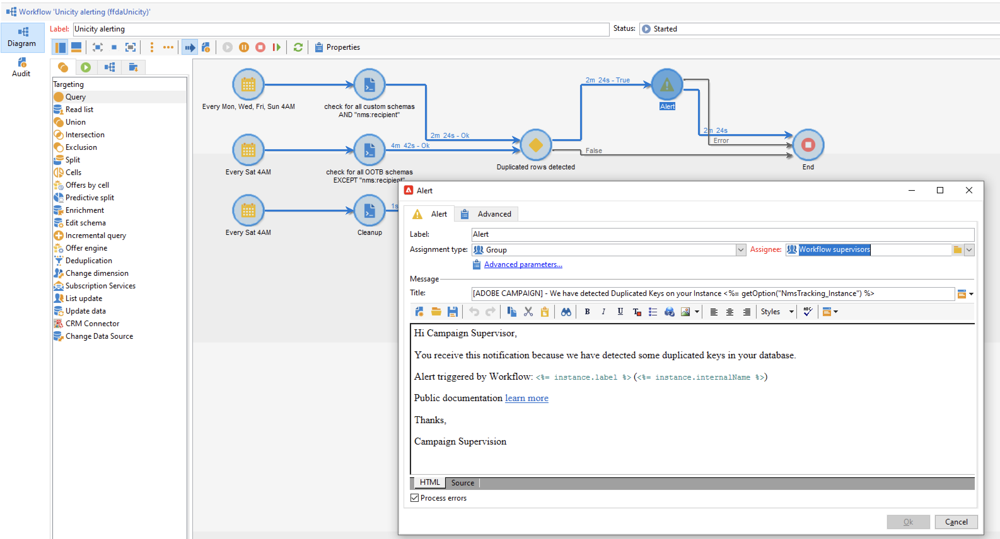
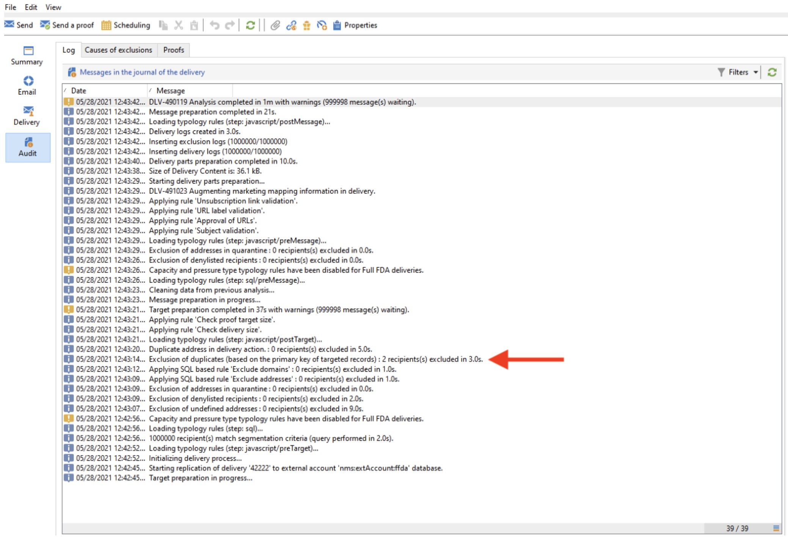
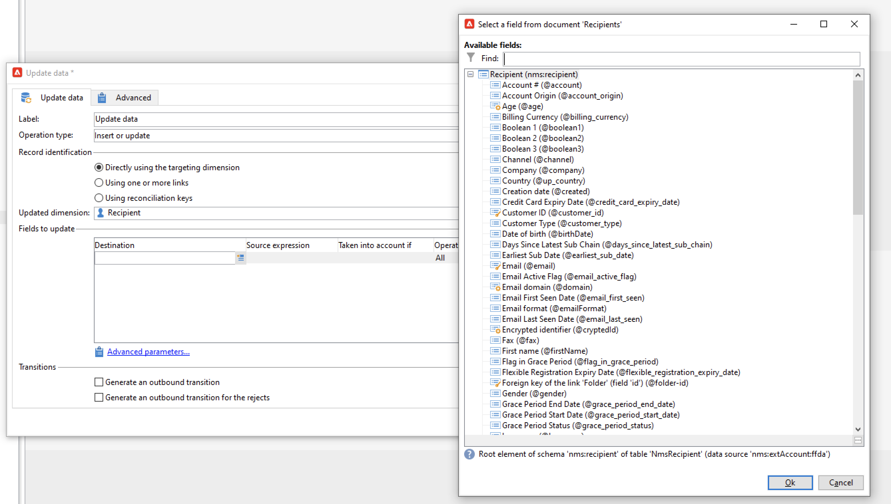

# Key management and unicity {#key-management}

In the context of an [Enterprise (FFDA) deployment](enterprise-deployment.md), the primary key is a Universally Unique IDentifier (UUID), which is a string of characters. To create this UUID, the main element of the schema must contain the **autouuid** and **autopk** attributes set to **true**.

Adobe Campaign v8 uses [!DNL Snowflake] as the core Database. The distributed architecture of the [!DNL Snowflake] database does not provide mechanism to ensure the unicity of a key within a table: end-users are responsible for key consistency within the Adobe Campaign database.

Avoiding duplicates on keys, and especially on primary keys, is mandatory to preserve relational database consistency. Duplicates on primary keys lead to issues with data management workflow activities such as **Query**, **Reconciliation**, **Update data**, and more. This critical to define proper reconciliation criteria when updating [!DNL Snowflake] tables.

>[!CAUTION]
>
>Duplicated keys is not restricted to UUIDs. It can happen in with IDs, including custom keys created in custom tables.

## Unicity Service{#unicity-service}

Unicity Service is a Cloud Database Manager component which helps users preserve and monitor the integrity of unique key constraints within Cloud Database tables. This allows you to reduce the risk of inserting duplicate keys.

As Cloud Database does not enforce unicity constraints, Unicity Service reduces the risk of inserting duplicates when managing the data with Adobe Campaign.

### Unicity workflow{#unicity-wf}

Unicity Service comes with a dedicated **[!UICONTROL Unicity alerting]** built-in workflow, to monitor unicity constraints and alert when duplicates are detected.

This technical workflow is available from the **[!UICONTROL Administration > Production > Technical workflows > Full FFDA Unicity]** node of Campaign Explorer. **It must not be modified**.

This workflow checks all custom and built-in schemas to detect duplicated rows.

If the **[!UICONTROL Unicity alerting]** (ffdaUnicity) workflow detects some duplicate keys, they are added to a specific **Audit Unicity** table, which includes the name of the schema, the type of key, the number of impacted rows, and the date. You can access duplicated keys from the **[!UICONTROL Administration > Audit > Key Unicity]** node. 

As a Database Administrator, you can use a SQL activity to remove the duplicates or contact Adobe Customer Care for more guidance.

### Alerting{#unicity-wf-alerting}

A specific notification is sent to the **[!UICONTROL Workflow Supervisors]** operator group when duplicated keys are detected. The content and the audience of this alert can be changed in the **Alert** activity of the **[!UICONTROL Unicity alerting]** workflow.

## Additional guardrails {#duplicates-guardrails}

Campaign comes with a set of new guardrails to prevent insertion of duplicated key in [!DNL Snowflake] database. 

>[!NOTE]
>
>These guardrails are available starting Campaign v8.3. To check your version, refer to [this section](../start/compatibility-matrix.md#how-to-check-your-campaign-version-and-buildversion)

### Delivery preparation {#remove-duplicates-delivery-preparation}

Adobe Campaign removes automatically any duplicated UUID from an audience during delivery preparation. This mechanism prevents any error from happening while preparing a delivery. As an end-user, you can check this information in the delivery logs: some recipients can be excluded from the main target because of duplicated key. In that case, the following warning is displayed: `Exclusion of duplicates (based on the primary key or targeted records)`.

### Update data in a workflow {#duplicates-update-data}

In the context of an [Enterprise (FFDA) deployment](enterprise-deployment.md), you cannot select an internal key (UUID) as field to update data in a workflow. 

### Query a schema with duplicates {#query-with-duplicates}

When a workflow starts running query on a schema, Adobe Campaign checks if any duplicated record is reported in the [Audit Unicity table](#unicity-wf). If so, workflow logs a warning as the subsequent operation on the duplicated data should potentially impact workflow result.

This check is performed in the following workflow activities:

* Query
* Incremental Query
* Read list

>[!NOTE]
>
>If your are transitioning from another Campaign version, it is imperative to remove duplicates, troubleshoot and sanitize data to avoid impacting your transition.
