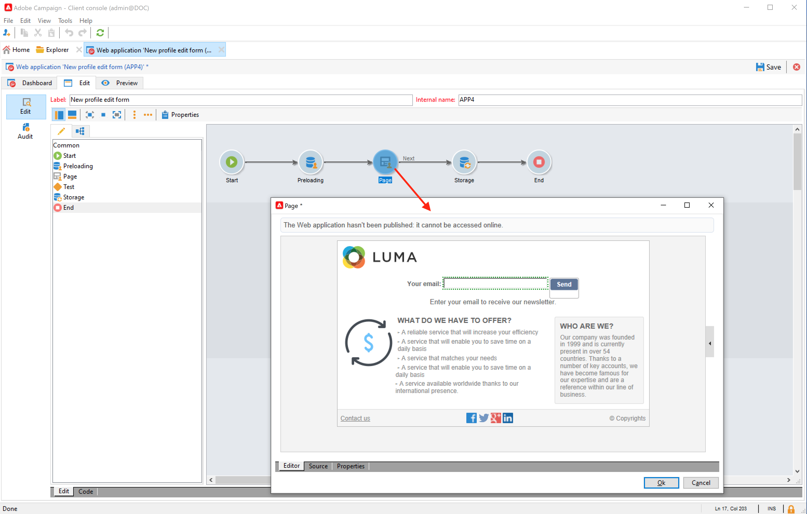

# Collect and update profiles with web forms

Use Campaign to create web forms and collect and manage profile data easily and efficiently. You can share these forms into your website, which makes it easy for your contacts to provide their information. Data is sent to Campaign to create or update their profile.

 

Learn how to create web forms in [Campaign Classic v7 documentation](https://experienceleague.adobe.com/docs/campaign-classic/using/designing-content/web-forms/about-web-forms.html){target="_blank"}.
