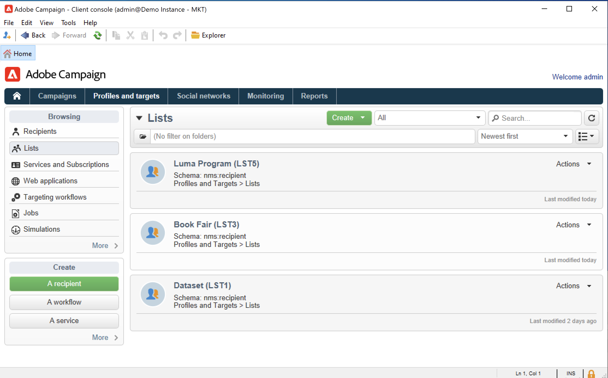
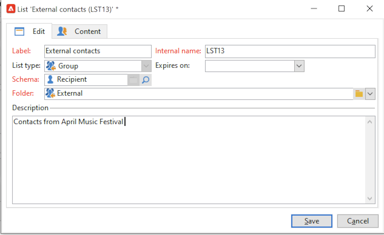
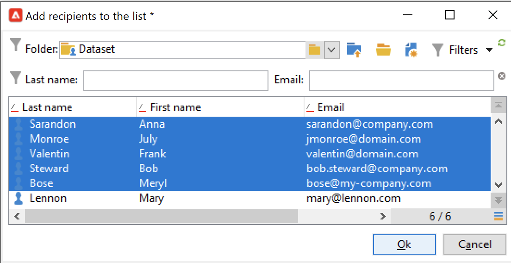
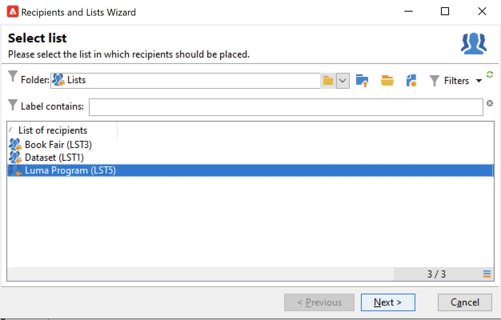
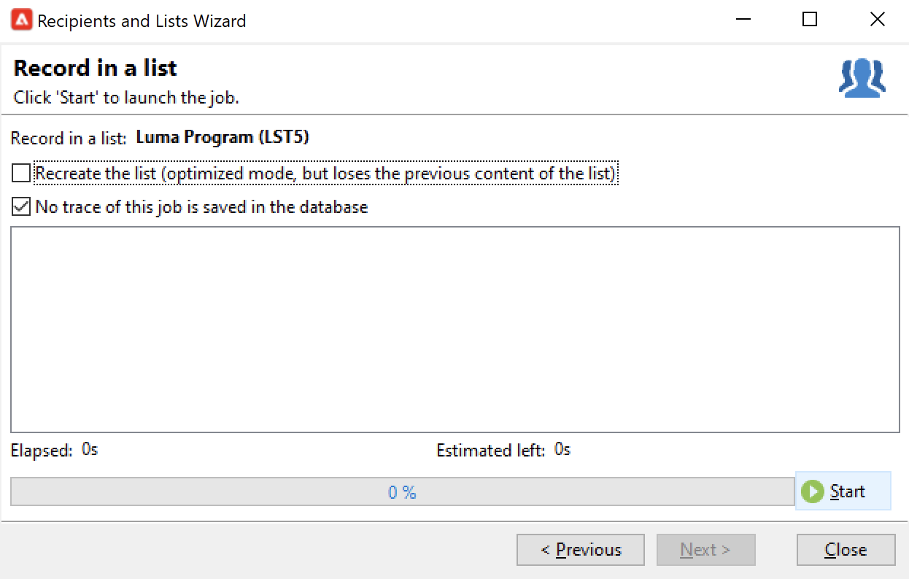
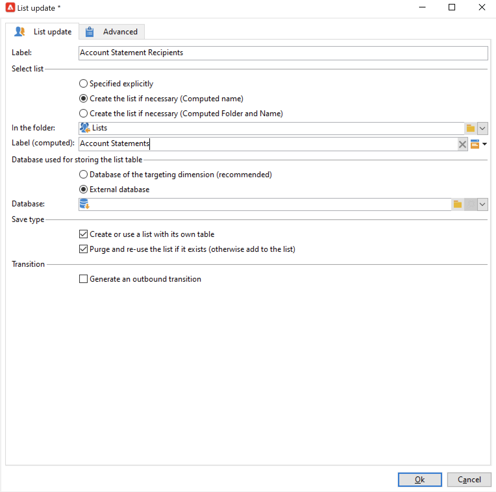
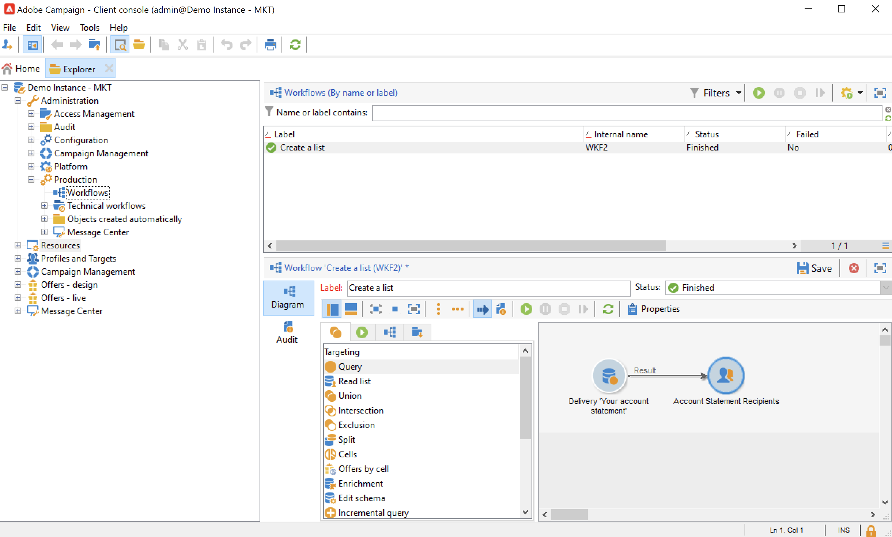

# Create an audience in a list{#create-segments}

Use Campaign lists to create and organize your audiences.

A list is a static set of contacts which can be targeted in delivery actions or updated during an import or another workflow action. For example, a population extracted from the database via a query can be stored as a list.

Lists are created and managed via the **[!UICONTROL Lists]** link in the **[!UICONTROL Profiles and targets]** tab. These list must be based on the default Adobe Campaign profile table (nms:recipient). [Learn more](../dev/datamodel#ootb-profiles.md)

>[!NOTE]
>
>To create lists containing other types of data, you must run a workflow. For example, by using a query on the visitor table then updating the list, you can create a visitor list. [Learn more](.#create-a-list-wf).

<!--

Two types of lists are available in Adobe Campaign:

* **[!UICONTROL Group]** type: The **[!UICONTROL Group]** type lists belong to a **static** list of people selected according to specific criteria. The list is like a snapshot of a set of profiles. Please note that it is not updated automatically in the event of profiles being added to the database.

  For more information on how to create a **[!UICONTROL Group]** type list, refer to this [page](#creating-a-profile-list-from-a-group).

* **[!UICONTROL List]** type: The **[!UICONTROL List]** type lists allows you to use workflows to create and manage lists. These will be specific lists resulting from data imports, that can be updated via the dedicated **[!UICONTROL List update]** workflow activity.

  Unlike the **[!UICONTROL Group]** type list, this type list can be automatically updated with a **[!UICONTROL Scheduler]** activity. Note that For an example on how to create **[!UICONTROL List]** type lists, refer to [this page](../../workflow/using/list-update.md).

 [Discover this feature in video](#create-list-video)
--> 

## Create a list of contacts {#create-a-list-of-contacts}

To create a list of contacts, follow the steps below: 

1. Click the **[!UICONTROL Create]** button and select **[!UICONTROL New list]**.
    
    

1. Enter the information in the **[!UICONTROL Edit]** tab of the list creation window.

    * Enter the list name in the **[!UICONTROL Label]** field and, if necessary, change the internal name.
    * Add a description for this list.
    * You can specify an expiration date: when this date is reached, the list is purged and automatically deleted.
    
      

1. In the **[!UICONTROL Content]** tab, click **[!UICONTROL Add]** to select the profiles belonging to the list.

   

   You can create a new profile and add it in the list directly from this window using the **[!UICONTROL Create]** icon. The profile will be added to the database.

1. Click **[!UICONTROL Save]** to save the list. It is then added to the overview of lists.

## Convert filtered contacts to a list {#convert-data-to-a-list}

You can select profiles and add them to a list. To perform this, follow the steps below:

1. From Campaign Explorer, select profiles and right-click. 
1. Select **[!UICONTROL Actions > Associate selection with a list...]**.

   

1. Select an existing list or create a new list, and click **[!UICONTROL Next]**.

   

1. Click the **[!UICONTROL Start]** button.

   

Select the **[!UICONTROL Recreate the list]** option to delete the existing content from the list and optimize the creation of the list (no query is needed to verify whether the profiles are already linked to the list).

If you uncheck the **[!UICONTROL No trace of this job is saved in the database]** option, you can select (or create) the execution folder where the information linked to this process will be stored.

The upper section of the window lets you monitor execution. The **[!UICONTROL Stop]** button lets you stop the process. Contacts already processed will be linked to the list.

Once the execution is finished, access the **[!UICONTROL Profiles and Targets > Lists]** menu and select the list: the **[!UICONTROL Content]** tab shows the profiles linked to this list.

## Create a list with a workflow  {#create-a-list-wf}

You can use the **[!UICONTROL List update]** activity to a population in a list of recipients.

In the example below, you create a list of all the recipient of a specific delivery. .

1. Add a **[!UICONTROL list update activity]** directly after a query then open it up to edit it.
1. You may select a label for the activity.
1. Select the **[!UICONTROL Create the list if necessary (Computed name)]** option to show that the list will be created once the first workflow has been executed, then updated with the following executions.
1. Select the folder where you wish to save the list.
1. Enter a label for the list. 
   
1. Leave the **[!UICONTROL Purge the list if it exists (otherwise add to the list)]** option checked to delete recipients that do not match the targeting criteria and to insert the new ones into the list.
1. Also leave the **[!UICONTROL Create or use a list with its own table]** option checked.
1. Leave the **[!UICONTROL Generate an outbound transition]** option unchecked.
1. Click **[!UICONTROL Ok]** then start the workflow.

   

   The list of matching recipients is then created or updated.

## Remove a profile from a list {#remove-a-profile-from-a-list}

To remove a profile from a list, edit the list, select the profile in the **[!UICONTROL Content]** tab, then click the **[!UICONTROL Delete]** icon.

## Delete a list of profiles {#delete-a-list-of-profiles}

To delete a list, browse to it from Campaign Explorer, select it and right-click. Choose **[!UICONTROL Delete]**. A warning message asks you to confirm the deletion.

>[!NOTE]
>
>When you delete a list, the profiles on the list are not affected but the data in their profile is updated.

## Tutorial videos {#create-list-videos}

### How to create a list of recipients

A list is a static set of recipients that can be targeted in delivery actions or updated during import operations or during workflow execution. A list of recipients is also referred to as audience.

Learn how to create an audience by configuring a list of recipients from the Explorer.

>[!VIDEO](https://video.tv.adobe.com/v/25602/quality=12)

### How use a workflow to create a list of recipients {#create-list-in-a-wf-video}

Learn how create a workflow in order to target recipients and how to make it recurring before using the list in an email target.

>[!VIDEO](https://video.tv.adobe.com/v/25603?quality=12)

Additional Campaign Classic how-to videos are available [here](https://experienceleague.adobe.com/docs/campaign-classic-learn/tutorials/overview.html).
