# Create and manage filters{#create-filters}

Data filtering is the process of selecting a smaller part of your data set, only those records that match certain criteria, and using that subset for specific actions (updates, audiences creation) or analysis.

When browsing Campaign from the **[!UICONTROL Explorer]**, the data is displayed in lists. You can use existing built-in filters to access a specific sub-set of this data: quarantined addresses, untargeted recipients, a specific age range or creation date for example.

You can also create your own filters, save them for future use or share them with other Campaign users. 

Filter configuration lets you select data from a list **[!UICONTROL dynamically]**: when the data is modified, the filtered data is updated.

>[!NOTE]
>
>User interface configuration settings are defined locally at the device level. It may sometimes be necessary to clean up this data, particularly if problems arise when refreshing data. To do this, use **[!UICONTROL File > Clear the local cache]** menu.

The following types of filter are available in Adobe Campaign:

## Predefined filters{#predefined-filters}

Predefined filters are available from the **Filters** button above each list.

For example, for the profiles, the following built-in filters are available:
  
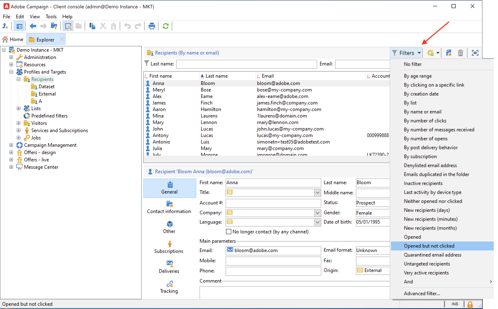

You can access the filters details in the **[!UICONTROL Profiles and Targets > Pre-defined filters]** node of the Explorer.

>[!NOTE]
>
>For all other lists of data, predefined filters are stored in the  **[!UICONTROL Administration > Configuration > Predefined filters]** node.

Select a filter to display its definition.

Use the last tab to preview the filtered data.

Built-in predefined filters are:

<table> 
 <tbody> 
  <tr> 
   <td> <strong>Label</strong>  </td> 
   <td> <strong>Query</strong>  </td> 
  </tr> 
  <tr> 
   <td> Opened  </td> 
   <td> Selects recipients who have opened a delivery.  </td> 
  </tr> 
  <tr> 
   <td> Opened but not clicked  </td> 
   <td> Selects recipients who have opened a delivery but have not clicked on a link.  </td> 
  </tr> 
  <tr> 
   <td> Inactive recipients  </td> 
   <td> Selects recipients who have not opened a delivery in X months.  </td> 
  </tr> 
  <tr> 
   <td> Last activity by device type  </td> 
   <td> Selects recipients who have clicked or opened delivery Y using device X in the last Z days.  </td> 
  </tr> 
  <tr> 
   <td> Last activity by device type (Tracking)  </td> 
   <td> Selects recipients who have clicked or opened delivery Y using device X in the last Z days.  </td> 
  </tr> 
  <tr> 
   <td> Untargeted recipients  </td> 
   <td> Selects recipients who have never been targeted via channel Y in X months.  </td> 
  </tr> 
  <tr> 
   <td> Very active recipients  </td> 
   <td> Selects recipients who have clicked in a delivery at least X times in the last Y months.  </td> 
  </tr> 
  <tr> 
 <td> Denylisted email address  </td> 
    <td> Selects recipients whose email address is on the denylist.  </td>
  </tr> 
  <tr> 
   <td> Quarantined email address  </td> 
   <td> Selects recipients whose email address is quarantined.  </td> 
  </tr> 
  <tr> 
   <td> Email addresses duplicated in the folder  </td> 
   <td> Selects recipients whose email address is duplicated in the folder.  </td> 
  </tr> 
  <tr> 
   <td> Neither opened nor clicked  </td> 
   <td> Selects recipients who have not opened a delivery, or clicked in a delivery.  </td> 
  </tr> 
  <tr> 
   <td> New recipients (days)  </td> 
   <td> Selects recipients that were created in the last X days.  </td> 
  </tr> 
  <tr> 
   <td> New recipients (minutes)  </td> 
   <td> Selects recipients that were created in the last X minutes.  </td> 
  </tr> 
  <tr> 
   <td> New recipients (months)  </td> 
   <td> Selects recipients that were created in the last X months.  </td> 
  </tr> 
  <tr> 
   <td> By subscription  </td> 
   <td> Selects recipients by subscription.  </td> 
  </tr> 
  <tr> 
   <td> By clicking on a specific link  </td> 
   <td> Selects recipients who clicked on a particular URL in a delivery.  </td> 
  </tr> 
  <tr> 
   <td> By post delivery behavior  </td> 
   <td> Selects recipients according to their behavior after receiving a delivery.  </td> 
  </tr> 
  <tr> 
   <td> By creation date  </td> 
   <td> Selects recipients by creation date, over a period ranging from X months (current date minus n months) to Y months (current date minus n months).  </td> 
  </tr> 
  <tr> 
   <td> By list  </td> 
   <td> Selects recipients by list.  </td> 
  </tr> 
  <tr> 
   <td> By number of clicks  </td> 
   <td> Selects recipients who clicked in a delivery in the last X months.  </td> 
  </tr> 
  <tr> 
   <td> By number of messages received  </td> 
   <td> Selects recipients according to the number of messages that they received.  </td> 
  </tr> 
  <tr> 
   <td> By number of opens  </td> 
   <td> Selects recipients who opened between X and Y deliveries over Z amount of time.  </td> 
  </tr> 
  <tr> 
   <td> By name or email  </td> 
   <td> Selects recipients according to their name or email.  </td> 
  </tr> 
  <tr> 
   <td> By age range  </td> 
   <td> Selects recipients according to their age.  </td> 
  </tr> 
 </tbody> 
</table>

### Default filters{#default-filters}

The fields above each list lets you use the **predefined default filter** for this list. For the recipient list, you can filter on the name and email address by default. 

>[!NOTE]
>
>The **%** character replaces any character string. For example, enter `%@gmail.com` in the Email field to display all the profiles with a Gmail address. Enter `%@L` in the Last name field to display all the profiles with a L in their last name.

To change the default filter for a recipient list, browse to the **[!UICONTROL Profiles and Targets > Predefined filters]** node.

For all other types of data, configure the default filter via the **[!UICONTROL Administration > Configuration > Predefined filters]** node.

Apply the following steps:

1. Select the filter you want to be used by default.
1. Click the **[!UICONTROL Parameters]** tab and select **[!UICONTROL Default filter for the associated document type]**.

   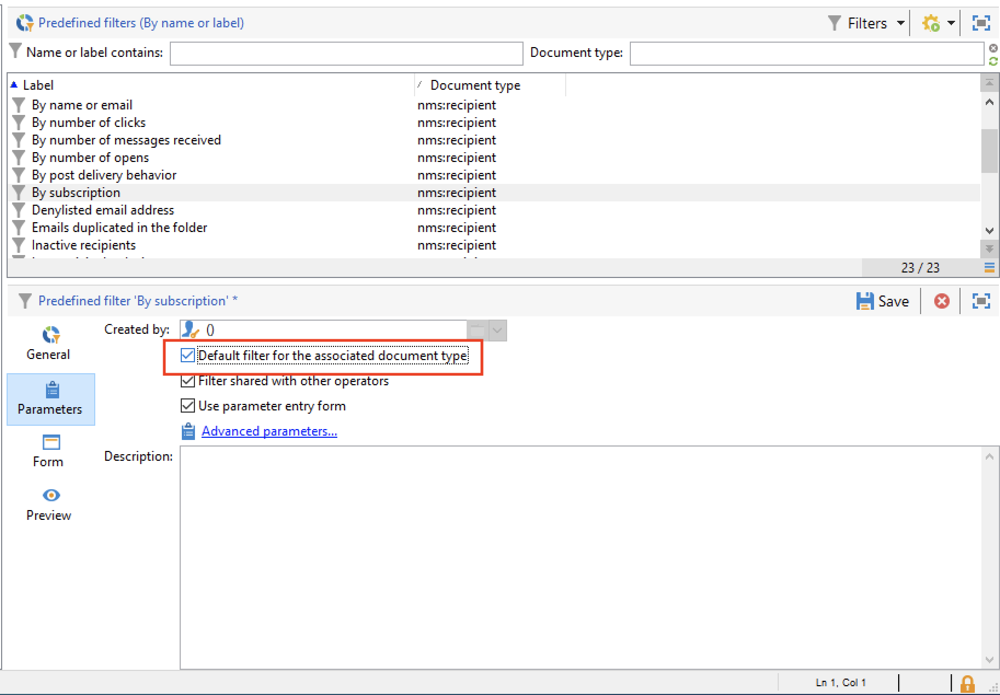

1. Uncheck that same option for the current default predefined filter.
1. Click **[!UICONTROL Save]** to apply the filter.
1. Browse to the Recipient folder and click the **[!UICONTROL Remove this filter]** icon on the right of the current filter: the new default filter is available. 
   

## Quick filters{#quick-filters}

Use and combine **Quick filters** to define filters on specific fields. 

Once added, quick filter fields are displayed above the data list, one after the other. They can be deleted independently of each other.

Quick filters are specific to each operator and are re-initialized each time the operator clears the cache of their client console.

If you need to reuse a filter, create an **advanced filter** and save it. [Learn more](#advanced-filters).

To create a **quick filter**, follow the steps:

1. Right-click the field you want to filter and select **[!UICONTROL Filter on this field]**.

   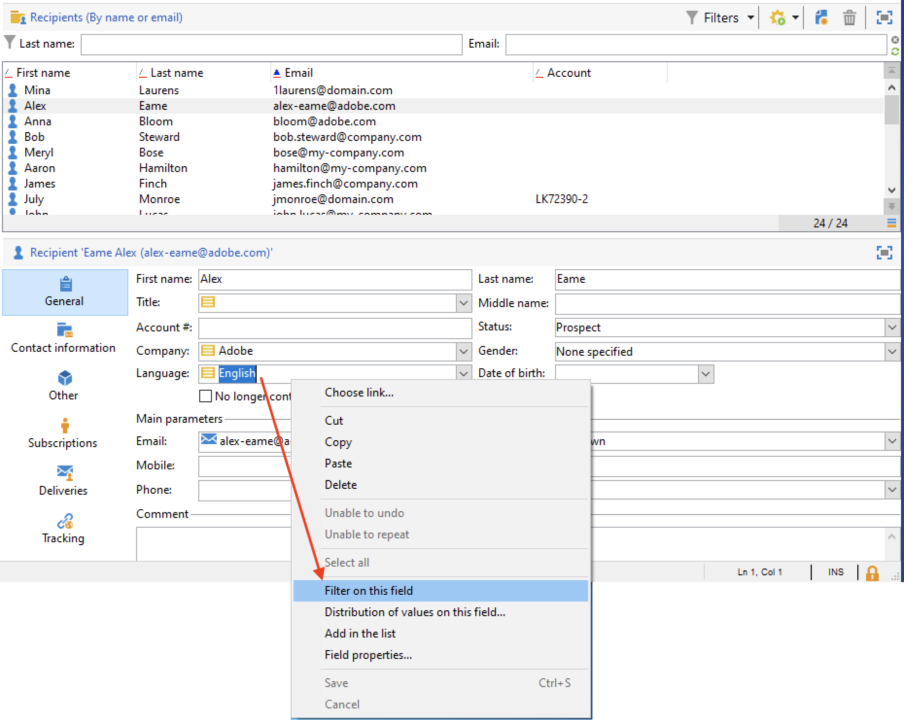

   The default filter fields are displayed above the list.

   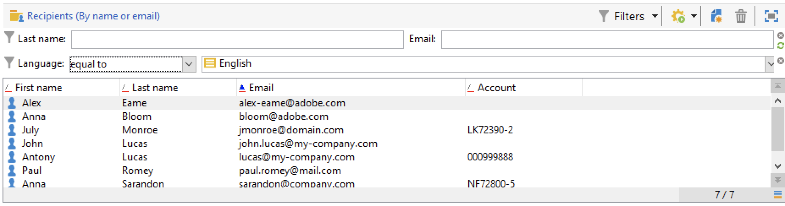

1. Select the filter options.
1. If needed, use the grey icon on the right side of a filter to remove it.
1. You can combine filters to refine your filter.

   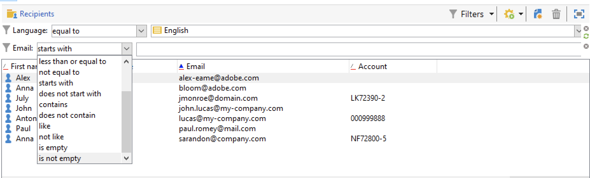

If you need to filer on a field which is not available in the form, it in the columns, and filter on that column. To do this,

1. Click the **[!UICONTROL Configure list]** icon.

   

1. Select the column to display, for example the age of the recipients, and click **Ok**.

   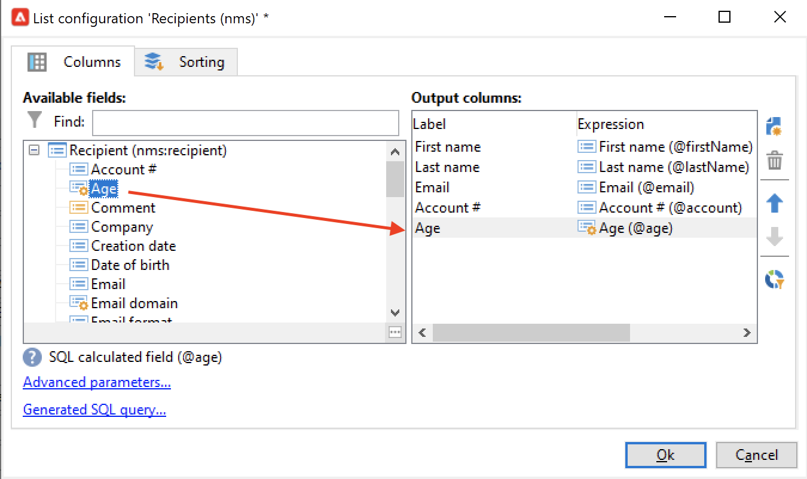

1. Right-click the **Age** column in the recipient list, and select **[!UICONTROL Filter on this column]**.

   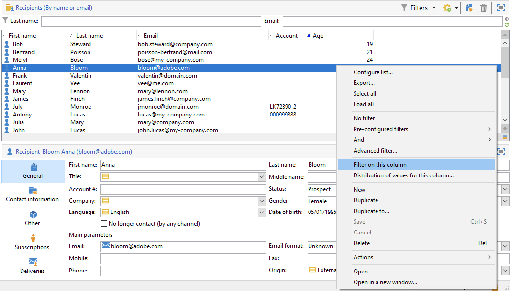

   You can then select the age filtering options. Add another filter on the age to define a range.

   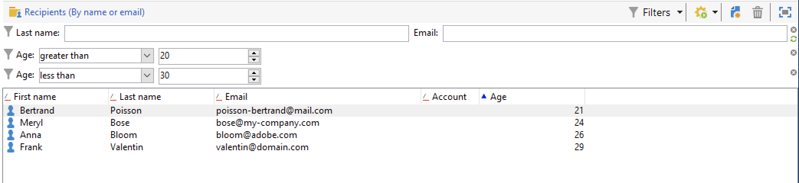

## Advanced filters{#advanced-filters}

Combine complex criteria in **Advanced filters**. Use these filters to create a complex query or a combination of queries on your data. These filters can be saved and shared with other Campaign users.

### Create an advanced filter{#create-adv-filters}

To create an **advanced filter**, click the **[!UICONTROL Filters]** button and select **[!UICONTROL Advanced filter...]**. 

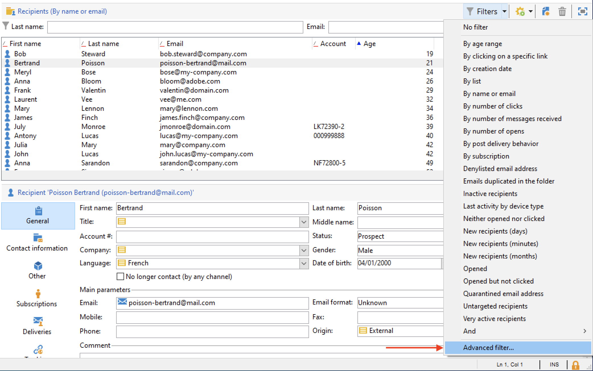

You can also right-click the list of data and select **[!UICONTROL Advanced filter...]**.

Define the filtering conditions. In the example below, you will filter on recipients whose Account number does not start with NL, and who live in Paris or Los Angeles.

1. Click the **[!UICONTROL Edit expression]** icon of the **[!UICONTROL Expression]** column.

   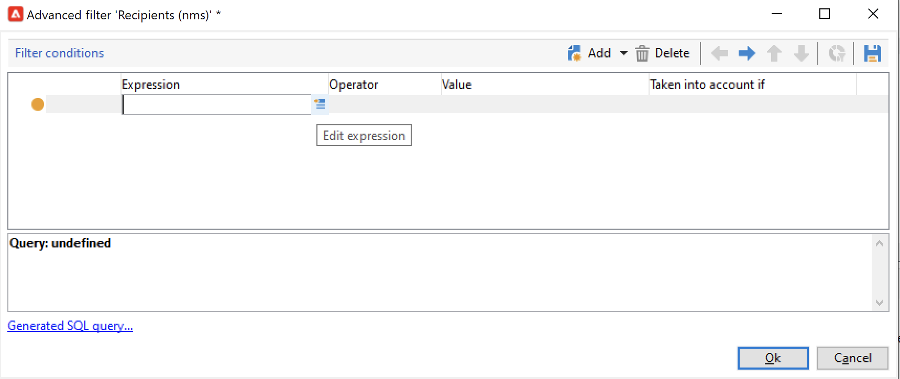

1. Select the field to filter on.
1. Select the operator to be applied from the drop-down list.

   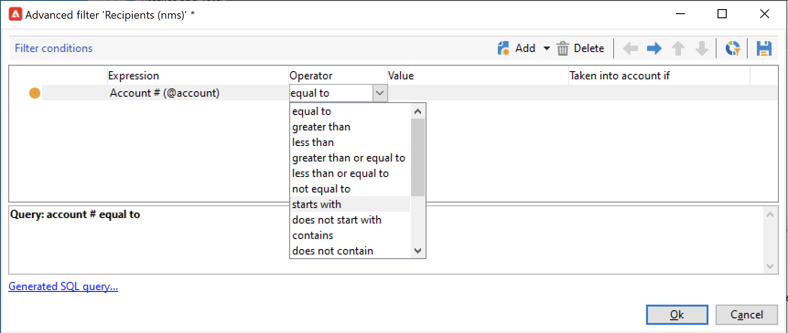

1. Select an expected value from the **[!UICONTROL Value]** column. You can combine several filters to refine your query. To add a filter condition, click **[!UICONTROL Add]**.

   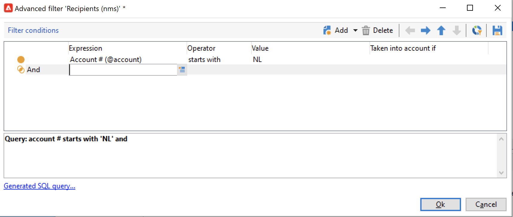

    >[!NOTE]
    >
    >You can assign a hierarchy to the expressions or change the order of the query expressions using the toolbar arrows.

1. Three operators are available to combine expressions:  **And**, **Or**, **Except**. Click the arrow to switch to **Or**.

   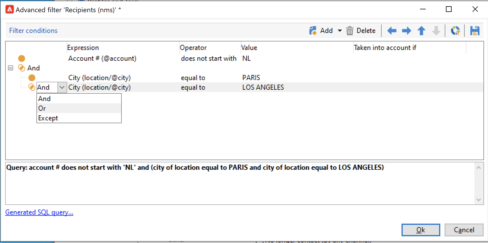

1. Click **[!UICONTROL Ok]** to create the filter and apply it to the current list.

The filter applied is displayed above the list.

To edit or modify this filter, click its description link in blue, above the list.

### Save an advanced filter{#save-adv-filters}

You can save an advanced filter as a  [predefined filter](#predefined-filters), so that you can reuse it and share it with the other Campaign users.

To save an advanced filter, follow the steps below:

1. Click the description of the filter to edit it.
1. Click the **[!UICONTROL Save as filter]** icon on the upper right section of the window.

   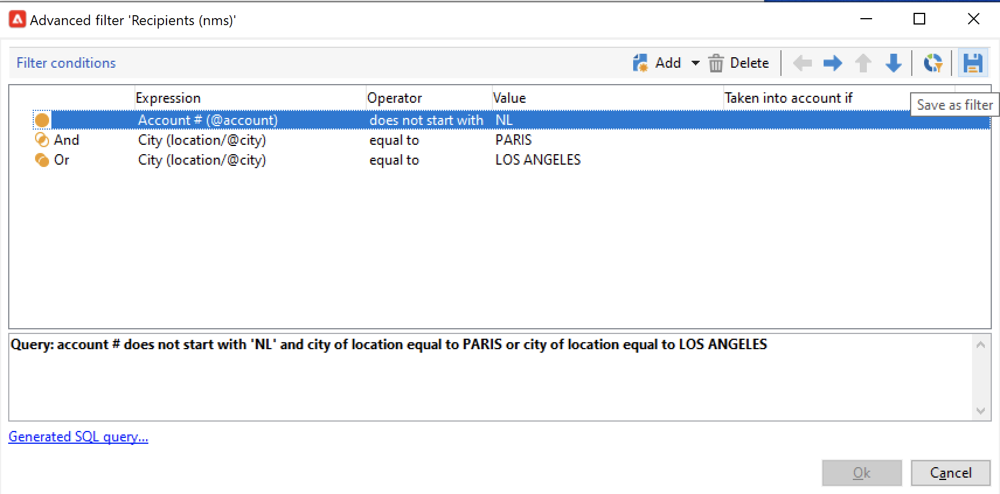

1. Enter a name for this filter and save it.

   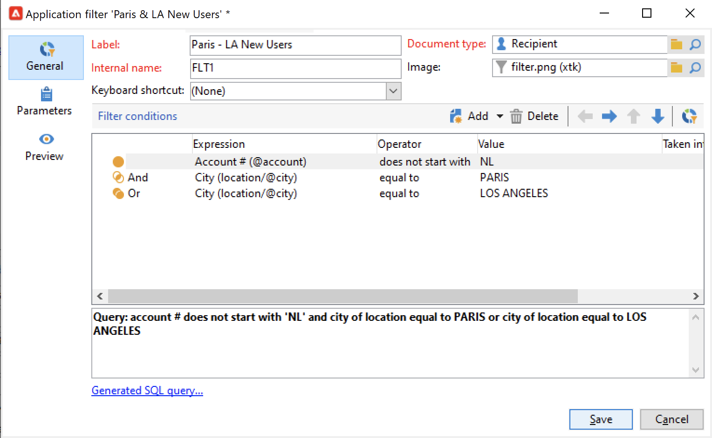

The filter is added to the [predefined filters](#predefined-filters). It can be updated from this node.

>[!NOTE]
>
>You can add a shortcut for your filter to activate it from your keyboard. 

This filter is also available from the predefined filters of the recipient list.

### Use a filter to define a segment {#filter-as-segment}

You can use and combine filters to create a target population segment.

Once saved, advanced filters are available when selecting the target population of a message, in the **[!UICONTROL User filters]** section.

>[!NOTE]
>
>Use the **[!UICONTROL Exclude recipients from this segment]** to target only contacts who do not match the filter criteria.

### Use functions to build advanced filters{#use-functions-adv-filters}

To perform advanced filtering capabilities, use functions to define the content of the filter. The Advanced filter editor leverages all capabilities of Campaign query editor.  

Learn how to build advanced queries in these end-to-end samples:

* Learn how to target on simple recipient attributes in [this page](https://experienceleague.adobe.com/docs/campaign/automation/workflows/wf-activities/targeting-activities/query.html){target="_blank"}.
* Learn how to filter on recipients not contacted during the last 7 days in [this page](https://experienceleague.adobe.com/docs/campaign/automation/workflows/use-cases/designing-queries/query-many-to-many-relationship.html){target="_blank"}.
* Learn how to recover the list of operators can be filtered by Active accounts in [this page](https://experienceleague.adobe.com/docs/campaign/automation/workflows/use-cases/designing-queries/create-a-filter.html){target="_blank"}.
* Learn how to build a birthday email audience in  [this page](https://experienceleague.adobe.com/docs/campaign/automation/workflows/use-cases/deliveries/send-a-birthday-email.html){target="_blank"}.

### Advanced parameters for predefined filters {#param-for-data-filters}

Advanced parameters are available for predefined filters. To access them, browse to the **[!UICONTROL Parameters]** tab of the filter.

* To display the filter by default for all the lists based on this Document type, select the **[!UICONTROL Default filter for the associated document type]** option.

  For example, the **[!UICONTROL By name or login]** filter is applied to operators This option is selected, so the filter is always displayed on all operator lists.

* To make a filter available to all Campaign operators, select the  **[!UICONTROL Filter shared with other operators]** option.

* To define a form to select the filtering criteria, select the  **[!UICONTROL Use parameter entry form]** option. This form must be entered in XML format in the **[!UICONTROL Form]** tab. For example, the built-in predefined filter **[!UICONTROL Recipients who have opened]**, available from the recipients list, displays a filter field that lets you select the delivery to which the filter applies to.

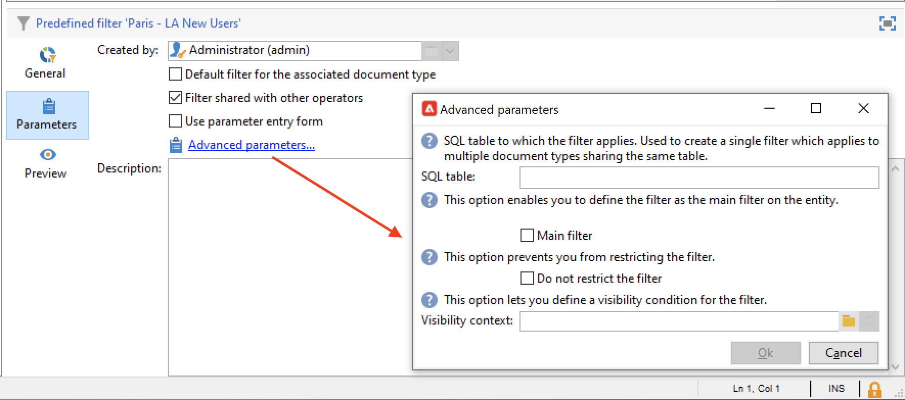

* The **[!UICONTROL Advanced parameters]** link lets you define additional settings. 
    
    * You can associate a SQL table with the filter to make it common to all editors that share the table.
    * To prevent any user from overriding the filter, select the **[!UICONTROL Do not restrict the filter]** option. For example, this option is active for "Recipients of a delivery" and "Recipients of deliveries belonging to a folder" filters which are available in the delivery wizard. These filters cannot be overloaded.
