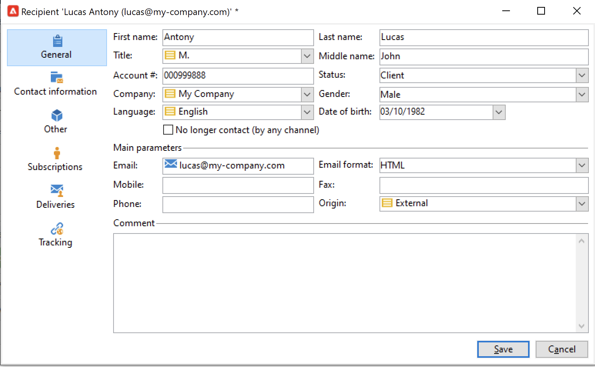

# Create profiles{#create-profiles}

To populate your Campaign database, you can import profiles or add them manually. 

## Create profiles manually{#create-profiles-manually}

To create a recipient manually, follow the steps below:

1. Browse to **[!UICONTROL Profiles and targets]** tab and select the **[!UICONTROL Recipients]** category. 

    

    By default, recipients are stored in the **[!UICONTROL Profiles and Targets > Recipients]** node of the tree. You can also create recipients from this view. 

1. Click the **[!UICONTROL Create button]**.
1. Enter the profile's data. 

    

    Learn more about the recipient built-in form in [this page](view-profiles.md#edit-a-profiles).

1. Click **[!UICONTROL Save]**: the profile is added to Campaign, in the default recipient folder.

## Import profiles with a workflow {#import-profiles-with-a-wf}

Workflows can be a useful way to automate some of your import processes. Whether you import data from a local file or from a SFTP, you can use workflows to standardize your data management procedures.

### Use data from a list: Read list {#data-from-read-list}

Prepare and structure your data in a file to import it with a workflow.

For more on using the read list activity in a workflow, refer to [Campaign Classic v7 documentation](https://experienceleague.adobe.com/docs/campaign-classic/using/automating-with-workflows/targeting-activities/read-list.html){target="_blank"}.

### Load data from a file {#data-from-a-file}

The data processed in a workflow can be extracted from a structured file so that it can be imported into Adobe Campaign.

A description of the loading data activity can be found in the [Campaign Classic v7 documentation](https://experienceleague.adobe.com/docs/campaign-classic/using/automating-with-workflows/action-activities/data-loading--file-.html){target="_blank"}.

Once data has been collected you can use it in your workflows, for example to enrich a delivery or update the database. For more on this, refer to [Campaign Classic v7 documentation]https://experienceleague.adobe.com/docs/campaign-classic/using/automating-with-workflows/introduction/how-to-use-workflow-data.htmll){target="_blank"}.

## One-shot imports{#import-jobs}

Adobe Campaign provides generic import capability which allows you, for example, to extract a list of customers or prospects who will then become part of a target population, or to supply your database with data from external files.

Generic imports are managed from the **[!UICONTROL Profiles and Targets > Jobs]** menu of the Adobe Campaign home page.

The steps to perform a generic import are detailed in [Campaign Classic v7 documentation](https://experienceleague.adobe.com/docs/campaign-classic/using/getting-started/importing-and-exporting-data/generic-imports-exports/about-generic-imports-exports.html){target="_blank"}.
