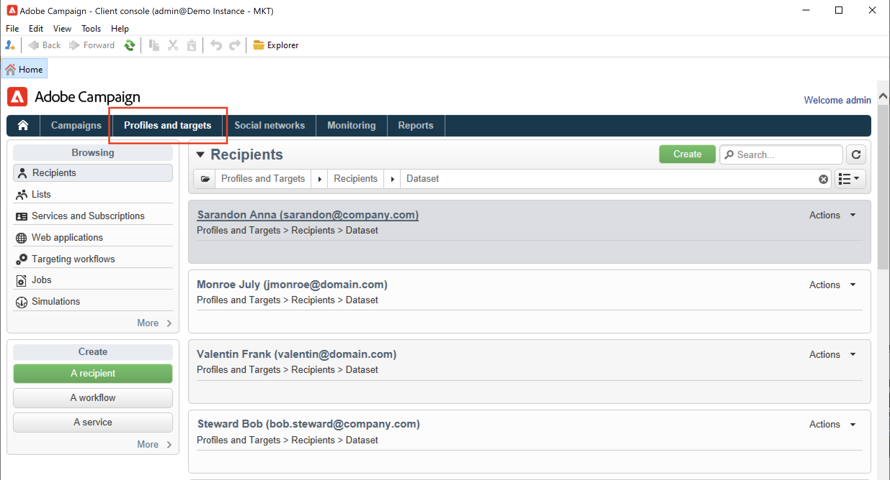
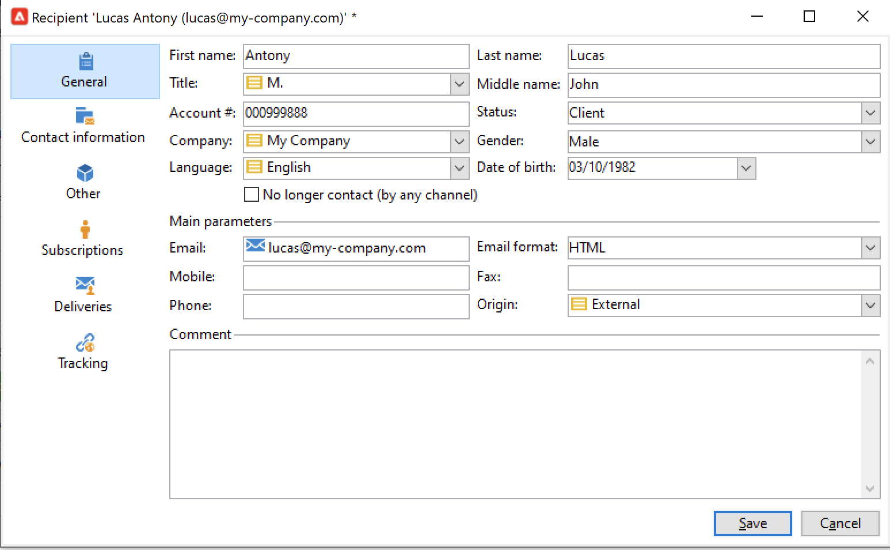

# Create profiles manually{#create-profiles-manual}

To populate your Campaign database, you can [import profiles](import-profiles.md) or add them manually as detailed below. 

To create a recipient manually, follow the steps below:

1. Browse to **[!UICONTROL Profiles and targets]** tab and select the **[!UICONTROL Recipients]** category. 

    

    By default, recipients are stored in the **[!UICONTROL Profiles and Targets > Recipients]** node of the tree. You can also create recipients from this view. 

1. Click the **[!UICONTROL Create button]**.
1. Enter the profile's data. 

    

    Learn more about the recipient built-in form in [this page](view-profiles.md#edit-a-profiles).

1. Click **[!UICONTROL Save]**: the profile is added to Campaign, in the default recipient folder.
