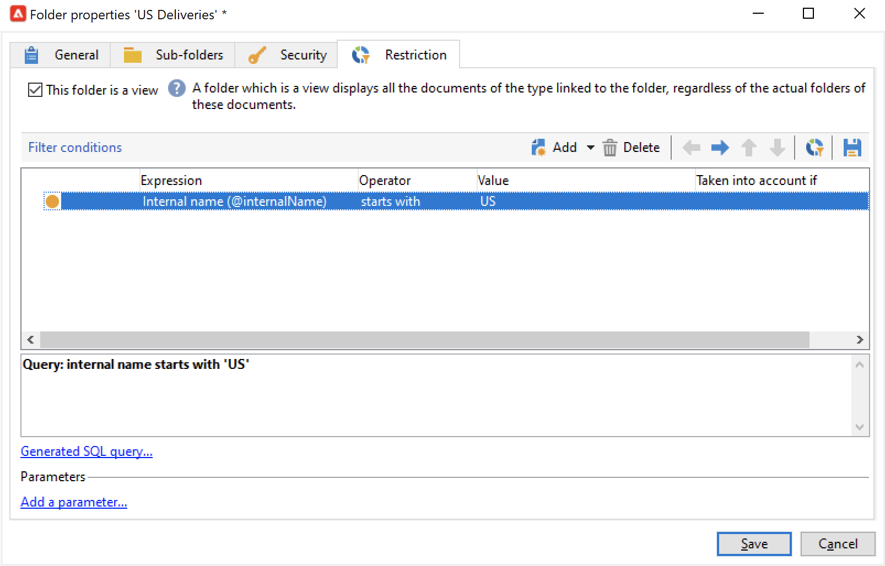

# Manage folders and views {#folders-and-views}

Campaign folders are nodes in the explorer tree. Based on their type, they contain certain types of data.

A view is a specific folder which does not contain any data but displays data that is physically stored in other folders of the same type. For example, if you turn a delivery folder to a view, this folder will show all the deliveries. This data can then be filtered.

>[!NOTE]
>To distinguish views from standard folders, their name is displayed in light blue instead of black.
>

Note that you can assign permissions to folders to restrict access to certain data. [Learn more](#restrict-access-to-a-folder)

## Best practices when working with folders

* **Use built-in folders** to make it easier for every person involved in the project to use, maintain and troubleshoot the application. Avoid creating custom folder structures for recipients, lists, deliveries, etc., but use the standard folders such as **Administration**, **Profiles & Targets**, **Campaign management**.

* **Create sub-folders**, for example save your technical workflows under the built-in folder: **[!UICONTROL Administration > Production > Technical Workflows]**, and create sub-folders per workflow type.

* **Define and apply a naming convention**, for example you can name the workflows in alphabetical order, so that they appear sorted in the order of execution, such as:

   A1 – import recipients, starts at 10:00;
   A2 – import tickets, starts at 11:00.

## Create a folder{#create-a-folder}

To create a folder, right-click on an existing folder and use the contextual menu.

To create the same type of folder than the one you selected, choose the first option in the contextual menu. For example, from a Recipients folder, select **[!UICONTROL Create a new 'Recipients' folder]**.

You can drag and drop the new folder to organize Campaign explorer tree as you need.

To create another type of folder, right-click on an existing folder and select **[!UICONTROL Add new folder]**. You can create all types of folders, depending on the data to be stored.

>[!CAUTION]
>These changes apply to all Campaign users.
>

## Turn a folder to a view{#turn-a-folder-to-a-view}

A view is a specific folder which does not contain any data but displays data that is physically stored in other folders of the same type.

You can turn any folder to a view, but the folder must be empty. Any data stored in the folder is deleted as you turn the folder to a view.

>[!CAUTION]
>
>A view displays data and provides access to it, even if the data is not physically stored in the view folder. To have access to the content, the operator must have the appropriate permissions in the source folders, at least Read access.  
>
>To grant access to a view without granting access to its source folder, do not grant read access to the parent node of the source folder.

In the example below, we will create a new folder to display only US deliveries, based on their internal name.

1. Create a **[!UICONTROL Deliveries]** folder, and name it **US Deliveries**.
1. Right-click this folder and select **[!UICONTROL Properties...]**.
1. In the **[!UICONTROL Restriction]** tab, select **[!UICONTROL This folder is a view]**. All the deliveries in the database will then be displayed.

   
    
1. Define the filter criteria from the query editor in the central section of the window: only the deliveries corresponding to the filter are displayed in the folder.

   

   >[!NOTE]
   >
   >Learn how to design queries in [this page](create-filters.md#advanced-filters)

>[!CAUTION]
>
>When managing [transactional messaging](../send/transactional.md) events, the **[!UICONTROL Real time events]** or **[!UICONTROL Batch events]** folders must not be set as views on the execution instances, as this could lead to permission issues.

## Organize your folders{#organize-your-folders}

By default, a new folder is added on the top of the hierarchy.

Browse the **Sub-folders** tab of a folder properties to organize its sub-folders.

You can move the folders with the arrows on the right or select the **[!UICONTROL Sort the sub-folders in alphabetical order]** option to sort them automatically.

## Filter data in a folder{#filter-data-in-a-folder}

To filter data stored in a folder, access to the folder properties and select the Restriction tab.

For example, the folder below will contain only contacts with an email address and whose origin is not flagged as 'External' - or is empty.

## Restrict access to a folder{#restrict-access-to-a-folder}

Use permissions on folders to organize and control access to Campaign data.

To edit permissions on a specific Campaign folder, follow the steps below:

1. Right-click on the folder and select **[!UICONTROL Properties...]**.
1. Browse to the **[!UICONTROL Security]** tab to view authorizations on this folder.

    

* To **authorize a group or an operator**, click the **[!UICONTROL Add]** button and select the group or operator to assign authorizations for this folder.
* To **forbid a group or an operator**, click **[!UICONTROL Delete]** and select the group or operator to remove authorization for this folder.
* To **select the rights assigned to a group or an operator**, select the group or operator, select the access rights you want to grant, and unselect the others.

### Propagate permissions {#propagate-permissions}

To propagate authorizations and access rights, select the **[!UICONTROL Propagate]** option in the folder properties.

The authorizations defined in this window will then be applied to all the sub-folders of the current node. You can always overload these authorizations for each of the sub-folders.

>[!NOTE]
>
>Unchecking the **[!UICONTROL Propagate]** option for a folder does not clear it for the sub-folders: you must clear it explicitly for each of the sub-folders.

### Grant access to all operators {#grant-access-to-all-operators}

In the **[!UICONTROL Security]** tab, select the **[!UICONTROL System folder]** to allow access to all operators, regardless of their permissions. 

If this option is cleared, you must explicitly add the operator (or their group) back to the list of authorizations for them to have access.

