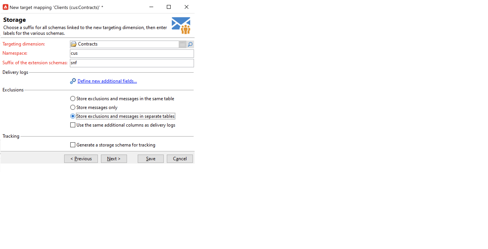

# Work with target mappings{#gs-target-mappings}

By default, delivery templates target **[!UICONTROL Recipients]**. Their target mapping therefore uses the fields of the **nms:recipient** table. 

You can use other target mappings for your deliveries, or create a new target mapping.

## Built-in target mappings {#ootb-mappings}

Adobe Campaign comes with the following built-in target mappings:

|  Name  | Use to | Schema  |
|---|---|---|
|  Recipients  | Deliver to recipients (built-in recipient table)  | nms:recipient  |
|  Visitors  | Deliver to visitors whose profiles have been collected via referral (viral marketing) for ex.  | mns:visitor  |
|  Subscriptions  | Deliver to recipients who are subscribed to an information service such as a newsletter | nms:subscription  |
|  Visitor subscriptions  | Deliver to visitors who are subscribed to an information service  | nms:visitorSub  |
|  Operators  | Deliver to Adobe Campaign operators  | nms:operator  |
|  External file  | Deliver via a file that contains all information needed for delivery  | No linked schema, no target entered  |

## Create a target mapping {#new-mapping}

You can also create a target mapping. You may need to add a custom target mapping for example if:

* you use a custom recipient table,
* you configure a filtering dimension which is different from the built-in targeting dimension on the target mapping screen.

Learn more about custom recipient tables in [this page](../dev/custom-recipient.md).

Adobe Campaign target mapping creation wizard helps you create all schemas required to use your custom target mapping.

1. Browse to **[!UICONTROL Administration]** `>` **[!UICONTROL Campaign Management]** `>` **[!UICONTROL Target mappings]** from Adobe Campaign explorer.

1. Create a new target mapping and select your custom schema as the targeting dimension.

   

1. Indicate the fields where the profile information is stored: last name, first name, email, address, etc.

   

1. Specify the parameters for information storage, including the suffix of the extension schemas for them to be easily identifiable.

   

   You can choose whether to store exclusions (**excludelog**), with messages (**broadlog**) or in a separate table.

   You can also choose whether to manage tracking for this delivery mapping (**trackinglog**).

1. Then select the extensions to be taken into account. The extension type depends on your Campaign settings and add-ons.

   

   Click the **[!UICONTROL Save]** button to launch delivery mapping creation: all linked tables are created automatically based on the selected parameters.

