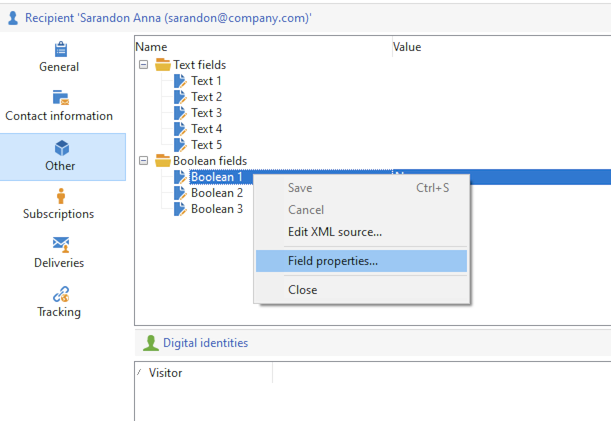

# View existing profiles{#view-profiles}

Browse to **[!UICONTROL Profiles and targets]** to access recipients stored in Adobe Campaign database. 

From this page, you can [create new recipient](create-profiles.md), edit an existing recipient and access its profile details.

For more advanced profile manipulations, access the Campaign tree from the **[!UICONTROL Explorer]** link on the Adobe Campaign home page.

>[!CAUTION]
>
>The built-in Recipient screen is define through a XML schema and its associated form. The XML schema is stored in the **[!UICONTROL Administration > Configuration > Data schemas]** node of the Adobe Campaign explorer tree. Only expert users may make changes to these schemas.  
>

## Edit a profile{#edit-a-profiles}

Select a profile to display details in a new tab.

The data concerning profiles is grouped in tabs. These tabs and their content depend on your specific settings and installed packages.

For a typical built-in recipient, you can access the following tabs:

* **[!UICONTROL General]**, for all general profile data. In particular, it contains the last name, first name, email address, email format, etc. 

    This tab also stores the **opt-out** flag for the profile: when the **[!UICONTROL No longer contact (by any channel)]** option is selected, the profile is on denylist. This information is added to the contact data if the recipient clicked on an unsubscription link in a newsletter for example. Such recipient is no longer be targeted on any channel (email, direct mail, etc.). For more on this, refer to [this page](../send/quarantines.md).

* **Contact information**, which contains the direct mail address of the selected profile. 

    You can check in this screen the quality index of the address, and how many errors the address contains. This information is used directly by the direct mail provider, based on the number of errors found during previous deliveries, and cannot be changed manually.

* **Other**, for specific fields which can be personalized and populated depending on your needs. 

    Use the **[!UICONTROL Field properties…]** contextual menu to change the names of the fields and define their format.

    

    Enter the new settings as below:

    

    Check the update in the UI:

    

    >[!CAUTION]
    >Changes apply to all recipients.
    >

* **Subscriptions**, for all the active subscriptions to services. Use the **History** tab to access details of subscriptions and unsibscriptions for this contact. 

    

    Learn more about Subscriptions [in this section](../start/subscriptions.md).

* **Deliveries**, for all the delivery logs for the selected profile. Use this tab to access the contact's marketing history: labels, dates, and status of all the delivery actions addressed to the profile via all channels.

* **Tracking**, for all the tracking logs for the selected profile. This information is used to track profile behavior following deliveries. This tab shows the cumulative total of all URLs tracked in deliveries. The list is configurable, and usually contains: the URL clicked, date and time of click, and the document that contained the URL

    Learn more about Tracking [in this section](../start/tracking.md).

## Active profiles {#active-profiles}

Active profiles are the profiles that are counted for billing purposes.

Billing only concerns profiles that are **active**. A profile is considered active if the profile has been targeted or communicated with in the past 12 months via any channel.

A profile that has been targeted by several deliveries is counted only once.

Active profiles count is available for **Marketing instances** only. It is not available for Execution instances, meaning MID (mid sourcing) and RT (Message Center / Real-time messaging) instances.

>[!NOTE]
>
>You can also monitor the number of active profiles on your instance directly from Campaign Control Panel. For more on this, refer to the [Control Panel documentation](https://experienceleague.adobe.com/docs/control-panel/using/performance-monitoring/active-profiles-monitoring.html).
