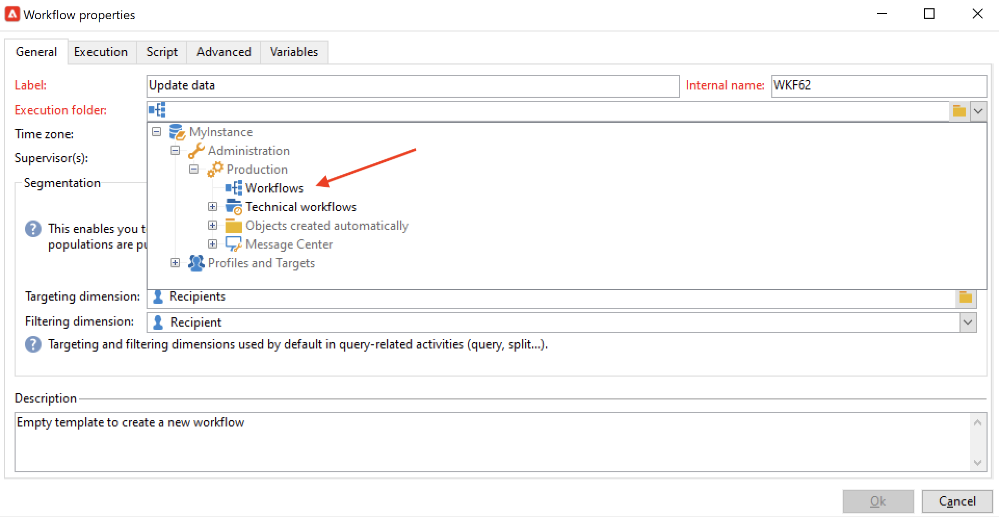

# Build a workflow {#build-a-workflow}

## Create a new workflow {#create-a-new-workflow}

Workflow creation flow depends on the type of workflows. You can:

* Create [Targeting workflows](#targeting-workflows) from  the **[!UICONTROL Profiles and Targets]** > **[!UICONTROL Jobs]** > **[!UICONTROL Targeting workflows]** node of the Explorer or from the **[!UICONTROL Profiles and Targets]** tab of the home page, via the **[!UICONTROL Targeting workflows]** sub-tab.

  

* Create [Campaign workflows](#campaign-workflows) from the **[!UICONTROL Targeting and workflows]** tab of a campaign

* Create [Technical workflows](#technical-workflows) from  the **[!UICONTROL Administration]** > **[!UICONTROL Production]** > **[!UICONTROL Technical workflows]** node of the Explorer. Best practice is to create a specific workflow folder to save your technical workflows.

Click the **[!UICONTROL New]** button located above the list of workflows.

Enter a label and click **[!UICONTROL Save]**.

## Add and link activities {#add-and-link-activities}

You must now define the various activities and link them together in the diagram. At this stage of the configuration, we can see the diagram label and the workflow status (Editing in progress). The lower section of the window is used for editing the diagram only. It contains a toolbar, a palette of activities (on the left) and the diagram itself (on the right).

>[!NOTE]
>
>If the palette is not shown, click the first button on the workflow toolbar to display it.

Activities are grouped by category in the different tabs of the palette. Available tabs and activities can vary depending on the workflow type (technical, targeting or campaign workflow).

* The first tab contains targeting and data manipulation activities. These activities are detailed in [Targeting activities](targeting-activities.md).
* The second tab contains the scheduling activities, which are mainly used for coordinating other activities. These activities are detailed in [Flow control activities](flow-control-activities.md).
* The third tab contains tools and actions that can be used in the workflow. These activities are detailed in [Action activities](action-activities.md).
* The fourth tab contains activities that depend on a given event, such as the receipt of an email or the arrival of a file on a server. These activities are detailed in [Event activities](event-activities.md).

To create the diagram

1. Add an activity by selecting it in the palette and by moving it to the diagram using a drag-and-drop operation.

   Add a **Start** activity and then a **Delivery** activity on the diagram.

   

1. Link the activities together by dragging the **Start** activity transition and dropping it on to the **Delivery** activity.

   

   You can automatically link an activity to the previous one by placing the new activity at the end of the transition.

1. Add the activities you need and link them together as shown in the diagram below.

   

>[!CAUTION]
>
>You can copy and paste activities within a same workflow. However, we do not recommend to copy paste activities across different workflows. Some settings attached to activities like Deliveries and Scheduler could lead to conflicts and errors while executing the destination workflow. Instead, we recommended you to  **Duplicate** workflows. For more information, see [Duplicate workflows](#duplicate-workflows).

You can change the display and layout of the chart using the following elements:

* **Use the toolbar**

  The diagram editing toolbar gives you access to the layout and execution functions of the workflow.

  

  This lets you adapt the layout of the editing tool: display of the palette and the overview, size and alignment of graphical objects.

  

  Icons related to progress and logs display are detailed in these sections:
  
    * [Display progress](monitor-workflow-execution.md#displaying-progress)
    * [Display logs](monitor-workflow-execution.md#displaying-logs)

* **Object alignment**

  To align icons, select them and click the **[!UICONTROL Align vertically]** or **[!UICONTROL Align horizontally]** icon.

  Use the **CTRL** key to select several scattered activities or to deselect one or more activities. Click on the diagram background to deselect everything.

* **Image management**

  You can customize the background image of the diagram as well as those related to the various activities. Refer to [Change activity images](change-activity-images.md).

## Configure activities {#configure-activities}

Double-click an activity to configure it or right-click and select **[!UICONTROL Open...]**.

>[!NOTE]
>
>Campaign workflow activities are detailed in [this section](activities.md).

The first tab contains the basic configuration. The **[!UICONTROL Advanced]** tab contains the additional parameters, which are used particularly for defining behavior when an error is encountered, specifying the execution duration for an activity, and for entering an initialization script.

For a better understanding of the activities and to improve workflow legibility, you can enter comments in the activities.

These comments are displayed automatically when operators scroll over the activity.

## Workflow templates {#workflow-templates}

Workflow templates contain the overall configuration of properties and possibly a range of activities concatenated within a diagram. This configuration can be reused for creating new workflows containing a certain number of pre-configured elements

You can create new workflow templates based on existing templates or change a workflow into a template directly.

Workflow templates are stored in the **[!UICONTROL Resources > Templates > Workflow templates]** node of the Explorer.

In addition to the usual workflow properties, the template properties allow you to specify the execution file for workflows created based on this template.

## Duplicate workflows {#duplicate-workflows}

You can duplicate different types of workflows. Once duplicated, modifications of the workflow are not carried over to the copy of the workflow.

>[!CAUTION]
>
>Copy-paste is available in workflows but we recommend you to use **Duplicate**. Once an activity copied, its whole configuration is kept. For delivery activities (Email, SMS, Push Notification...), the delivery object attached to the activity is also copied which can lead to crash.

1. Right-click on a workflow.
1. Click **Duplicate**.

     

1. In the workflow window, change the workflow label.
1. Click **Save**.

The duplicate feature is not directly available in the view of a campaign.

Yet, you can create a view to display all the workflows on your instance. In this view, you can duplicate workflows using **Duplicate to**.

**Create a view**

1. In **Explorer**, go to the folder you need to create your view in.
1. Right-click and go to **Add a new folder** > **Process**, select **Workflows**.

    

The new folder **Workflows** is created.

1. Right-click and select **Properties**.
1. In the **Restriction** tab, enable the **This folder is a view** option and click **Save**.

    

The folder is now populated with all the workflows of your instance.

**Duplicate a campaign workflow**

1. Select a campaign workflow in the workflow view.
1. Right-click **Duplicate to**.
1. Change its label.
1. Click **Save**.

You can see your duplicated workflow in the workflow view.
