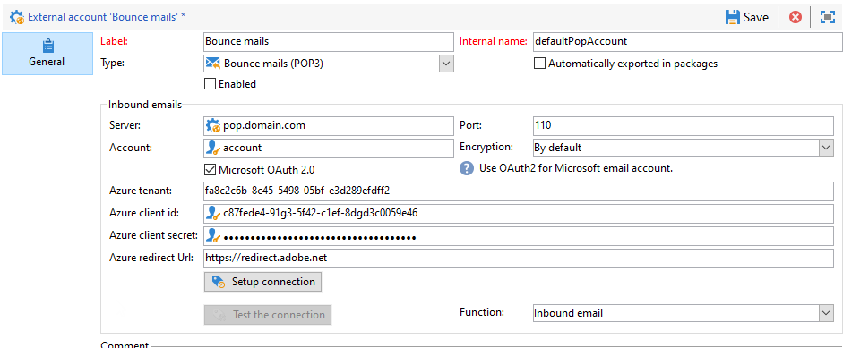

# Configure your external accounts {#config-external-accounts}

Adobe Campaign comes with a set of pre-defined external accounts. In order to set up connections with external systems, you can create new external accounts.

External accounts are used by technical processes such as technical workflows or campaign workflows. For example, when setting up a file transfer in a workflow or a data exchange with any other application (Adobe Target, Experience Manager, etc.), you need to select an external account.

You can access external accounts from Adobe Campaign **[!UICONTROL Explorer]**: browse to **[!UICONTROL Administration]** `>` **[!UICONTROL Platform]** `>` **[!UICONTROL External accounts]**.

>[!CAUTION]
>
>* As a Managed Cloud Services user, external accounts are configured for your instance by Adobe and must not be modified.
>
>* In the context of an [Enterprise (FFDA) deployment](../architecture/enterprise-deployment.md), a specific **[!UICONTROL Full FDA]** (ffda) external account manages connection between Campaign local database and Cloud database ([!DNL Snowflake]).
>

## Campaign-specific external accounts {#ac-external-accounts}

The following technical accounts are used by Adobe Campaign to enable and execute specific processes.

### Bounce mails {#bounce-mails-external-account}

>[!NOTE]
>
>The Microsoft Exchange Online OAuth 2.0 authentication for POP3 capability is available starting Campaign v8.3. To check your version, refer to [this section](../start/compatibility-matrix.md#how-to-check-your-campaign-version-and-buildversion).
>

The **Bounce mails** external account specifies the external POP3 account to be used to connect to the email service. All servers configured for POP3 access can be used to receive return mail.

Learn more about inbound emails in [this page](https://experienceleague.adobe.com/docs/campaign/automation/workflows/wf-activities/event-activities/inbound-emails.html){target="_blank"}.

To configure the **[!UICONTROL Bounce mails (defaultPopAccount)]** external account:

* **[!UICONTROL Server]** - URL of the POP3 server.

* **[!UICONTROL Port]** - POP3 connection port number. The default port is 110.

* **[!UICONTROL Account]** - Name of the user.

* **[!UICONTROL Password]** - User account password.

* **[!UICONTROL Encryption]** - Type of chosen encryption between **[!UICONTROL By default]**, **[!UICONTROL POP3 + STARTTLS]**, **[!UICONTROL POP3]** or **[!UICONTROL POP3S]**.

* **[!UICONTROL Function]** - Inbound email or SOAP router.

>[!CAUTION]
>
>Before configuring your POP3 external account using Microsoft OAuth 2.0, you first need to register your application in the Azure portal. For more on this, refer to this [page](https://docs.microsoft.com/en-us/azure/active-directory/develop/quickstart-register-app){target="_blank"}.
>

To configure a POP3 external using Microsoft OAuth 2.0, check the **[!UICONTROL Microsoft OAuth 2.0]** option and fill in the following fields:

* **[!UICONTROL Azure tenant]** - Azure ID (or Directory (tenant) ID) can be found in the **Essentials** drop-down of your application overview in the Azure portal.

* **[!UICONTROL Azure Client ID]** - Client ID (or Application (client) ID) can be found in the **Essentials** drop-down of your application overview in the Azure portal.

* **[!UICONTROL Azure Client secret]** - Client secret ID can be found in the **Client secrets** column from the **Certificates & secrets** menu of your application in the Azure portal.

* **[!UICONTROL Azure Redirect URL]** - Redirect URL can be found in the **Authentication** menu of your application in the Azure portal. It should end with the following syntax `nl/jsp/oauth.jsp`, e.g. `https://redirect.adobe.net/nl/jsp/oauth.jsp`.

After entering your credentials, click **[!UICONTROL Setup the connection]** to finish your external account configuration.

### Routing {#routing}

The **[!UICONTROL Routing]** external account allows you to configure each channel available in Adobe Campaign depending on the packages installed.

Learn more about external account management and delivery execution in [this section](../architecture/architecture.md#split).

### Execution instance {#execution-instance}

In the context of transactional messaging, the execution instance is linked to the control instance and connects them. Transactional message templates are deployed to the execution instance. Learn more about Message Center architecture in [this page](../architecture/architecture.md#transac-msg-archi).

## Access to External Systems external accounts {#external-syst-external-accounts}

### Federated Data Access (FDA) {#fda-external-accounts}

The **External database** type external account is used to connect to an external database via Federated Data Access (FDA). Learn more about Federated Data Access (FDA) option in [this section](../connect/fda.md).

>[!NOTE]
>
>External databases compatible with Adobe Campaign v8 are listed in the [Compatibility matrix](../start/compatibility-matrix.md). FDA connections use ODBC drivers; with Adobe Campaign Managed Cloud Services, the ODBC driver and external account configuration are set up by Adobe.

External account configuration settings depend on the database engine. With Adobe Campaign Managed Cloud Services, external accounts configuration is performed by Adobe. Learn more about this configuration in [Adobe Campaign Classic v7 documentation](https://experienceleague.adobe.com/en/docs/campaign-classic/using/installing-campaign-classic/accessing-external-database/external-accounts){target="_blank"}.

### Databricks External Account {#databricks-external-accounts}

The Databricks FDA connection uses the Databricks ODBC driver. Starting Campaign v8.9.1, Databricks external accounts support OAuth2 authentication via service principal (non-interactive client credentials flow), providing secure authentication for federated data access. 

Learn more about service principals in [Microsoft documentation](https://learn.microsoft.com/en-us/azure/databricks/admin/users-groups/service-principals){target="_blank"}.

To configure OAuth2 authentication via service principal in Campaign:

1. The Databricks workspace administrator enables service principals on the Databricks workspace and generates credentials. To authorize access to your Azure Databricks resources with OAuth, create an OAuth secret (used to generate OAuth access tokens for authentication).
2. In Adobe Campaign, create or edit a Databricks external account and open the **OAuth** tab.
3. Paste the credentials into the **Secret** field of the OAuth tab of the Databricks external account.
4. Use **[!UICONTROL Test the connection]** to validate the configuration.

### X (formerly known as Twitter) {#twitter-external-account}

The **Twitter** type external account is used to connect Campaign to your X account, to post messages on your behalf. Learn more about X integration in [this section](../connect/ac-tw.md).

## Adobe Solution Integration external accounts {#adobe-integration-external-accounts}

* **Adobe Experience Cloud** - The **[!UICONTROL Adobe Experience Cloud]** external account is used to implement Adobe Identity Management Service (IMS) to connect to Adobe Campaign. Learn more about Adobe Identity Management Service (IMS) in [this section](../start/connect.md#logon-to-ac).

* **Web Analytics** - The **[!UICONTROL Web Analytics (Adobe Analytics)]** external account is used to configure data transfer from Adobe Analytics to Adobe Campaign. Learn more about Adobe Campaign - Adobe Analytics integration in [this page](../connect/ac-aa.md).

* **Adobe Experience Manager** - The **[!UICONTROL AEM]** external account allows you to manage the content of your email deliveries as well as your forms directly in Adobe Experience Manager. Learn more about Adobe Campaign - Adobe Experience Manager integration in [this page](../connect/ac-aem.md).

## CRM Connector external accounts {#crm-external-accounts}

* **Microsoft Dynamics CRM** -  The **[!UICONTROL Microsoft Dynamics CRM]** external account allows you to import and export Microsoft Dynamics data into Adobe Campaign. Learn more about Adobe Campaign - Microsoft Dynamics CRM integration in [this page](../connect/ac-ms-dyn.md).

* **Salesforce.com** - The **[!UICONTROL Salesforce CRM]** external account allows you to import and export Salesforce data into Adobe Campaign. Learn more about Adobe Campaign - Salesforce.com CRM integration in [this page](../connect/ac-sfdc.md).

## Transfer Data external accounts {#transfer-data-external-accounts}

These external accounts can be used to import or export data to Adobe Campaign using a **[!UICONTROL Transfer file]** workflow activity. Learn more about **File transfer** in workflows in [this page](https://experienceleague.adobe.com/docs/campaign/automation/workflows/wf-activities/event-activities/file-transfer.html){target="_blank"}.

* **FTP and SFTP** - The **FTP** external account lets you configure and test access to a server outside of Adobe Campaign. To set up connections with external systems such as SFTP or FTP servers used for file transfers, you can create your own external accounts.

    To do so, specify in this external account the address and credentials used to establish the connection to the SFTP or FTP server.

    >[!NOTE]
    >
    >Starting from release 8.5, you can now securely authenticate using a private key when configuring your SFTP external account. [Learn more on key management](https://experienceleague.adobe.com/docs/control-panel/using/sftp-management/key-management.html){target="_blank"}.

* **Amazon Simple Storage Service (S3)** - The **AWS S3** connector can be used to import or export data to Adobe Campaign using a **[!UICONTROL Transfer file]** workflow activity. As you are setting up this new external account, you need to provide the following details:

    * **[!UICONTROL AWS S3 Account Server]**: URL of your server, in the form `<S3bucket name>.s3.amazonaws.com/<s3object path>`.

    * **[!UICONTROL AWS access key ID]**: Learn how to find your AWS access key ID in [Amazon documentation](https://docs.aws.amazon.com/general/latest/gr/aws-sec-cred-types.html#access-keys-and-secret-access-keys){target="_blank"}.

    * **[!UICONTROL Secret access key to AWS]**: Learn how to find your secret access key to AWS in [Amazon documentation](https://aws.amazon.com/fr/blogs/security/wheres-my-secret-access-key/){target="_blank"}.

    * **[!UICONTROL AWS Region]**: Learn more on AWS regions in [Amazon documentation](https://aws.amazon.com/about-aws/global-infrastructure/regions_az/){target="_blank"}.

    * The **[!UICONTROL Use server side encryption]** checkbox allows you to store your file in S3 encrypted mode. Learn how to find the access key ID and secret access key in [Amazon documentation](https://docs.aws.amazon.com/general/latest/gr/aws-sec-cred-types.html#access-keys-and-secret-access-keys){target="_blank"}.

* **Azure Blob Storage** - The **Azure** external account can be used to import or export data to Adobe Campaign using a **[!UICONTROL Transfer file]** workflow activity. To configure the **Azure** external account to work with Adobe Campaign, you need to provide the following details:

    * **[!UICONTROL Server]**: URL of your Azure Blob storage server.

    * **[!UICONTROL Encryption]**: Type of encryption: **[!UICONTROL None]** or **[!UICONTROL SSL]**.

    * **[!UICONTROL Access key]**: Learn how to find your **[!UICONTROL Access key]** in [Microsoft documentation](https://docs.microsoft.com/en-us/azure/storage/common/storage-account-keys-manage?tabs=azure-portal){target="_blank"}.

* **Microsoft Fabric** - The **Microsoft Fabric** external account allows you to import and export data between Microsoft Fabric and Adobe Campaign using the **[!UICONTROL Transfer file]** workflow activity. To configure this integration, provide the following details:

    * **[!UICONTROL Server]**: URL of your Microsoft Fabric storage server.

    * **[!UICONTROL Application ID]**: The unique identifier of the application used to authenticate and access Microsoft Fabric resources.

    * **[!UICONTROL Client secret]**: The authentication key or password associated with the application, required to securely connect to Microsoft Fabric.
