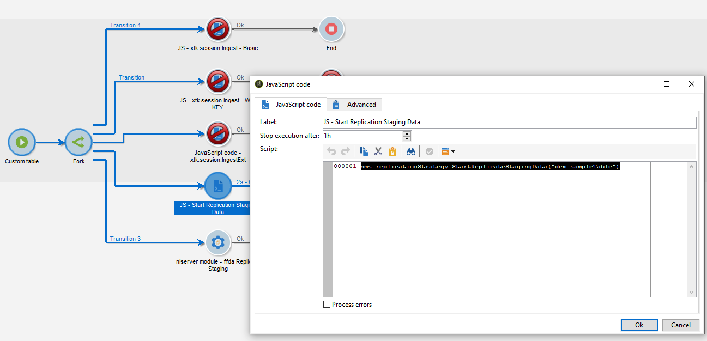

# Technical workflows and data replication

## Technical workflows{#tech-wf}

Adobe Campaign comes with a set of built-in technical workflows. Technical workflows execute processes or jobs, scheduled on a regular basis on the server.

These workflows perform maintenance operations on the database, leverage the tracking information in the delivery logs, create recurring campaigns, and more.

 The full list of technical workflows is detailed in [Campaign Classic v7 documentation](https://experienceleague.adobe.com/docs/campaign-classic/using/automating-with-workflows/advanced-management/about-technical-workflows.html){target="_blank"}


In addition to these technical workflows, Campaign v8 relies on specific technical workflows to manage [data replication](#data-replication).

* **[!UICONTROL Replicate Reference tables]**
    This workflow performs automatic replication of built-in tables that need to be present on Campaign local database (Postgres) and Cloud database ([!DNL Snowflake]). It is scheduled to execute every hour, daily. If **lastModified** field exists, replication happens incrementally, otherwise the whole table is replicated. The order of the tables in the array below is the order used by the replication workflow.
* **[!UICONTROL Replicate Staging data]**
    This workflow replicates staging data for unitary calls. It is scheduled to execute every hour, daily.
* **[!UICONTROL Deploy FFDA immediately]**  
    This workflow performs an immediate deployment to the Cloud database.
* **[!UICONTROL Replicate FFDA data immediately]**
    This workflow replicates the XS data for a given external account.

These technical workflows are available from the **[!UICONTROL Administration > Production > Technical workflows > Full FFDA replication]** node of Campaign Explorer. **They must not be modified.**

If needed, you can launch data synchronization manually. To perform this, right-click on the **Scheduler** activity and select **Execute pending task(s) now**.

## Data replication{#data-replication}

Some built-in tables are replicated from Campaign local database to [!DNL Snowflake] Cloud database through dedicated workflows described above.

Understand which databases Adobe Campaign v8 uses, why data is being replicated, which data is being replicated and how the replication process works.

>[!VIDEO](https://video.tv.adobe.com/v/334460?quality=12)


### Data replication policies

Replication policies are based on the size of the tables. Some tables will be replicated in real-time, some others will be replicated on hourly basis. Some tables will have incremental updates when others will be replaced.

In addition to the built-in **Replicate Reference Tables** technical workflow, you can force data replication in your workflows. 

You can:

* add a specific **Javascript code** activity with the following code:

```
nms.replicationStrategy.StartReplicateStagingData("dem:sampleTable")
```




* add a specific **nlmodule** activity with the following command:

```
nlserver ffdaReplicateStaging -stagingSchema -instance:acc1
```


**Related topics**

 Learn how to get started with workflows in [Campaign Classic v7 documentation](https://experienceleague.adobe.com/docs/campaign-classic/using/automating-with-workflows/introduction/about-workflows.html?lang=en#automating-with-workflows){target="_blank"}

 Access data retention periods in [this section](../dev/datamodel-best-practices.md#data-retention)
