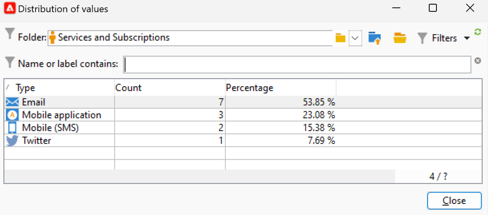

# Campaign user interface settings {#ui-settings}

## Default units {#default-units}

In Adobe Campaign, for fields which express a duration (e.g. validity period of the resources, approval deadline for a task, etc.), values can be expressed in the following **units**:

* **[!UICONTROL s]** for seconds
* **[!UICONTROL mn]** for minutes
* **[!UICONTROL h]** for hours
* **[!UICONTROL d]** for days

## Customize Campaign Explorer{#customize-explorer}

You can add folders to Campaign Explorer, create views and assign permissions.

Learn how to manage folders and views in [this page](../audiences/folders-and-views.md)

## Manage and customize lists {#customize-lists}

In Campaign Client Console, data is displayed in lists. You can adapt these lists to your needs. For example, you can add columns, filter data, count records, save and share your settings.

In addition, you can create and save filters.  Learn more about filters in [this page](../audiences/create-filters.md).

### Number of records {#number-of-records}

By default, Adobe Campaign loads the first 200 records of a list. This means that the display does not necessarily show all the records of the table you are viewing. You can run a count of the number of records in the list and load more records.

In the lower right-hand part of the list screen, a **counter** shows how many records have been loaded and the total number of records in the database (after applying any filters):

If a question mark appears instead of the number on the right, such as `240/?`, click the counter to launch the calculation.

To load and display additional records click **[!UICONTROL Continue loading]**. By default, 200 records are loaded. To change the default number of records to load, use the **[!UICONTROL Configure list]** icon in the bottom right-hand corner of the list. In the list configuration window, click **[!UICONTROL Advanced parameters]** (bottom left) and change the number of lines to retrieve.

To load all the records, right-click the list and select **[!UICONTROL Load all]**.

>[!CAUTION]
>
>When a list contains a high volume of records, full loading can take some time.
>

### Add and remove columns {#add-columns}

For each list, the built-in column configuration can be adapted to display more information or hide unused columns.

When data is visible in the detail of a record, right-click the field and select **[!UICONTROL Add in the list]**.

The column is added to the right of the existing columns.

You can also use the list configuration screen to add and remove columns:

1. From a list of records, click **[!UICONTROL Configure list]** icon on the lower right section.
1. Double-click the fields to be added in the **[!UICONTROL Available fields]** list: they are added to the **[!UICONTROL Output columns]** list. 

    

   >[!NOTE]
   >
   >By default, advanced fields are not displayed. To display them, click the **Display advanced fields** icon, on the lower right section of the list of available fields.
   >
   >Fields are identified by specific icons: SQL fields, linked tables, calculated fields, etc. For each field selected, the description is displayed under the list of available fields.
   >

1. Use the up/down arrows to modify the **display order**.

1. Click **[!UICONTROL OK]** to confirm the configuration and display the result.

If you need to remove a column, select it and click the **Trash** icon.

You can use the **[!UICONTROL Distribution of values]** icon to view the repartition of values for the selected field in the current folder.

### Create a new column {#create-a-new-column}

You can create new columns to display additional fields in the list. 

To create a column, follow these steps:

1. From a list of records, click **[!UICONTROL Configure list]** icon on the lower right section.
1. Click the **[!UICONTROL Add]** icon to display a new field in the list.
1. Configure the field to add in the column.

### Display data in sub-folders {#display-sub-folders-records}

Lists can display:

* All records contained in the selected folder (default)
* All records contained in the selected folder and its sub-folders

To switch from one display mode to the other, click **[!UICONTROL Display sub-levels]** in the Campaign toolbar.

### Save a list configuration {#saving-a-list-configuration}

The list configurations are defined locally for each user. When the local cache is cleared, local configurations are disabled.

By default, setting parameters apply to all lists with the corresponding folder type. When you modify how the list of recipients is displayed from a folder, this configuration is applied to all the other recipient folders.

You can save more than one configuration to be applied to different folders of the same type. The configuration is saved with the properties of the folder containing the data and can be reapplied.

To save a list configuration so that it can be reused, follow the steps below:

1. From the Explorer, right click the folder containing the displayed data.
1. Select **[!UICONTROL Properties]**.
1. Click **[!UICONTROL Advanced settings]** and then specify a name in the **[!UICONTROL Configuration]** field. 
1. Click **[!UICONTROL OK]** and then click **[!UICONTROL Save]**.

You can then apply this configuration any another folder of the same type. Learn more about folders in [this page](../audiences/folders-and-views.md).

### Export a list {#exporting-a-list}

To export data from a list, you must use an export wizard. To access it, select the elements to be exported from the list, right-click and select **[!UICONTROL Export...]**.

<!--The use of the import and export functions is explained in [Generic imports and exports](../../platform/using/about-generic-imports-exports.md).-->

>[!CAUTION]
>
>Elements from a list must not be exported using the Copy/Paste function.

### Sort a list {#sorting-a-list}

Lists can contain a large amount of data. You can sort these data or apply simple or advanced filters. Sorting lets you display data in ascending or descending order. Filters let you define and combine criteria to display selected data only.

Click the column header to apply an ascending or descending sort, or to cancel data sorting. Active sort status and sorting order are indicated by a blue arrow before the column label. A red dash before the column label means that the sort is applied to data indexed from the database. This sorting method is used to optimize sort jobs.

You can also configure sorting or combine sort criteria. To do this, follow the steps below:

1. **[!UICONTROL Configure list]** below and to the right of the list. 
1. In the list configuration window, click the **[!UICONTROL Sorting]** tab.
1. Select the fields to sort and the sort direction (ascending or descending).
1. Sort priority is defined by the order of the sort columns. To change the priority, use the appropriate icons to change the order of the columns.

   Sort priority does not affect the display of the columns in the list.

1. Click **[!UICONTROL Ok]** to confirm this configuration and display the result in the list.

## Work with enumerations {#enumerations}

An enumeration (also known as 'itemized list') is a list of values suggested by the system to populate fields. Use enumerations to standardize the values of these fields, help with data input or use within queries.

The list of values appears as a drop-down list from which you can select the value to be entered in the field. The drop-down list also enables predictive input: enter the first letters, and the application fills in the rest.

The values for this type of field are defined and overall administration of these fields (adding/deleting a value) is performed via the **[!UICONTROL Administration > Platform > Enumerations]** node of the tree.

### Types of enumerations {#types-of-enum}

Enumerations are stored in the **[!UICONTROL Administration > Platform > Enumerations]** folder of the explorer. 

They can be: Open, System, Emoticon or Closed.

* An **Open** enumeration allows users to add new values directly in the fields based on this enumeration.
* A **Closed** enumeration has a fixed list of values which can only be modified from the **[!UICONTROL Administration > Platform > Enumerations]** folder of the explorer. 
* An **Emoticon** enumeration is used to update the emoticon list. Learn more
* A **System** enumeration is associated to system fields and is coming with an Internal name.

For **Open** and **Closed** enumerations, specific options are available:

* **Simple enumeration** is the default standard type.
* **Alias cleansing** enumeration is used to harmonize the enumeration values stored in the database. [Learn more](#alias-cleansing)
* **Reserved for binning** is an option which allows you to link cube values to this enumeration. [Learn more](../reporting/gs-cubes.md)

### Alias cleansing {#alias-cleansing}

In the enumeration fields, you can select a value, or enter a custom value which is not available in the drop-down list. Custom values can be added to the existing enumerations values, as a new one - in this case, the **[!UICONTROL Open]** option must be selected. These custom values can be cleaned using alias cleansing capabilities. For example if a user enters `Adob` instead of `Adobe`, alias cleansing process can automatically replace it by the correct term.

>[!CAUTION]
>
>Data cleansing is a critical process that impacts the data in the database. Adobe Campaign carries out mass data updates, which may lead to some values being deleted. This operation is therefore reserved for expert users.

Enable the **[!UICONTROL Alias cleansing]** option to use data cleansing capabilities for an enumeration. When this option is selected, the **[!UICONTROL Alias]** tab is displayed at the bottom of the window. 

When a user enters a value which does not exist in an Alias cleansing enumeration, it is added to the **Values** list. You can [create aliases from these values](#convert-to-alias), or [create new aliases from scratch](#create-alias).

#### Create an alias{#create-alias}

To create an alias, follow these steps:

1. Click **[!UICONTROL Add]** button of the **[!UICONTROL Alias]** tab.
1. Enter the alias you want to convert and select the value to be applied in the drop-down list. 

    

1. Click **[!UICONTROL Ok]** and confirm.
    
1. Save your changes. The replacement of values is performed by the **Alias cleansing** workflow which is executed every night. Refer to [Run data cleansing](#running-data-cleansing).

For all fields based on this enumeration, when a user enters the value **Adob** in a "company" field (in the Adobe Campaign Client Console, in a web form), it will automatically be replaced by the value **Adobe**.

#### Convert a wrong value to an alias{#convert-to-alias}

You can also convert an existing enumeration value into an alias. To perform this:

1. In the list of values of an enumeration, right-click and browse to **[!UICONTROL Actions... > Convert values into aliases...]**. 

    

1. Select the values to be converted in aliases and click **[!UICONTROL Next]**.
1. Click **[!UICONTROL Start]** to run the conversion.

    Once execution is complete, aliases are added to the list, in the **Alias** tab. You can associate a correct value to replace wrong entries. To perform this: 

1. Select a value to clean.
1. Click the **Detail...** button.
1. Select the new value in the drop-down list.

    

>[!NOTE]
>
>You can track the occurrences of an alias in the **[!UICONTROL Hits]** column in the **[!UICONTROL Alias]** sub-tab. It can display the number of times this value was entered.  [Learn more](#calculate-entry-occurrences).

#### Run data cleansing {#running-data-cleansing}

Data cleansing is performed by the **[!UICONTROL Alias cleansing]** technical workflow. By default, it is executed on a daily basis.

Cleansing can also be triggered via the **[!UICONTROL Cleanse values...]** link.

The **[!UICONTROL Advanced parameters...]** link lets you set the date starting from which collected values are taken into account.

Click the **[!UICONTROL Start]** button to run data cleansing.

##### Monitor occurrences {#calculate-entry-occurrences}

The **[!UICONTROL Alias]** sub-tab of an enumeration can display the number of occurrences of an alias among all the values entered. This information is an estimate and will be displayed in the **[!UICONTROL Hits]** column.

>[!CAUTION]
>
>Calculating alias entry occurrences can take a long time.
>

You can run hit calculation manually via the **[!UICONTROL Cleanse values...]** link. To do this, click the **[!UICONTROL Advanced parameters...]** link and select option(s).

* **[!UICONTROL Update the number of alias hits]**: this lets you update hits which have already been calculated, based on the entered date.
* **[!UICONTROL Recalculate the number of alias hits from the start]**: lets you run calculation on the entire Adobe Campaign platform.

You can also create a dedicated workflow in order for the calculation to run automatically for a given period, once a week for example.

To do this, create a copy of the **[!UICONTROL Alias cleansing]** workflow, change the scheduler and use the following settings in the **[!UICONTROL Enumeration value cleansing]** activity:

* **-updateHits** to update the number of alias hits,
* **-updateHits:full** to recalculate all alias hits.
