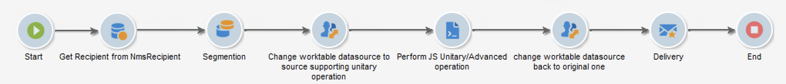

# Manage and automate processes

Configure Campaign to leverage powerful marketing campaign automation capabilities.

You can set up:

* Workflows
* Recurring campaigns
* End-to-end validation cycle
* Alerts
* Automatic report sending
* Triggered events

## Design and use workflows{#gs-ac-wf}

Use Adobe Campaign workflows to improve the speed and scale of every aspect of your marketing campaigns, from creating segments and preparing messages to delivery.

Learn how to design workflows in these [end-to-end use cases](#end-to-end-uc).

Learn more about workflows user interface and execution in Campaign Classic v7 documentation:

* [Get started with workflows](https://experienceleague.adobe.com/docs/campaign-classic/using/automating-with-workflows/introduction/about-workflows.html?lang=en#automating-with-workflows){target="_blank"}

* [Workflow best practices](https://experienceleague.adobe.com/docs/campaign-classic/using/automating-with-workflows/introduction/workflow-best-practices.html){target="_blank"}

* [Built-in technical workfows](https://experienceleague.adobe.com/docs/campaign-classic/using/automating-with-workflows/advanced-management/about-technical-workflows.html){target="_blank"}

* [Monitor workflows execution](https://experienceleague.adobe.com/docs/campaign-classic/using/automating-with-workflows/monitoring-workflows/monitoring-workflow-execution.html){target="_blank"}

* [Build an audience in a marketing campaign workflow](https://experienceleague.adobe.com/docs/campaign-classic/using/orchestrating-campaigns/orchestrate-campaigns/marketing-campaign-target.html?lang=en#building-the-main-target-in-a-workflow){target="_blank"}

## Workflow activities {#wf-activities}

 Learn more about the available workflow activities [Campaign Classic v7 documentation](https://experienceleague.adobe.com/docs/campaign-classic/using/automating-with-workflows/introduction/about-activities.html){target="_blank"}

Workflow activities are grouped by category. The four activity categories are available:

* [Targeting activities](https://experienceleague.adobe.com/docs/campaign-classic/using/automating-with-workflows/targeting-activities/about-targeting-activities.html){target="_blank"}: Query, Read list, Enrichment, Union, and more
* [Flow control activities](https://experienceleague.adobe.com/docs/campaign-classic/using/automating-with-workflows/flow-control-activities/about-flow-control-activities.html){target="_blank"}: Scheduler, Fork, Alert, External signal, and more
* [Action activities](https://experienceleague.adobe.com/docs/campaign-classic/using/automating-with-workflows/action-activities/about-action-activities.html){target="_blank"}: Cross-channel deliveries, Javascript code, CRM activities, Update aggregate, and more
* [Event activities](https://experienceleague.adobe.com/docs/campaign-classic/using/automating-with-workflows/action-activities/about-action-activities.html){target="_blank"}: File transfer, Web download and more

### Change data source activity {#change-data-source-activity}

The **[!UICONTROL Change data source]** activity allows you to change the data source of a workflow **[!UICONTROL Working table]**. This provides more flexibility to manage data across different data sources such as FDA, FFDA and local database.

The **[!UICONTROL Working table]** allows Adobe Campaign workflow to handle data and share data with the workflow activities.
By default, the **[!UICONTROL Working table]** is created in the same database as the source of the data we query on.

For example, when querying the **[!UICONTROL Profiles]** table, stored on the Cloud database, you will create a **[!UICONTROL Working table]** on the same Cloud database.
To change this, you can add the **[!UICONTROL Change Data Source]** activity to choose a different data source for your **[!UICONTROL Working table]**.

Note that when using the **[!UICONTROL Change Data Source]** activity, you will need to switch back to the Cloud database to continue the workflow execution.

To use the **[!UICONTROL Change Data Source]** activity:

1. Create a workflow.

1. Query your targeted recipients with a **[!UICONTROL Query]** activity. 

    For more information on the **[!UICONTROL Query]** activity, refer to the [Query](https://experienceleague.adobe.com/docs/campaign-classic/using/automating-with-workflows/targeting-activities/query.html#creating-a-query) page in Campaign Classic V7 documentation.

1. From the **[!UICONTROL Targeting]** tab, add a **[!UICONTROL Change data source]** activity and double-click it to select **[!UICONTROL Default data source]**.
    
    The working table, which contains the result of your query, is then moved to the default PostgreSQL database.

1. From the **[!UICONTROL Actions]** tab, drag and drop a **[!UICONTROL JavaScript code]** activity to perform unitary operations on the working table.

    For more information on the **[!UICONTROL JavaScript code]** activity, refer to the [JavaScript code and Advanced JavaScript code](https://experienceleague.adobe.com/docs/campaign-classic/using/automating-with-workflows/action-activities/sql-code-and-javascript-code.html#javascript-code) page in Campaign Classic V7 documentation.

1. Add another **[!UICONTROL Change data source]** activity to switch back to the Cloud database. 
    
    Double-click your activity and select **[!UICONTROL Active FDA external account]** then the corresponding external account.

1. You can now start your workflow.

## Manage virtual warehouses {#warehouse}

After creating your workflow, you can access additional options with the **[!UICONTROL Properties]** button for further configuration.

 Learn more about **Workflow properties** in [Campaign Classic v7 documentation](https://experienceleague.adobe.com/docs/campaign-classic/using/automating-with-workflows/advanced-management/workflow-properties.html?lang=en){target="_blank"}

From the **[!UICONTROL Execution]** tab of your workflow's **[!UICONTROL Properties]**, you can choose to link your workflow to different warehouses and optimize your workload management. For more information on **Warehouses**, refer to the [Snowflake documentation](https://docs.snowflake.com/en/user-guide/warehouses-overview.html).

Depending on your workflow's purpose, you can choose between the following three warehouses from the **[!UICONTROL Warehouse]** drop-down:

* **[!UICONTROL Default]** / **[!UICONTROL Campaign]**: set by default when creating a new workflow.

* **[!UICONTROL Import / Export]**: should be set with import or export workflows to optimize your activities' performance.

* **[!UICONTROL Campaign Burst]**: should be set with campaign or deliveries workflows to optimize your deliveries processing time.

>[!NOTE]
>
>The **[!UICONTROL System]** warehouse is only set for built-in workflows.

## Set up recurring campaigns

Design recurring workflow and create a new delivery instance each time the workflow is executed. For example, if your workflow is designed to run once a week, that would result in 52 Deliveries after one year. This also means that logs will be separated by each delivery instance.

 Learn how to create a recurring campaign in [Campaign Classic v7 documentation](https://experienceleague.adobe.com/docs/campaign-classic/using/orchestrating-campaigns/orchestrate-campaigns/setting-up-marketing-campaigns.html?lang=en#recurring-and-periodic-campaigns){target="_blank"}

## Leverage trigger events

Use Campaign Transactional messaging to automate messages generated from events triggered from information systems. These transactional messages can be invoice, order confirmation, shipping confirmation, password change, product unavailability notification, account statement or website account creation for instance. These messages can be sent individually or in batch via email, SMS or push notifications.

 Learn more about transactional messaging capabilities in in [this section](../send/transactional.md).

Connect Adobe Campaign and Adobe Analytics to retrieve user actions and send near real-time personalized messages. 

 Learn how to integrate Campaign with other solutions in [this section](../start/connect.md)

## Workflow end-to-end use cases{#end-to-end-uc}

In this section, you will find various use cases leveraging Campaign workflows capabilities. These use cases are built in Adobe Campaign Classic v7 and apply to Adobe Campaign v8.

### Deliveries {#deliveries}

* [A/B testing](https://experienceleague.adobe.com/docs/campaign-classic/using/sending-messages/a-b-testing/use-case/a-b-testing-use-case.html){target="_blank"}

    Learn how to compare two email delivery contents via a targeting workflow. The message and the text are identical in both deliveries: only the layout changes. The targeted population is divided into three: two test groups and the remaining population. A different version of the delivery is sent to each test group.
    
* [Sending a birthday email](https://experienceleague.adobe.com/docs/campaign-classic/using/automating-with-workflows/use-cases/deliveries/sending-a-birthday-email.html){target="_blank"}

    This use case presents how to plan sending a recurring email to a list of recipients on the day of their birthday.

* [Loading delivery content](https://experienceleague.adobe.com/docs/campaign-classic/using/automating-with-workflows/use-cases/deliveries/loading-delivery-content.html){target="_blank"}
    When your delivery content is available in an HTML file located on a remote server, you can easily load this content into Adobe Campaign deliveries.

* [Cross-channel delivery workflow](https://experienceleague.adobe.com/docs/campaign-classic/using/automating-with-workflows/use-cases/deliveries/cross-channel-delivery-workflow.html){target="_blank"}

    Learn how to build a cross-channel delivery workflow. The objective is to segment an audience from the recipients of your database into different groups and send an email to the first group and a SMS to the other.

* [Email enrichment with custom date fields](https://experienceleague.adobe.com/docs/campaign-classic/using/automating-with-workflows/use-cases/deliveries/email-enrichment-with-custom-date-fields.html){target="_blank"}

    Learn how to send an email with custom data fields to profiles who celebrate their birthdays this month. The email will include a coupon valid one week before and after their birthday.

* [Automating content creation, edition and publishing](https://experienceleague.adobe.com/docs/campaign-classic/using/sending-messages/content-management/automating-via-workflows.html){target="_blank"}

    Learn how to automate the creation and delivery of a content block with Campaign Content Management add-on.

### Monitoring {#monitoring}

* [Send a report to a list](https://experienceleague.adobe.com/docs/campaign-classic/using/automating-with-workflows/use-cases/monitoring/sending-a-report-to-a-list.html){target="_blank"}

    Learn how to generate a monthly built-in Tracking indicators report in PDF format and send it to a list of Campaign operators.

* [Supervise your workflows](https://experienceleague.adobe.com/docs/campaign-classic/using/automating-with-workflows/use-cases/monitoring/supervising-workflows.html){target="_blank"}

    Learn how to create a workflow that lets you monitor the status of a set of workflows that are “paused”, “stopped” or “with errors”.

* [Send personalized alerts to operators](https://experienceleague.adobe.com/docs/campaign-classic/using/automating-with-workflows/use-cases/monitoring/sending-personalized-alerts-to-operators.html){target="_blank"}

    Learn how to send an alert to an operator that will contain the name of profiles who opened a newsletter but did not click the link it contains.

### Data management {#management}

* [Coordinate data updates](https://experienceleague.adobe.com/docs/campaign-classic/using/automating-with-workflows/use-cases/data-management/coordinating-data-updates.html){target="_blank"}

    Learn how to check that the update process has ended before executing another update operation. To do this, we will set up an instance variable, and let the workflow test if the instance is running to decide whether or not to continue the execution of the workflow and perform the update.

* [Create a summary list](https://experienceleague.adobe.com/docs/campaign-classic/using/automating-with-workflows/use-cases/data-management/creating-a-summary-list.html){target="_blank"}

    Learn how to create a workflow which, after collecting files and following several enrichments, lets you create a summary list. The example is based on a list of contacts who made purchases in a store.

* [Enrich data](https://experienceleague.adobe.com/docs/campaign-classic/using/automating-with-workflows/use-cases/data-management/enriching-data.html){target="_blank"}

    Learn how to send personalized deliveries to profiles who took part in the latest competition depending on their score.

* [Use aggregates](https://experienceleague.adobe.com/docs/campaign-classic/using/automating-with-workflows/use-cases/data-management/using-aggregates.html){target="_blank"}

    Learn how to identify the last recipients added to the database.

* [Quarterly list update using an incremental query](https://experienceleague.adobe.com/docs/campaign-classic/using/automating-with-workflows/use-cases/designing-queries/quarterly-list-update.html){target="_blank"}

    Learn how to use an incremental query to automatically update a recipient list.

* [Set up a recurring import workflow](https://experienceleague.adobe.com/docs/campaign-classic/using/automating-with-workflows/use-cases/data-management/recurring-import-workflow.html){target="_blank"}

    Learn how to design a workflow that can be reused for importing profiles coming from a CRM in the Adobe Campaign database. 

### Targeting {#designing-queries}

* [Query the recipient table](https://experienceleague.adobe.com/docs/campaign-classic/using/automating-with-workflows/use-cases/designing-queries/querying-recipient-table.html){target="_blank"}

    Learn how to recover the names and emails of recipients whose email domain is “orange.co.uk” and who don’t live in London.

* [Query delivery information](https://experienceleague.adobe.com/docs/campaign-classic/using/automating-with-workflows/use-cases/designing-queries/querying-delivery-information.html){target="_blank"}

    Learn how to define queries on delivery information to retrieve profile's behavior.

* [Compute aggregates](https://experienceleague.adobe.com/docs/campaign-classic/using/automating-with-workflows/use-cases/designing-queries/performing-aggregate-computing.html){target="_blank"}

    Learn how to count the number of profiles living in London, according to gender.
    
* [Query using a many-to-many-relationship](https://experienceleague.adobe.com/docs/campaign-classic/using/automating-with-workflows/use-cases/designing-queries/querying-using-many-to-many-relationship.html){target="_blank"}

    Learn how to find profiles not contacted during the last 7 days. 

* [Call an instance variable in a query](https://experienceleague.adobe.com/docs/campaign-classic/using/automating-with-workflows/advanced-management/javascript-scripts-and-templates.html?lang=en#example){target="_blank"}

    Learn how to use an instance variable to compute dynamically the split percentage to apply on a population.

<!--
### Change data source activity {#data-source-uc}

The **[!UICONTROL Change data source]** activity allows you to change the data source of a workflow **[!UICONTROL Working table]**. 

In this use case, learn how to use the **[!UICONTROL Change data source]** activity to perform unitary operations to insert or update information to the recipient table.

1. Create a workflow and add a **[!UICONTROL Start]** activity.

1. Query your targeted recipients from the NmsRecipient table with a **[!UICONTROL Query]** activity. 

    For more information on the **[!UICONTROL Query]** activity, refer to the [Query](https://experienceleague.adobe.com/docs/campaign-classic/using/automating-with-workflows/targeting-activities/query.html#creating-a-query) page in Campaign Classic V7 documentation.

1. 

1. From the **[!UICONTROL Targeting]** tab, add a **[!UICONTROL Change data source]** activity and double-click it to select **[!UICONTROL Default data source]**.
    
    The working table, which contains the result of your query, is then moved to the default PostgreSQL database.

1. From the **[!UICONTROL Actions]** tab, drag and drop a **[!UICONTROL JavaScript code]** activity to perform unitary operations on the working table.

1. Add another **[!UICONTROL Change data source]** activity to revert back to the Cloud database. 
    
    Double-click your activity and select **[!UICONTROL Active FDA external account]** then the corresponding external account.

1. Add an **[!UICONTROL End]** activity and start your workflow.
-->

