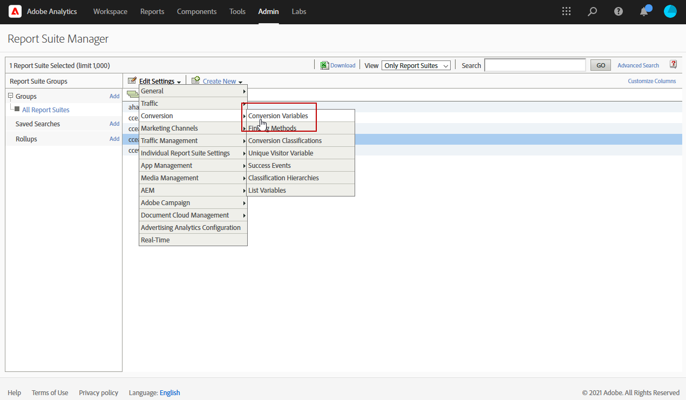

# Work with Campaign and Adobe Analytics

You can configure Adobe Analytics to integrate Campaign and Analytics.

This integration allows Adobe Campaign and Adobe Analytics to interact through the **Web Analytics connectors** add-on. This integration sends indicators and attributes of email campaigns delivered by Adobe Campaign to Adobe Analytics.

💬 As a Managed Cloud Services user, [contact Adobe](../start/campaign-faq.md#support) to connect Campaign with Adobe Experience Cloud services and solutions. The Web Analytics connector add-on must be installed on your environment, through the dedicated package.

Using Adobe Analytics Connector, Adobe Campaign has a way of measuring internet audience (Web Analytics). The Web analytics tools enable Adobe Campaign to forward indicators and campaign attributes to Analytics.

The action perimeter of each tool is as follows:

* **Adobe Analytics** marks the email campaigns launched with Adobe Campaign

* **Adobe Campaign** sends the indicators and campaign attributes to the connector, which in turn forwards them to the Web analytics tool

>[!CAUTION]
>
>Adobe Analytics Connector is not compatible with Transactional messaging (Message Center).

To set up Campaign-Analytics connection, you must perform the following operations:

1. [Create your Report suite in Adobe Analytics](#report-suite-analytics)
1. [Configure your Conversion variables and Success events](#configure-conversion-success)
1. [Configure your external account in Adobe Campaign](#external-account-ac)

## Create your Analytics Report suite {#report-suite-analytics}

To create your **[!UICONTROL Report suite]** in [!DNL Adobe Analytics], follow the steps below:

1. From [!DNL Adobe Analytics], select the **[!UICONTROL Admin tab]** then click **[!UICONTROL All admin]**.

   

1. Click **[!UICONTROL Report suites]**.

   

1. From the **[!UICONTROL Report suite manager]** page, click **[!UICONTROL Create new]** then **[!UICONTROL Report suite]**.

   For the detailed procedure on **[!UICONTROL Report suite]** creation, refer to this [section](https://experienceleague.adobe.com/docs/analytics/admin/manage-report-suites/new-report-suite/t-create-a-report-suite.html?lang=en#prerequisites).

   

1. Select a template. 

1. Configure your new report suite with the following information:

   * **[!UICONTROL Report Suite ID]**
   * **[!UICONTROL Site Title]**
   * **[!UICONTROL Time Zone]**
   * **[!UICONTROL Go Live Date]**
   * **[!UICONTROL Estimated Page Views Per Day]**

   

1. When configured, click **[!UICONTROL Create report suite]**.

## Configure your Conversion variables and Success events {#configure-conversion-success}

After creating your **[!UICONTROL Report suite]**, you need to configure your **[!UICONTROL Conversion variables]** and **[!UICONTROL Success events]** as follows:

1. Select your previously configured **[!UICONTROL Report suite]**. 

1. From the **[!UICONTROL Edit settings]** button, select  **[!UICONTROL Conversion]** >  **[!UICONTROL Conversion variables]**.

   

1. Click **[!UICONTROL Add new]** to create the identifiers required for measuring the impact of the email campaign, i.e. the internal campaign name (cid) and the iNmsBroadlog (bid) table ID.

   To learn how to edit **[!UICONTROL Conversion variables]**, refer to this [section](https://experienceleague.adobe.com/docs/analytics/admin/admin-tools/conversion-variables/t-conversion-variables-admin.html?lang=en#admin-tools).
   
   

1. Click **[!UICONTROL Save]** when done.

1. Then, to create your **[!UICONTROL Success events]**, select **[!UICONTROL Conversion]** >  **[!UICONTROL Success events]** from the  **[!UICONTROL Edit settings]** button.

   

1. Click **[!UICONTROL Add new]** to configure the following **[!UICONTROL Success events]**:

   * **[!UICONTROL Clicked]**
   * **[!UICONTROL Opened]**
   * **[!UICONTROL Person clicks]**
   * **[!UICONTROL Processed]**
   * **[!UICONTROL Scheduled]**
   * **[!UICONTROL Sent]**
   * **[!UICONTROL Total bounces]**
   * **[!UICONTROL Unique Clicks]**
   * **[!UICONTROL Unique Opens]**
   * **[!UICONTROL Unsubscribed]**

   To learn how to configure **[!UICONTROL Success events]**, refer to this [section](https://experienceleague.adobe.com/docs/analytics/admin/admin-tools/success-events/t-success-events.html?lang=en#admin-tools)

   

1. Click **[!UICONTROL Save]** when done.

When your report suite is configured, you will need to configure the **[!UICONTROL External accounts]** in Adobe Campaign.

## Configure your Campaign external account {#external-account-ac}

You now need to configure your **[!UICONTROL Web Analytics]** external account in Adobe Campaign to enable the sync between the two solutions.

Note that if one of your **[!UICONTROL Report suite]**, **[!UICONTROL Conversion variables]** or **[!UICONTROL Success events]** is not visible when configuring your external account, this means that you are missing a permission for this newly created component in the **[!UICONTROL Product profile]** associated to the user. 

For more information on this, refer to the [Product profiles for Adobe Analytics](https://experienceleague.adobe.com/docs/analytics/admin/admin-console/permissions/product-profile.html?lang=en#product-profile-admins) page.

1. Go to the **[!UICONTROL Administration]** > **[!UICONTROL Platform]** > **[!UICONTROL External accounts]** folder of the Adobe Campaign tree and click **[!UICONTROL New]**.

   

1. Use the drop-down list to select the **[!UICONTROL Web Analytics]** type and **[!UICONTROL Adobe Analytics]** from the **[!UICONTROL Integration]** drop-down.

   

1. Click **[!UICONTROL Configure]** next to the **[!UICONTROL Integration]** drop-down.

1. From the **[!UICONTROL Configure Analytics integration]** window, map your external account with your previously created Report suite providing the following information: 

   * **[!UICONTROL E-Mail]**
   * **[!UICONTROL IMS Org]**
   * **[!UICONTROL Analytics Company]**
   * **[!UICONTROL Report Suite]**

1. From the **[!UICONTROL eVars]** category, map the two **[!UICONTROL Conversion variables]** configured in [!DNL Adobe Analytics].

   

1. From the **[!UICONTROL Events]** category, map the ten **[!UICONTROL Success events]** configured in [!DNL Adobe Analytics].

1. Click **[!UICONTROL Submit]** when done. Adobe Campaign will create a **[!UICONTROL Data source]**, **[!UICONTROL Calculated metrics]**, **[!UICONTROL Remarketing segments]** and **[!UICONTROL Classifications]** in the mapped Analytics **[!UICONTROL Report Suite]**.

   Once this sync between [!DNL Adobe Analytics] and Adobe Campaign is done, you can close the window.

1. Settings can be viewed from the **[!UICONTROL Data Settings]** tab from the **[!UICONTROL Configure Analytics integration]** window. 

   Using the **[!UICONTROL Sync]** button, [!DNL Adobe Campaign] will sync the name changes done in [!DNL Adobe Analytics]. If the component is deleted in [!DNL Adobe Analytics], the component will be strikethrough in [!DNL Adobe Campaign] or displayed with a **not found** message.

   

   >[!NOTE]
   >
   > You cannot add or remove segments in this version of Campaign v8.
   
1. From your **[!UICONTROL External account]**, click the **[!UICONTROL Enrich the formula...]** link to change the URL calculation formula to specify the Web analytics tool integration information (campaign IDs) and the domains of the sites whose activity must be tracked.

   

1. Specify the domain name(s) of the sites.

   

1. Click **[!UICONTROL Next]** and make sure the domain names have been saved.

   

1. If necessary, you can overload the calculation formula. To do this, check the box and edit the formula directly in the window.

   >[!IMPORTANT]
   >
   >This configuration mode is reserved for expert users: any error in this formula may result in stopped email deliveries.

1. The **[!UICONTROL Advanced]** tab lets you configure or modify more technical settings.

    * **[!UICONTROL Lifespan]**: lets you specify the delay (in days_ after which the web events recovered in Adobe Campaign by technical workflows. Default: 180 days.
    * **[!UICONTROL Persistence]**: lets you the period during which all web events (a purchase for example) can be attributed to a re-marketing campaign, Default: 7 days.

>[!NOTE]
>
>If you are using several audience measuring tools, you can select **[!UICONTROL Other]** in the **[!UICONTROL Partners]** drop-down list when creating the external account. You may only reference one external account in the delivery properties: you will therefore need to adapt the formula of tracked URLs by adding the parameters expected by the Adobe and all other measuring tools used.

## Technical workflow of web analytics processes {#technical-workflows-of-web-analytics-processes}

Data exchange between Adobe Campaign and Adobe Analytics is handled by a technical workflow which runs as a background task.

This workflow is available from Campaign Explorer tree, under the **[!UICONTROL Administration]** > **[!UICONTROL Production]** > **[!UICONTROL Technical workflows]** > **[!UICONTROL Web analytics process]** folder.

The **[!UICONTROL Sending of indicators and campaign attributes]** workflow lets you send email campaign indicators via Adobe Campaign to the Adobe Experience Cloud using Adobe Analytics Connector. This workflow is triggered at 4am every day and it can take 24 hours for the data to be sent to Analytics.

Please note that this workflow should not be restarted or else it will resend all the prior data which can skew Analytics results.

The indicators involved are:
      
* **[!UICONTROL Messages to deliver]** (@toDeliver)
* **[!UICONTROL Processed]** (@processed)
* **[!UICONTROL Success]** (@success)
* **[!UICONTROL Total count of opens]** (@totalRecipientOpen)
* **[!UICONTROL Recipients who have opened]** (@recipientOpen)
* **[!UICONTROL Total number of recipients who clicked]** (@totalRecipientClick)
* **[!UICONTROL People who clicked]** (@personClick)
* **[!UICONTROL Number of distinct clicks]** (@recipientClick)
* **[!UICONTROL Opt-Out]** (@optOut)
* **[!UICONTROL Errors]** (@error)

>[!NOTE]
>
>Data sent is the delta based on the last snapshot which may lead to negative value in the metric data.

The attributes sent are as follows:

* **[!UICONTROL Internal name]** (@internalName)
* **[!UICONTROL Label]** (@label)
* **[!UICONTROL Label]** (operation/@label): only if the **Campaign** package is installed
* **[!UICONTROL Nature]** (operation/@nature): only if the **Campaign** package is installed
* **[!UICONTROL Tag 1]** (webAnalytics/@tag1)
* **[!UICONTROL Tag 2]** (webAnalytics/@tag2)
* **[!UICONTROL Tag 3]** (webAnalytics/@tag3)
* **[!UICONTROL Contact date]** (scheduling/@contactDate)

## Track deliveries {#tracking-deliveries-in-adobe-campaign}

In order for the Adobe Experience Cloud to be able to track activity on the sites once the delivery is sent by Adobe Campaign, you need to reference the matching connector in the delivery properties. To do this, apply the following steps:

1. Open the delivery of the campaign to be tracked.

   

1. Open the delivery properties.
1. Go to the **[!UICONTROL Web Analytics]** tab and select the previously created external account. Refer to [Configure your external account in Adobe Campaign](#external-account-ac).

   

1. You can now send your delivery and access your report for it in Adobe Analytics.

**Related topics**

* [Campaign - Experience Cloud Triggers integration](ac-triggers.md)
