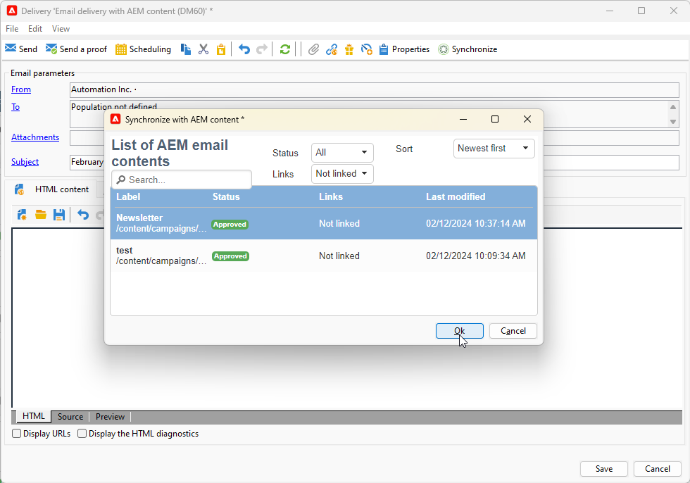

# Work with Campaign and Adobe Experience Manager {#ac-aem}

Integration between Adobe Campaign and Adobe Experience Manager allows you to manage the content of your email deliveries as well as your forms directly in Adobe Experience Manager. You have the option to either import your **Adobe Experience Manager** content into Campaign or connect your **Adobe Experience Manager as a Cloud service** account, allowing you to edit your content directly within the Web interface.

[Discover how to edit your Adobe Experience Manager as Cloud Service content within Campaign Web Interface](https://experienceleague.adobe.com/docs/campaign-web/v8/integrations/aem-content.html?lang=en)

[Learn more about Adobe Experience Manager in this document](https://experienceleague.adobe.com/docs/experience-manager-65/administering/integration/campaignonpremise.html#aem-and-adobe-campaign-integration-workflow)

## Import content from Adobe Experience Manager {#integrating-with-aem}

  As a Managed Cloud Services user, [contact Adobe](../start/campaign-faq.md#support) to integrate Adobe Experience Manager with Campaign.

This integration can be used for example to create a newsletter in Adobe Experience Manager which will then be used in Adobe Campaign as part of an email campaign.

**From Adobe Experience Manager:**

1. Navigate to your [!DNL Adobe Experience Manager] author instance and click Adobe Experience at the upper left corner of the page. Choose **[!UICONTROL Sites]** from the menu.

   

1. Access **[!UICONTROL Campaigns > Name of your brand (here we.Shopping) > Main Area > Email]**.

1. Click **[!UICONTROL Create]** and select **[!UICONTROL Page]** from the dropdown menu.

   

1. Select the **[!UICONTROL Adobe Campaign Email]** template and name your newsletter.

1. After creating your page, access the **[!UICONTROL Page information]** menu and click **[!UICONTROL Open Properties]**.

   

1. Customize your email content by adding components, such as personalization fields from Adobe Campaign.. [Learn more](https://experienceleague.adobe.com/docs/experience-manager-65/content/sites/authoring/aem-adobe-campaign/campaign.html?lang=en#editing-email-content)

1. Once your email is ready, navigate to the **[!UICONTROL Page information]** menu and click **[!UICONTROL Start workflow]**.

   

1. From the first drop-down, select **[!UICONTROL Approve Adobe Campaign]** as workflow model and click **[!UICONTROL Start workflow]**.

   

1. A disclaimer will appear at the top of your page stating, `This page is subject to the workflow Approve for Adobe Campaign`. Click **[!UICONTROL Complete]** next to the disclaimer to confirm the review and click **[!UICONTROL Ok]**.

1. Click **[!UICONTROL Complete]** again and select **[!UICONTROL Newsletter approval]** in the **[!UICONTROL Next Step]** drop-down.

   

Your newsletter is now ready and synchronized in Adobe Campaign.

**From Adobe Campaign:**

1. From the **[!UICONTROL Campaigns]** tab, click **[!UICONTROL Deliveries]** then **[!UICONTROL Create]**.

1. Choose the **[!UICONTROL Email delivery with AEM content (mailAEMContent)]** template from the **[!UICONTROL Delivery template]** drop-down menu.

   

1. Add a **[!UICONTROL Label]** to your delivery and click **[!UICONTROL Continue]**.

1. Click **[!UICONTROL Synchronize]** to access your AEM deliveries.

   If the button is not visible in your interface, navigate to the **[!UICONTROL Properties]** button and access the **[!UICONTROL Advanced]** tab. Ensure that the **[!UICONTROL Content editing mode]** field is configured to **[!UICONTROL AEM]**, and input your AEM instance details in the **[!UICONTROL AEM account]** field.

   

1. Select the AEM delivery previously created in [!DNL Adobe Experience Manager] and confirm by clicking **[!UICONTROL Ok]**.

   

1. Ensure to click the **[!UICONTROL Refresh content]** button whenever modifications are made to your AEM delivery.

   

1. To remove linkage between Experience Manager and Campaign, click **[!UICONTROL Desynchronize]**.

Your email is now ready to be send to your audience.

## Import assets from Adobe Experience Manager Assets library {#assets-library}

You can also directly insert assets from your [!DNL Adobe Experience Manager Assets Library] while editing an email or a landing page in Adobe Campaign. This functionality is detailed in [Adobe Experience Manager Assets documentation](https://experienceleague.adobe.com/docs/experience-manager-65/content/assets/managing/manage-assets.html?lang=en).

**From Adobe Experience Manager:**

1. Navigate to your [!DNL Adobe Experience Manager] author instance and click Adobe Experience at the upper left corner of the page. Choose **[!UICONTROL Assets]** `>` **[!UICONTROL Files]** from the menu.

   

1. Click **Create** then **Files** to import your asset to your **Adobe Experience Manager Assets Library**. [Learn more](https://experienceleague.adobe.com/docs/experience-manager-65/content/assets/managing/manage-assets.html?lang=en#uploading-assets)

   

1. Rename your asset if needed and select **Upload**.

Your asset is now uploaded to your **Adobe Experience Manager Assets Library**.

**From Adobe Campaign:**

1. In Adobe Campaign, create a new delivery by browsing to the **Campaigns** tab, click **Deliveries** and click the **Create** button above the list of existing deliveries.

   

1. Select a **Delivery template**, then name your delivery.

1. Define and personalize the message content. [Learn more](../send/email.md)

1. To use your **Adobe Experience Manager Assets library**, access the **[!UICONTROL Properties]** of your AEM delivery and select the **[!UICONTROL Advanced]** tab. 

   Choose your **AEM account** and enable the **[!UICONTROL Use above AEM instance as shared asset library]** option.

   

1. From the **Image** icon, access the **[!UICONTROL Select a shared asset]** menu.

   

1. From the selection window, select an image from your **Adobe Experience Manager Assets library**, then **Select**.

   

Your asset is now uploaded to your email delivery. You can now specify the target audience, confirm the delivery, and proceed with sending it. 
