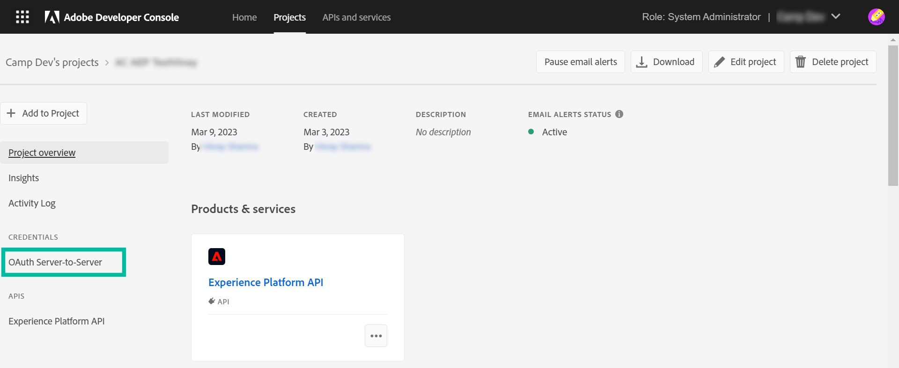
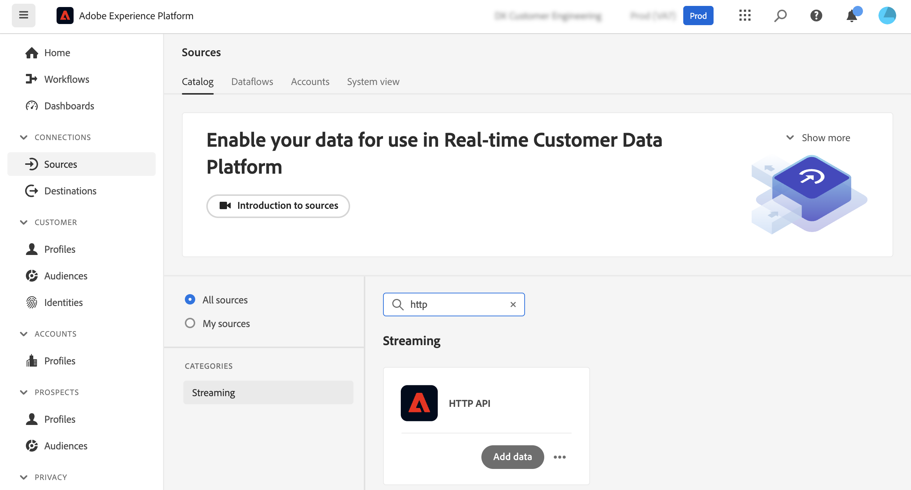
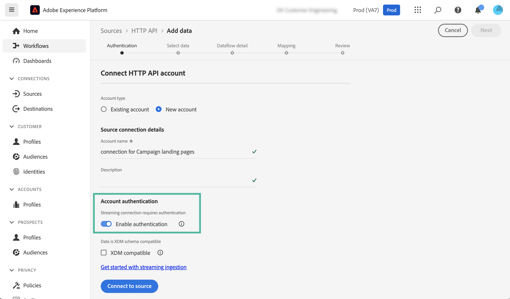
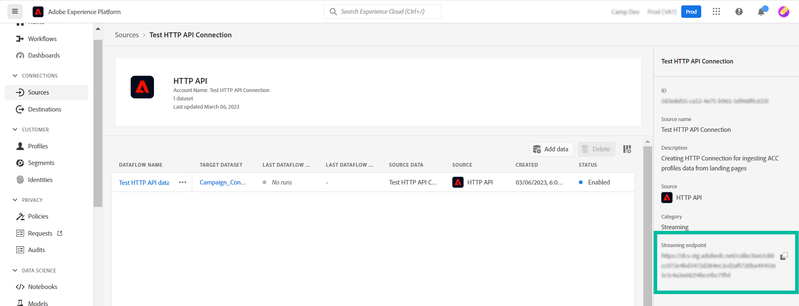
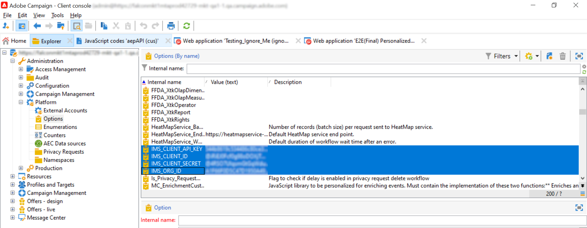
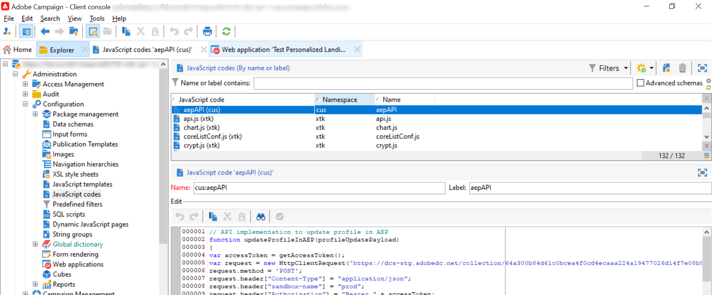
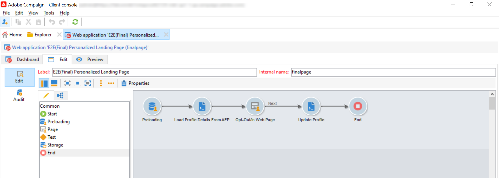

# Update Adobe Experience Platform profiles from Adobe Campaign landing pages

The integration between Adobe Campaign and Adobe Experience Platform allows you to synchronize data seamlessly between your Adobe Campaign landing pages and Adobe Experience Platform. With this integration, you can:

* Retrieve Adobe Experience Platform profile attributes to display updated information in Adobe Campaign landing pages,
* Send back updated profile attributes to Adobe Experience Platform to update the corresponding attributes based on what has been filled and submitted in the landing pages.

The main steps to set up this integration are as follows:

1. [Set up an OAuth connection](#oauth)
1. [Create an HTTP API Source connection](#source)
1. [Add authentication options in Adobe Campaign](#xtk)
1. [Add JavaScript codes in Adobe Campaign](#JavaScript)
1. [Configure the landing pages workflow](#script-activity)

## Set up an Oauth connection {#oauth}

Adobe Cloud Platform APIs use the OAuth 2.0 protocol for authentication and authorization. To connect Adobe Experience Platform to Adobe Campaign using API calls, you need to generate an access token using the OAuth Integration created in Adobe Developer Console.

To do this, follow these steps:

1. Access the Adobe Developer Console.
1. Create a new API connection using the Adobe Experience Platform API product. Detailed steps on how to obtain an OAuth 2.0 access token are available in the [Adobe Developer Console documentation](https://developer.adobe.com/developer-console/docs/guides/authentication/Tools/OAuthPlayground/).
1. Once the connection is created, navigate to the **[!UICONTROL OAuth Server-to-Server]** menu and copy the details below, which are required in Campaign for authentication:

    * CLIENT ID
    * CLIENT SECRET
    * ORGANIZATION ID

    {width="70%"}

Now that your Oauth connection is configured, create and configure a new **[!UICONTROL HTTP API]** Source connection to link Adobe Campaign with Adobe Experience Platform.

## Create an HTTP API Source connection {#source}

With the OAuth connection in place, the next step is to create an **[!UICONTROL HTTP API]** Source connection in Adobe Experience Platform. This connection allows you to stream data to Adobe Experience Platform using APIs. Follow these steps:

1. Navigate to Adobe Experience Platform **[!UICONTROL Sources]**, search for the **[!UICONTROL HTTP API]** source then click **[!UICONTROL Add data]**.

    {width="70%"}

1. Configure the connection depending on your needs. Detailed information on how to configure an HTTP API connection is available in [Adobe Experience Platform sources documentation](https://experienceleague.adobe.com/docs/experience-platform/sources/ui-tutorials/create/streaming/http.html).

    At the **[!UICONTROL Authentication]** step, toggle on the **[!UICONTROL Enable authentication]** option to authenticate using the access token generated prevearlier through the OAuth integration.

    {width="70%"}

1. Once the source connection is configured, the streaming endpoint displays. This endpoint is required to ingest data into Adobe Experience Platform. 

    {width="70%"}

    You can also access a sample of the data format ingested into Adobe Experience Platform by opening the newly created dataflow from the **[!UICONTROL Dataflows]** tab.

    {width="70%"}

Now that the HTTP API Source connection is set up, you need to add specific options into Adobe Campaign to enable the connection to Adobe Experience Platform.

## Add authentication options in Adobe Campaign {#xtk}

Once the HTTP API Source connection is configured, you need to add specific options into Adobe Campaign to enable the connection with Adobe Experience Platform. This can be done either in the Campaign Administration menu, or when executing your landing page workfow by adding a specific **[!UICONTROL JavaScript code]** activity.

Browse the tabs below to discover the two methods:

>[!BEGINTABS]

>[!TAB Add options from the Administration menu]

1. Navigate to the **[!UICONTROL Administration]** > **[!UICONTROL Platform]** > **[!UICONTROL Options]**  menu.
1. Add the following options with the corresponding values from Adobe Developer Console:

    * IMS_CLIENT_ID = cryptString(CLIENT ID)
    * IMS_CLIENT_SECRET = cryptString(CLIENT SECRET)
    * IMS_ORG_ID = ORGANIZATION ID
    * IMS_CLIENT_API_KEY = cryptString(CLIENT ID)

    {width="70%"}

    >[!NOTE]
    >
    >The cryptString() function is used to encrypt your authentication data.

>[!TAB Add options using a JavaScript code activity]

To configure these options automatically at the execution of your landing pages workflow, add a **[!UICONTROL JavaScript code]** activity to your workflow with the code below. [Learn how to configure a JavaScript code activity](https://experienceleague.adobe.com/docs/campaign/automation/workflows/wf-activities/action-activities/sql-code-and-JavaScript-code.html#JavaScript-code).

At workflow execution, the options are automatically created in the Campaign console with the provided values.

    ```
    loadLibrary("xtk:shared/nl.js");
    loadLibrary("xtk:shared/xtk.js");
    loadLibrary("xtk:shared/json2.js");
    loadLibrary("xtk:common.js");

    function setAuthCredentials()
    {
    setOption("IMS_CLIENT_ID", cryptString('CLIENT ID'));
    setOption("IMS_CLIENT_SECRET", cryptString('CLIENT SECRET'));
    setOption("IMS_ORG_ID", cryptString('ORGANIZATION ID'));
    setOption("IMS_CLIENT_API_KEY", cryptString('CLIENT ID'));
    }
    ```

>[!ENDTABS]

Now that authentication options are configure into Camapign, you need to create custom JavaScript codes to allow data sync between Campaign and Adobe Experience Platform from your landing page.

## Add options at workflow execution {#JavaScript}

To allow data synchronization between landing pages and Adobe Experience Platform, custom JavaScript codes must be added to Adobe Campaign. Follow these steps:

1. Navigate to the **[!UICONTROL Administration]** > **[!UICONTROL Configuration]** > **[!UICONTROL JavaScript codes]** menu.
1. Create new JavaScript codes and copy paste the below snippets.

    >[!NOTE]
    >
    >Access token and authentication data are automatically retrieved from the options set up previously.

    +++  Script 1 - Load profile attributes from Experience Platform

    This code checks if the profile exists in Adobe Experience Platform before loading the landing page. It retrieves the profile attributes and displays them in the corresponding fields of the landing page.

    ```
    // API implementation to read profile from AEP
    function getProfileInfo(email)
    {
    var accessToken = getAccessToken();
    var request = new HttpClientRequest(('https://platform-stage.adobe.io/data/core/ups/access/entities?schema.name=_xdm.context.profile&entityId=' + email + '&entityIdNS=email&fields=identities,consents.marketing'));
    request.method = 'GET';
    request.header["Content-Type"] = "application/json";
    request.header["sandbox-name"] = "prod";
    request.header["x-gw-ims-org-id"] = getOption('IMS_ORG_ID');
    request.header["x-api-key"] = getOption('IMS_CLIENT_API_KEY');
    request.header["Authorization"] = "Bearer " + accessToken;
    request.execute();
    return request.response;
    }
    ```

    +++

    +++ Script 2 - Update Experience Platform profile attributes

    This code updates profile attributes in Adobe Experience Platform with the values submitted in the landing page.

    ```
    // API implementation to update profile in AEP
    loadLibrary("xtk:shared/nl.js");
    loadLibrary("xtk:shared/xtk.js");
    loadLibrary("xtk:shared/json2.js");
    loadLibrary("xtk:common.js");

    function updateProfileInAEP(profileUpdatePayload)
    {
    var accessToken = getAccessToken();
    var request = new HttpClientRequest('https://dcs-stg.adobedc.net/collection/64a300b84d61c0bcea4f0cd4ecaaa224a19477026d14f7e08b5408ffaf5e6162?syncValidation=false');
    request.method = 'POST';
    request.header["Content-Type"] = "application/json";
    request.header["sandbox-name"] = "prod";
    request.header["Authorization"] = "Bearer " + accessToken;
    var body = '{"header":{"schemaRef":{"id":"https://ns.adobe.com/campdev/schemas/35d8e567772e1a1093ed6cf9e41d2c1fec22eeb3a89583e1","contentType":"application/vnd.adobe.xed-full+json;version=1.0"},"imsOrgId":"A1F66F0D5C47D1950A494133@AdobeOrg","datasetId":"63c7fa2a20cce11b98cccb41","source":{"name":"testHTTPSourcesVinay - 03/06/2023 5:43 PM"}},"body":{"xdmMeta":{"schemaRef":{"id":"https://ns.adobe.com/campdev/schemas/35d8e567772e1a1093ed6cf9e41d2c1fec22eeb3a89583e1","contentType":"application/vnd.adobe.xed-full+json;version=1.0"}},"xdmEntity":' + profileUpdatePayload +'}}';
    request.body = body;
    request.execute();
    return request.response;
    }


    // Get Access token from OAuth-Server-to-server API call
    function getAccessToken() {
    var clientId = decryptString(getOption('IMS_CLIENT_ID'));
    var clientSecret = decryptString(getOption('IMS_CLIENT_SECRET'));
    var request = new HttpClientRequest(('https://ims-na1-stg1.adobelogin.com/ims/token/v2?grant_type=client_credentials' + '&client_id=' + clientId + '&client_secret=' + clientSecret + '&scope=openid,session,AdobeID,read_organizations,additional_info.projectedProductContext'));
    request.method = 'POST';
    request.execute();
    var response = request.response;
    if(response.code != 200){
    logError('GetAccessToken failed,', response.code, response.body);
    return;
    }
    var body = ''+response.body;
    var parsedResponse = JSON.parse(body);
    var accessToken = parsedResponse.access_token;
    logInfo("Access token generated successfully");
    return accessToken;
    }
    ```

    +++

    {width="70%"}

Now that the custom JavaScript codes are created into Adobe Campaign, you can configure the workflow containing your landing page to use these JavaScript codes for data synchronization.

## Leverage the JavaScript codes into your landing page {#script}

With the JavaScript codes added to Adobe Campaign, you can leverage them into your landing page workflow using **[!UICONTROL JavaScript code]** activities:

* To load data from Experience Platform before loading the landing page, add a **[!UICONTROL JavaScript code]** activity before the landing page activity and copy paste Script 1.

    +++ Script 1 - Load profile attributes from Experience Platform

    ```
    // Script code to read profile from AEP.

    logInfo("Loading profile from AEP");
    loadLibrary("cus:aepAPI");
    var recipient=ctx.recipient;
    var email = recipient.@email;
    var response = getProfileInfo(email);
    ctx.isAEPProfileExists = 1;

    if(response.code == 404){
    ctx.isAEPProfileExists = 0
    logInfo("Profile with email" + email + " not found in AEP, ignoring the update activity");
    }
    else if(response.code == 200){
    var body = ''+response.body;
    var parsedResponse = JSON.parse(body);
    for (var key in parsedResponse) {
        var value =  parsedResponse[key];
        var marketing = value.entity.consents.marketing;
        logInfo("User Consent Details : " + JSON.stringify(marketing));   
        if(marketing.hasOwnProperty('email')&&marketing.email.hasOwnProperty('val')&&marketing.email.val=='n'){
        ctx.recipient.@blackListEmail = 1;
        }
        if(marketing.hasOwnProperty('sms')&&marketing.sms.hasOwnProperty('val')&&marketing.sms.val=='n'){
        ctx.recipient.@blackListMobile = 1;
        }
        if(marketing.hasOwnProperty('push')&&marketing.push.hasOwnProperty('val')&&marketing.push.val=='n'){
        ctx.recipient.@blackListPostalMail = 1;
        }
    } 
    }
    ```

    +++
    
* To update Experience Platform profile attributes with the data submitted in the landing page, add a **[!UICONTROL JavaScript code]** activity after the landing page activity and copy paste Script 2.

    +++ Script 2 - Update Experience Platform profile attributes

    ```
    // Script code to update profile in AEP and ACC.

    logInfo("Executing script to update AEP profile.");

    // Loading aepAPI library JS code
    loadLibrary("cus:aepAPI");

    var recipient=ctx.recipient

    // Update profile only if it exists in AEP
    if(ctx.isAEPProfileExists==1){
    
    var email = recipient.@email
    logInfo(email);
    logInfo(recipient.@blackListEmail);
    logInfo(recipient.@blackListMobile);
    logInfo(recipient.@blackListPostalMail);

    var optOutPayload = new Array();

    if(recipient.@blackListEmail==1){
        optOutPayload.push('"email":{"val":"n"}');
    }
    else
        optOutPayload.push('"email":{"val":"y"}');

    if(recipient.@blackListMobile==1){
        optOutPayload.push('"sms":{"val":"n"}');
    }
    else
        optOutPayload.push('"sms":{"val":"y"}');

    if(recipient.@blackListPostalMail==1){
        optOutPayload.push('"push":{"val":"n"}');
    }
    else
        optOutPayload.push('"push":{"val":"y"}');

    var profileUpdatePayload = '{'+ '"personalEmail":{"address":' + '\"' + email + '\"' + '},' +'"consents":{"marketing":{' + optOutPayload.toString() + '}}}';

    var response = updateProfileInAEP(profileUpdatePayload);
    if(response.code == 200){
    var body = '' + response.body;
    logInfo("AEP Profile Updated successfully, Response " + body);
    // Update ACC profile 
    recipient.@xtkschema = "nms:recipient";
    recipient.@_operation = "update";
    recipient.@_key="@id";
    xtk.session.Write(recipient);
    logInfo("ACC Profile Updated successfully");
    }
    else{
        logError('Server Error: ', response.code, response.body);
    } 
    }
    else {
    logInfo("Ignoring AEP profile update as profile doesn't exists.");
    
    // Update ACC profile   
    recipient.@xtkschema = "nms:recipient";
    recipient.@_operation = "update";
    recipient.@_key="@id";  
    xtk.session.Write(recipient);
    logInfo("ACC Profile Updated successfully");
    }
    ```

    +++

>[!CAUTION]
>
>Ensure that you customize the payload in each script based on your specific needs.
>
>If you do not add any script before the landing page activity, no profile existence check will be performed in Adobe Experience Platform. When the landing page is submitted and the profile doesn't exist, it will be created in Adobe Experience Platform with the attributes from the landing page.

Detailed information on how to configure a JavaScript code activity are available in [this page](https://experienceleague.adobe.com/docs/campaign/automation/workflows/wf-activities/action-activities/sql-code-and-JavaScript-code.html#JavaScript-code).

Here is the sample workflow using the JavaScript code activities before and after a landing page: 

{width="70%"}
