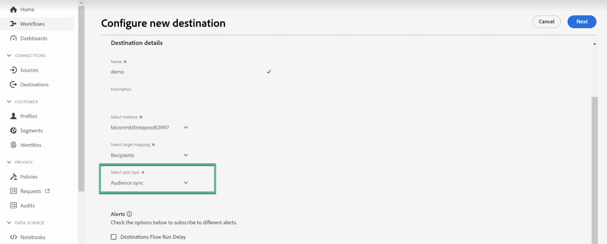

# Work with Campaign and Adobe Experience Platform

The Adobe Campaign Managed Cloud Service Destination and Source connectors allow seamless integration between Adobe Campaign and Adobe Experience Platform. With this integration, you can:

* Send Adobe Experience Platform audiences over to Adobe Campaign, and send back delivery and tracking logs into Adobe Experience Platform for analysis purpose,
* Bring Adobe Experience Platform profile attributes into Adobe Campaign and have a sync process in place so that they can be updated on a regular basis.

## Send Adobe Experience Platform audiences to Campaign {#audiences}

The main steps to send Adobe Experience Platform audiences to Adobe Campaign and send back delivery and tracking logs are as follows:

* Use an Adobe Campaign Managed Cloud Services **Destination connection** to send Experience Platform segments over to Adobe Campaign:

    1. Access the Adobe Experience Platform Destinations catalog and create a new **[!UICONTROL Adobe Campaign Managed Cloud Services]** connection.
    1. Provide details on the Campaign instance to use and choose **[!UICONTROL Audience sync]** as the sync type.

        {width="800" align="center"}

    1. Select the segments to send over to Adobe Campaign.
    1. Configure the attributes that you want to export in the audience. 
    1. Once the flow has been configured, the selected audiences will be available for activation into Adobe Campaign.

        {width="800" align="center"}

    Detailed information on how to configure the destination are available in [Adobe Campaign Managed Cloud Services connection documentation](https://www.adobe.com/go/destinations-adobe-campaign-managed-cloud-services-en){target="_blank"}

* Use an Adobe Campaign Managed Cloud Services **Source connection** to send Adobe Campaign delivery and tracking logs over to Adobe Experience Platform:

    To do this, configure a new Adobe Campaign Managed Cloud Services **Source connection** to ingest Campaign events into Adobe Experient Platform. Provide details on the Campaign instance and the schema to use, select a dataset where data should be ingested, then configure the fields to retrieve. [Learn how to create an Adobe Campaign Managed Cloud Services source connection](https://www.adobe.com/go/sources-campaign-ui-en)

    {width="800" align="center"}

## Sync profile attributes between Adobe Experience Platform and Adobe Campaign {#profile}

By connecting Adobe Campaign with Adobe Experience Platform, you can bring in additional profile attributes which are tied to a profile on Adobe Experience Platform and have a sync process in place so that they are updated in the Adobe Campaign database. 

For example, let's say you are capturing opt-in and opt-out values in Adobe Experience Platform. With this connection, you can bring over these values into Adobe Campaign and have a sync process in place so that they are updated on a regular basis.

>[!NOTE]
>
>Profile attributes sync is available for profiles that are already present in Adobe Campaign database.

The main steps to sync Adobe Experience Platform profile attributes with Adobe Campaign are as follows:

1. Access the Adobe Experience Platform Destinations catalog and create a new **[!UICONTROL Adobe Campaign Managed Cloud Services]** connection.
1. Provide details on the Campaign instance to use and choose **[!UICONTROL Profile sync (Update only)]** as the sync type.

    {width="800" align="center"}

1. Select the segments targeting the profiles to update into Adobe Campaign database.
1. Configure the profile attributes that you want to update into Adobe Campaign. 
1. Once the flow has been configured, the selected profile attributes will be synced with Adobe Campaign and updated for all the profiles targeted by the segments configured in the destination.

Detailed information on how to configure the destination are available in [Adobe Campaign Managed Cloud Services connection documentation](https://www.adobe.com/go/destinations-adobe-campaign-managed-cloud-services-en){target="_blank"}