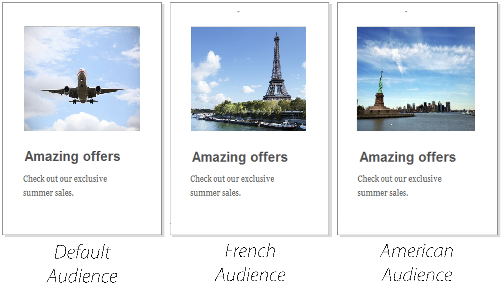
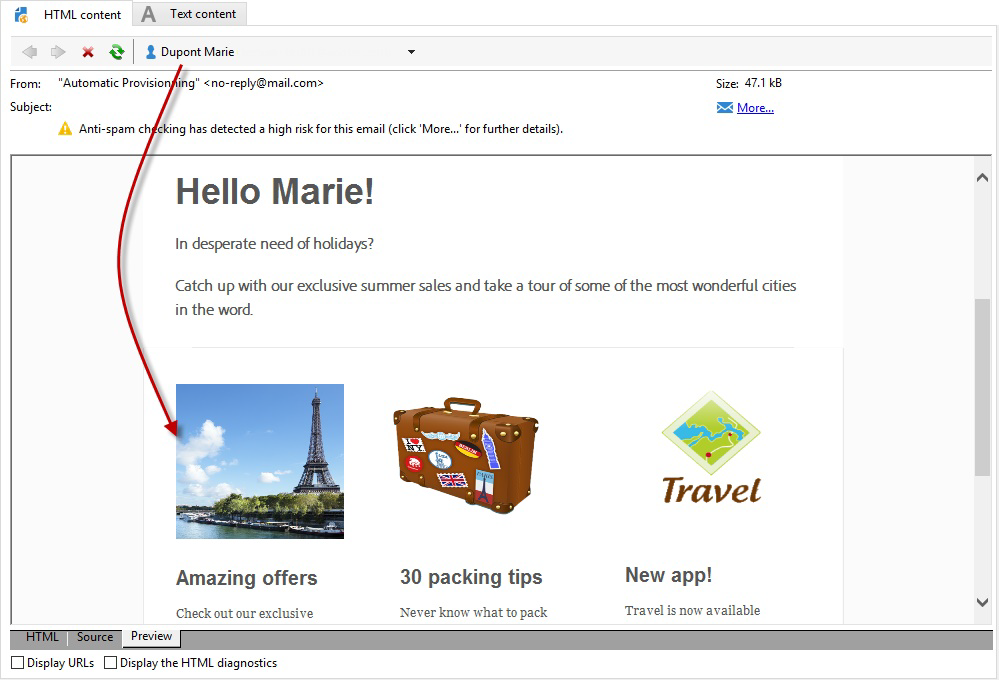

# Work with Campaign and Adobe Target

Connect Campaign and Target to include an offer from Adobe Target in an Adobe Campaign email delivery.

This integration helps you to implement use cases as follows: when a recipient opens an email sent via Adobe Campaign, a call to Adobe Target allows you to display a dynamic version of the content. This dynamic version is computed depending on the rules specified beforehand when creating the email.

>[!NOTE]
>The integration only supports static images. The other types of content cannot be personalized.

  As a Managed Cloud Services user, [contact Adobe](../start/campaign-faq.md#support) to implement Experience Cloud triggers with Campaign.

The following types of data can be used by Adobe Target:

* Data from the Adobe Campaign database
* Segments linked to the visitor ID in Adobe Target, only if the data used is not subject to legal limitations
* Adobe Target data: user agent, IP address, geolocalization data

## Insert a dynamic content

In the example below, you will learn how to integrate **a dynamic offer** from Adobe Target into an Adobe Campaign email.

We want to create a message with an image that will dynamically change according to the recipient's country. The data is sent with each mbox request and depends on the visitor's IP address.

In this email, we want one of the images to vary dynamically according to the following user-experiences:

* The email is opened in France.
* The email is opened in the United States.
* If none of these conditions apply, a default image is displayed.

THe following steps need to be achieved in Adobe Campaign and Adobe Target:

1. [Insert the dynamic offer in an email](#inserting-dynamic-offer)
1. [Create redirect offers](#create-redirect-offers)
1. [Create audiences](#audiences-target)
1. [Create an Experience Targeting Activity](#creating-targeting-activity)
1. [Preview and send the message](#preview-send-email)

### Insert the dynamic offer in an email {#inserting-dynamic-offer}

In Adobe Campaign, define the target and the content of your email. You can insert a dynamic image from Adobe Target.

To do this, specify the default image's URL, the location name, and the fields you want to transfer to Adobe Target.

In Adobe Campaign, there are two ways to insert a dynamic image from Target into an email:

* If you are using the digital content editor, choose an existing image and select **[!UICONTROL Insert]** > **[!UICONTROL Dynamic image served by Adobe Target]** from the toolbar.

   

* If you are using the standard editor, place the cursor where you want to insert the image and select **[!UICONTROL Include]** > **[!UICONTROL Dynamic image served by Adobe Target...]** from the personalization drop-down menu.

   

You can then define the image parameters:

* The **[!UICONTROL Default image]**'s URL is the image that will be displayed when none of the conditions are fulfilled. You can also select an image from your Assets library.
* The **[!UICONTROL Target location]** is the name of your dynamic offer's location. You will have to select this location in your Adobe Target activity.
* The **[!UICONTROL Landing Page]** lets you redirect the default image to a default landing page. This URL applies only when the default image is displayed in the final email. It is optional.
* The **[!UICONTROL Additional decision parameters]**  defines the mapping between the fields defined in the Adobe Target segments and the Adobe Campaign fields. The Adobe Campaign fields used must have been specified in the rawbox. In our example, we added the Country field.

If you use Enterprise permissions in your settings in Adobe Target, add the corresponding property in this field. Learn more about Target Enterprise permissions in [this page](https://experienceleague.adobe.com/docs/target/using/administer/manage-users/enterprise/properties-overview.html?lang=en#administer).

### Create redirect offers {#create-redirect-offers}

In Adobe Target, you can create different versions of your offer. Depending on each user experience, a redirect offer can be created and you can specify the image that will be displayed.

In our case, we need two redirect offers, the third one (the default one) is to be defined in Adobe Campaign.

1. To create a new redirect offer in Target Standard, from the **[!UICONTROL Content]** tab, click **[!UICONTROL Code offers]**.

1. Click **[!UICONTROL Create]** then **[!UICONTROL Redirect Offer]**.

   

1. Enter a name for the offer and the URL of your image.

   

1. Follow the same procedure for the remaining redirect offer. For more on this, refer to this [page](https://experienceleague.adobe.com/docs/target/using/experiences/offers/offer-redirect.html?lang=en#experiences).

### Create audiences {#audiences-target}

In Adobe Target, you need to create the two audiences into which the people who visit your offer will be categorized for the different contents to be delivered. For each audience, add a rule to define who will be able to see the offer.

1. To create a new audience in Target, from the **[!UICONTROL Audiences]** tab, click **[!UICONTROL Create Audience]**.

   

1. Add a name to your audience.

   

1. Click **[!UICONTROL Add a rule]** and select a category. The rule uses specific criteria to target the visitors. You can refine the rules by adding conditions or by creating new rules in other categories.

1. Follow the same procedure for the remaining audiences.

### Create an Experience Targeting Activity {#creating-targeting-activity}

In Adobe Target, we need to create an Experience Targeting activity, define the different experiences, and associate them with the corresponding offers.

First you need to define the audience:

1. To create an Experience Targeting activity, from the **[!UICONTROL Activities]** tab, click **[!UICONTROL Create Activity]** then **[!UICONTROL Experience Targeting]**.

   

1. Select **[!UICONTROL Form]** as **[!UICONTROL Experience Composer]**.

1. Choose an audience by clicking the **[!UICONTROL Change audience]** button.

   

1. Select the audience that was created in the previous steps.

   

1. Create another experience by clicking **[!UICONTROL Add Experience Targeting]**.

Then add a content for each audience:

1. Select the location name that you chose when inserting the dynamic offer in Adobe Campaign.

   

1. Click the drop-down button and select **[!UICONTROL Change Redirect Offer]**.

   

1. Select the redirect offer that you had previously created.

   

1. Follow the same steps for the second experience.

The **[!UICONTROL Target]** window summarizes your activity. If necessary, you can add other experiences.

   

The **[!UICONTROL Goal & Settings]** window allows you to personalize your activity by setting a priority, an objective, or a duration.

The **[!UICONTROL Reporting Settings]** section lets you select an action and edit the parameters that will determine when your goal is achieved.

   

## Preview and send the message {#preview-send-email}

In Adobe Campaign, you can now preview your email and test its rendering on different recipients. 

You will notice that the image changes according to the different experiences created.

You are now ready to send your email including a dynamic offer from Target.

   
