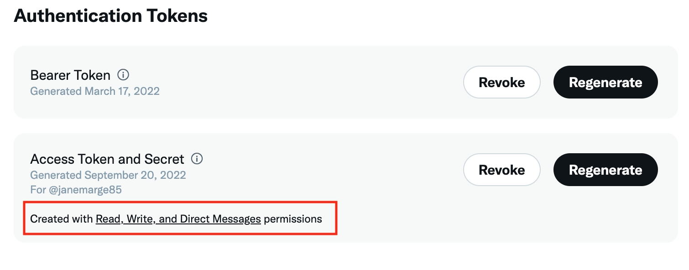

# Work with Campaign and X (Twitter) {#tw-ac-ovv}

The **Managing social networks (Social Marketing)** module lets you interact with your customers via X (formerly known as Twitter). Use this capability to:

* Post messages and send DMs - Use Adobe Campaign Social Marketing to post messages on X. You can also send direct messages to all your followers.

* Collect new contacts - Adobe Campaign Social Marketing also makes it easy to acquire new contacts: contact users and ask them if they want to share their profile information. If they accept, Adobe Campaign automatically recovers the data, which enables you to carry out targeting campaigns and, when possible, to implement cross-channel strategies.

 As a Managed Cloud Services user, [contact Adobe](../start/campaign-faq.md#support) to connect Campaign with X. The  **Managing social networks (Social Marketing)** add-on must be installed on your environment, through the dedicated package, and the Twitter External Account must be configured.

To configure Adobe Campaign to post tweets to your X accounts, delegate write access to Adobe Campaign for these accounts. To do this, you must:

1. Create a X account and sign up for a developer account. [Learn more](#dev-account)
1. (optional) Create a test X account for sending proofs. [Learn more](#tw-test-account)
1. Create a X application (one app per X account). [Learn more](#create-an-app-on-twitter)
1. Create a new service for **[!UICONTROL Twitter]** (one service per X account). [Learn more](#create-tw-service)
1. Synchronize your X account with Campaign. [Learn more](#synchro-tw-accounts)

## X developer account {#dev-account}

To start with this integration, you must sign up for a [X developer account](https://developer.twitter.com){target="_blank"}.

Campaign uses the 1.1 version of the X API. To use it, you need to apply for Elevated access via the Developer Portal. Learn more about X Elevated Access [in this page](https://developer.twitter.com/en/portal/products/elevated){target="_blank"}.

## Create an application on X {#create-an-app-on-twitter}

Once you have been approved with Elevated access, create a X application to enable Adobe Campaign to create posts on your X account. To do this, follow the steps below:

1. Log on to your X account.
1. Connect to [X developer portal](https://developer.twitter.com/en/apps).
1. Select **Create an App**.
1. Let X assistant guide you through the process.
1. To allow Adobe Campaign to create posts on your account, edit to the **App permissions** from the User authentication set up section of your app. Select **Read, Write, and Direct Messages**. 

   
   
1. In the **Type of app** section, select **Web App, Automated App or Bot**. You can leave the **Callback URL** field empty, and save your configuration.

   

1. Back to your app dashboard, select your app and browse to the **Keys and tokens** tab. Under **Access Token and Secret**, if the **Read, Write, and Direct Messages** permission is not mentioned, you must regenerate your app's token and secret. Note that all the keys and tokens must be saved upon creation. You will need them to configure your Campaign Twitter service.

   

>[!NOTE]
>
>You need one application per X account. As a consequence, you must create another test application to send proofs to your test account.
>

## Create a Twitter service in Campaign {#create-tw-service}

To link your Campaign instance with your X account, create a **Twitter** service and delegate write access to Campaign. 

>[!CAUTION]
>
>Create one **Twitter** service per X account. As a consequence, you must create another test service to send proofs to your [test account](#tw-test-account).
>
>Each **Twitter** service must also be created by Adobe on your MID instance. Contact your Adobe representative to have your environment configured.
>

To enter settings, you must access both to your Adobe Campaign client console and an your X app permissions.

1. In **Adobe Campaign**, browse to the **[!UICONTROL Profiles and targets]** tab, and select the **[!UICONTROL Services and Subscriptions]** link
1. Create a new service.
1. Select the **[!UICONTROL Twitter]** type.
1. Enter the label and internal name of the service.

   >[!CAUTION]
   >
   >The **[!UICONTROL Internal name]** of the service must be the exact same name of your X account. 
   >

1. By default, followers are saved in the **[!UICONTROL Visitors]** folder. You can select another location from the **[!UICONTROL Visitor folder]** field. [Learn more](../send/twitter.md#direct-tw-messages)

   
   
   >[!NOTE]
   >
   >The **[!UICONTROL Synchronize subscriptions]** option is enabled by default: this option recovers automatically the list of your X followers so that you can [send them direct messages](../send/twitter.md#direct-tw-messages). Synchronization is performed by a [dedicated technical workflow](#synchro-tw-accounts). 

1. From your X app, copy the content of the **API Key** and **[API Key Secret]** fields and paste them into the **[!UICONTROL Consumer key]** and **[!UICONTROL Consumer secret]** fields of your Campaign **Twitter** service.

1. From your X app, copy the content of the **Access Token** and **Access Token Secret** fields and paste them into the **[!UICONTROL Access token]** and **[!UICONTROL Access token secret]** fields of your Campaign **Twitter** service.

1. In Campaign client console, click **[!UICONTROL Save]**. You have now delegated write access to Adobe Campaign.

To check your settings, you can:

* Edit the **Twitter** service which you have just created.
* Browse the **[!UICONTROL Twitter page]** tab: your Twitter account should be displayed. 
   

## Synchronize your X account {#synchro-tw-accounts}

Synchronization between Campaign and X is managed through dedicated technical workflows. These workflows are stored in the **[!UICONTROL Administration > Production > Technical workflows > Managing social networks]** folder. 

They are stopped by default: you must start them manualy when you start using the **Social Marketing** module.

The **[!UICONTROL Synchronization of Twitter accounts]** technical workflow synchronizes X accounts in Adobe Campaign. This workflow recovers the list of X followers so that you can send them direct messages. [Learn more](../send/twitter.md#direct-tw-messages)

By default, this workflow is triggered every Thursday at 7:30AM. You can use the **[!UICONTROL Execute pending task(s) now]** option to start the workflow at any time as you are implementing this integration.  You can also edit the scheduler to change the workflow triggering frequency. Learn more in [this page](../../automation/workflow/scheduler.md).

>[!CAUTION]
>
>To recover the list of X subscribers, the **[!UICONTROL Twitter account synchronization]** option must be checked for the service linked to the account. [Learn more](#create-tw-service)

The followers are stored in a specific table: the visitors table. To display the list of X followers, browse to the **[!UICONTROL Profiles and Targets > Visitors]**.

For each follower, Adobe Campaign stores the following information:

* **[!UICONTROL Origin]**: Twitter
* **[!UICONTROL External ID]**: user identifier
* **[!UICONTROL Username]**: account name of the user
* **[!UICONTROL Full name]**: name of the user
* **[!UICONTROL Number of friends]**: number of followers
* **[!UICONTROL Checked]**: this field indicates whether the user has a verified Twitter account

Once this configuration is done, you can create posts on your X accounts and send direct messages to your followers. [Learn more](../send/twitter.md)

## Create a test account on X {#tw-test-account}

In addition to X account, create a private X account which can be used for sending [tweet proofs](../send/twitter.md#send-tw-proofs). To do this, follow the steps below:

1. Create a new X account.
1. Access the account  **Settings**.
1. Browse to **Privacy & Safety** and **Audience and Tagging** and check the **Protect your posts** option. Your posts and other account information are only visible to people who follow you.

Configure your X app and Campaign service to work with this test account, as described above.
