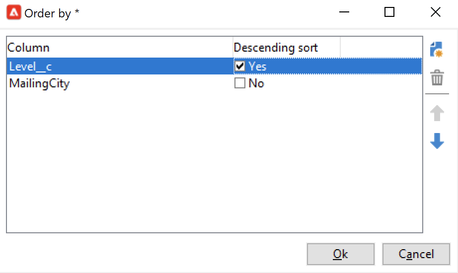

# Synchronize data between Campaign and your CRM {#data-synchronization}

Data synchronization between Adobe Campaign and your CRM is managed by the **CRM Connector** workflow activity.

For example, to import the Microsoft Dynamics data into Adobe Campaign, create the following type of workflow:

This workflow imports the contacts via Microsoft Dynamics, synchronizes them with the existing Adobe Campaign data, deletes duplicate contacts, and updates the Adobe Campaign database.

The **[!UICONTROL CRM Connector]** activity needs to be configured to synchronize data.

With this activity you can:

* Import from the CRM - [Learn more](#importing-from-the-crm)
* Export to CRM - [Learn more](#exporting-to-the-crm)
* Import objects deleted in the CRM - [Learn more](#importing-objects-deleted-in-the-crm)
* Delete objects in the CRM - [Learn more](#deleting-objects-in-the-crm)

Select the external account that matches the CRM that you want to configure synchronization with, then select the object to synchronize: accounts, opportunities, leads, contacts, etc.

The configuration of this activity depends on the process to be carried out. Various configurations are detailed below.

## Import from the CRM {#importing-from-the-crm}

To import data via the CRM in Adobe Campaign, you need to create the following type of workflow:

1. Select an **[!UICONTROL Import from the CRM]** operation.
1. In the **[!UICONTROL Remote object]** drop-down list, select the object to import. This object match with one of the tables created in Adobe Campaign during connector configuration.
1. In the **[!UICONTROL Remote fields]** section, enter the fields to be imported.

   To add a field, click the **[!UICONTROL Add]** button in the toolbar, then click the **[!UICONTROL Edit expression]** icon.

   If necessary, change the data format using the drop-down list of the **[!UICONTROL Conversion]** columns. Possible conversion types are detailed in [this section](#data-format).

   >[!CAUTION]
   >
   >The identifier of the record in the CRM is mandatory for linking objects in CRM and in Adobe Campaign. It is added automatically when the box is approved.  
   >
   >The last modification date on the CRM side is also mandatory for incremental data imports.

1. You can filter the data to be imported based on your needs. To do this, click the **[!UICONTROL Edit the filter...]** link.

   In the following example, Adobe Campaign will only import contacts for which some activity has been recorded since Nov 1st 2021.

   

   >[!CAUTION]
   >
   >The limitations related to data filtering modes are detailed in [this section](#filtering-data).

1. Use the **[!UICONTROL Use automatic index...]** option to automatically manage incremental object synchronization between your CRM and Adobe Campaign, depending on the date and their last modification.

   For more on this, refer to [this section](#variable-management).

### Manage variables {#variable-management}

Activate the **[!UICONTROL Automatic index]** option to collect only objects modified since the last import.

The date of the last synchronization is stored in an option specified in the configuration window, by default: **LASTIMPORT_<%=instance.internalName%>_<%=activityName%>**.

>[!NOTE]
>
>This note only applies to the generic **[!UICONTROL CRM Connector]** activity. For other CRM activities, the process is automatic.  
>
>This option has to be manually created and populated under **[!UICONTROL Administration]** > **[!UICONTROL Platform]** > **[!UICONTROL Options]**. It must be a text option and its value needs to match the following format: **yyyy/MM/dd hh:mm:ss**. 
> 
>You need to manually update this option for any further import.

You can specify the remote CRM field to be taken into account to identify the most recent changes.

By default, the following fields are used (in the specified order):

* For Microsoft Dynamics: **modifiedon**,
* For Salesforce.com: **LastModifiedDate**, **SystemModstamp**.

Activating the **[!UICONTROL Automatic index]** option generates three variables that can be used in the synchronization workflow via a **[!UICONTROL JavaScript code]** type activity. These activities are:

* **vars.crmOptionName**: name of the option that contains the last import date.
* **vars.crmStartImport**: start date (included) of the last data import.
* **vars.crmEndDate**: end date (excluded) of the last data import.

  >[!NOTE]
  >
  >These dates are displayed in the following format: **yyyy/MM/dd hh:mm:ss**.

### Filter data {#filtering-data}

To ensure efficient operation with the various CRMs, filters need to be created using the following rules:

* Each filtering level may only use one type of operator.
* The AND NOT operator is not supported.
* Comparisons may only concern null values ('is empty'/'is not empty' type) or numbers. This means that the value (right-hand column) is assessed and the result of this assessment must be a number. JOIN type comparisons are therefore not supported.
* The value contained in the right-hand column is assessed in JavaScript.
* JOIN comparisons are not supported.
* The expression in the left-hand column must be a field. It cannot be a combination of several expressions, a number, etc.

### Order by {#order-by}

In Microsoft Dynamics and Salesforce.com, you can sort the remote fields to be imported in ascending or descending order.

To do this, click the **[!UICONTROL Order by]** link and add the columns to the list.

The order of the columns in the list is the sorting order:

### Record identification {#record-identification}

Rather than import elements included (and possibly filtered) in the CRM, you can use a population calculated beforehand in the workflow.

To do this, select the **[!UICONTROL Use the population calculated upstream]** option and specify the field that contains the remote identifier.

Then select the fields of the inbound population that you want to import, as shown below:

## Export to the CRM {#exporting-to-the-crm}

Export Adobe Campaign data into your CRM to copy its entire contents to your CRM database.

To export data to your the CRM, create the following type of workflow:

1. Select an **[!UICONTROL Export to CRM]** operation.
1. Go to the **[!UICONTROL Remote object]** drop-down list and select the object to export. This object matches with one of the tables created in Adobe Campaign during connector configuration.

   >[!CAUTION]
   >
   >The export function of the **[!UICONTROL CRM Connector]** activity can insert or update fields on your CRM. To enable field updates in the CRM, specify the primary key of the remote table. If the key is missing, data will be inserted, instead of being updated.

1. If you need to perform faster exports, check the  **[!UICONTROL Export in Batches]** option.

   

1. In the **[!UICONTROL Mapping]** section, click **[!UICONTROL New]** to specify the fields to be exported and their mapping in your CRM.

   To add a field, click the **[!UICONTROL Add]** button in the toolbar, then click the **[!UICONTROL Edit expression]** icon.

   >[!NOTE]
   >
   >If no match is defined for a field, the values cannot be updated: they are inserted directly into the CRM.

   If necessary, change the data format using the drop-down list of the **[!UICONTROL Conversion]** columns. Possible conversion types are detailed in [this section](#data-format).

   >[!NOTE]
   >
   >The list of records to be exported and the result of the export are saved in a temporary file that remains accessible until the workflow is finished or re-started. This enables you to start the process safely in case of errors.

## Additional configurations {#additional-configurations}

### Data format {#data-format}

You can convert data format on the fly when importing them to or from your CRM.

To do this, select the conversion to be applied in the matching column.

The **[!UICONTROL Default]** mode applies automatic data conversion, which in most cases equals a copy/paste of the data. However, time zone management is applied.

Other possible conversions are:

* **[!UICONTROL Date only]**: deletes Date + Time type fields.
* **[!UICONTROL Without time offset]**: cancels the time zone management applied in the default mode.
* **[!UICONTROL Copy/Paste]**: uses raw data such as strings (no conversion).

### Error processing {#error-processing}

Within the framework of data imports or exports, you can apply a specific process to errors and rejects. To do this, select the **[!UICONTROL Keep the rejections in a file]** and **[!UICONTROL Process errors]** options in the **[!UICONTROL Behavior]** tab.

These options add the related output transitions.

Then insert the relevant activities to process data. For example, add a **Wait** activity and schedule retries for errors.

The **[!UICONTROL Reject]** output transition lets you access the output schema that contains the specific columns relevant to error messages and codes. For Salesforce.com, this column is **errorSymbol** (error symbol, different from the error code), **errorMessage** (description of the error context).

## Import objects deleted in the CRM {#importing-objects-deleted-in-the-crm}

You can import objects deleted in the CRM into Adobe Campaign.

1. Select an **[!UICONTROL Import objects deleted in the CRM]** operation.
1. Go to the **[!UICONTROL Remote object]** drop-down list and select the object concerned by the process. This object matches with one of the tables created in Adobe Campaign during connector configuration.
1. Specify the deletion period to be taken into account in the **[!UICONTROL Start date]** and the **[!UICONTROL End date]** fields (dates are included).

   >[!CAUTION]
   >
   >The deletion period must coincide with your CRM specific limitations. For example for Salesforce.com, elements deleted over 30 days ago cannot be recovered.

## Delete objects in the CRM {#deleting-objects-in-the-crm}

To delete objects on your CRM, specify the primary key of the remote elements to be deleted.

The **[!UICONTROL Behavior]** tab lets you enable the processing of rejects. This option generates a second output transition for the **[!UICONTROL CRM connector]** activity. For more on this, refer to [Error processing](#error-processing).
