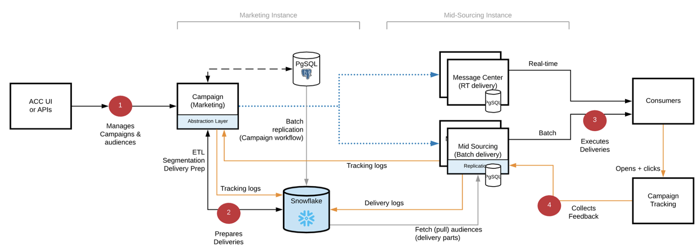
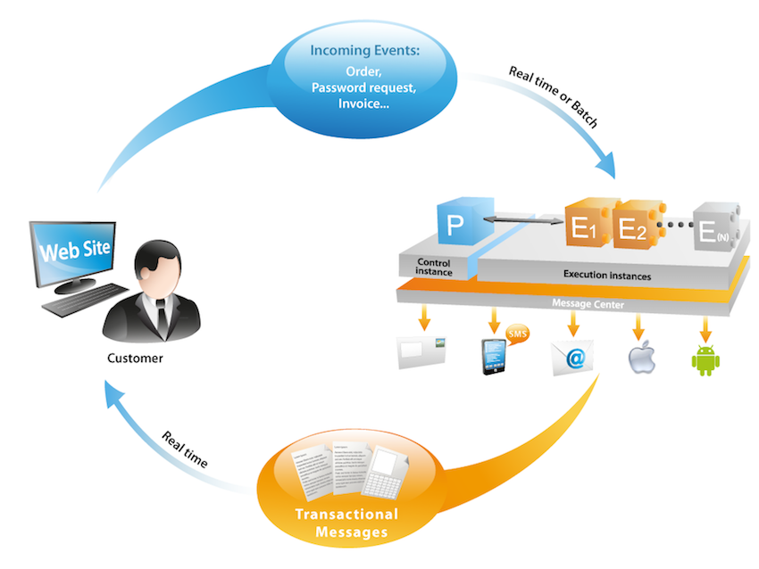

# Get Started with Campaign architecture{#gs-ac-archi}

## Environments 

Campaign is made available as individual instances with each instance representing a complete Campaign environment.

Three types of environments available with Campaign Cloud Service:

* **Production environment**: hosts the applications for the business practitioners.

* **Stage environment**: used for various performance and quality tests before changes to the application are pushed to the production environment.

* **Development environment**: allows developers to implement Campaign under the same runtime conditions as the stage and production environments.

You can export and import packages from one environment to another.

:arrow_upper_right: Learn more about packages in [Campaign Classic documentation](https://experienceleague.adobe.com/docs/campaign-classic/using/getting-started/administration-basics/working-with-data-packages.html)

## Mid-sourcing deployment{#mid-sourcing-deployment}

General communication between servers and processes is carried out according to the following schema:

 

* The execution and bounce management modules are disabled on the instance.

* The application is configured to perform message execution on a remote "mid-sourced" server that is driven using SOAP calls (over HTTP or HTTPS).

>[!NOTE]
>
> Campaign v8 relies on a hybrid architecture. If you are transitioning from Campaign Classic v7, note that all deliveries go through the mid-sourcing server. 
> As a consequence, internal routing is **not possible** in Campaign v8, and the external account has been disabled accordingly.

## Message Center architecture{#transac-msg-archi}

Transactional messaging (Message Center) is the Campaign module designed for managing trigger messages. 

:bulb: Learn how to send transactional messages in [this section](../send/transactional.md).

In response to an action of a customer on a website, an event is sent Campaign through a REST API, and the message template is populated with the information or data provided through the API call, and a transactional message is sent in real-time to the customer. These messages can be sent individually or in batches via email, SMS or push notifications. 

In this specific architecture, execution cell is separated from the control instance to ensure high availability and load management.

* The **Control instance** (or Marketing instance) is used by marketers and IT teams to create, configure and publish message templates. This instance also centralize event monitoring and history.
    
    :arrow_upper_right: Learn how to create and publish message templates in [Campaign Classic documentation](https://experienceleague.adobe.com/docs/campaign-classic/using/transactional-messaging/message-templates/introduction.html?lang=en#transactional-messaging)

* The **Execution instance** retreives incoming events (password reset or orders from a website for example) and sends out personalized messages. There can be more than one execution instance to process messages via the load-balancer and scale the number of events to be proceeded for maximum availability.

>[!CAUTION]
>
>The control instance and the execution instance(s) must be installed on different machines. They cannot share the same Campaign instance.

:arrow_upper_right: Message Center architecture is described in [Campaign Classic documentation](https://experienceleague.adobe.com/docs/campaign-classic/using/transactional-messaging/introduction/transactional-messaging-architecture.html?lang=en#transactional-messaging)

### Authentication

To use these capabilities, Adobe Campaign users log on to the control instance to create transactional message templates, generate the message preview using a seed list, display reports and monitor execution instance(s).

* Single Execution instance
    When interacting with an Adobe hosted Message Center execution instance, an external system can first retrieve a session token (that by default expires in 24 hours), by making an api call to the session logon method, using a provided account login and password.
    Then, with the sessionToken provided by the execution instance in response to the above call, the external application can make SOAP api invocations (rtEvents or batchEvents) to send communications, without the need to include in each SOAP call the account login and password.
 
* Multiple execution instances
    In a multi-cell execution architecture with multiple execution instances behind a load balancer, the logon method invoked by the external application is going through the load balancer: for that reason, a token-based authentication cannot  be used. A user/password-based authentication is required. 

:arrow_upper_right: Learn more about Transactional messaging events in [Campaign Classic documentation](https://experienceleague.corp.adobe.com/docs/campaign-classic/using/transactional-messaging/introduction/event-description.html?lang=en#about-transactional-messaging-datamodel)