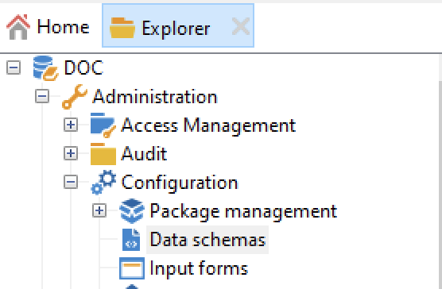
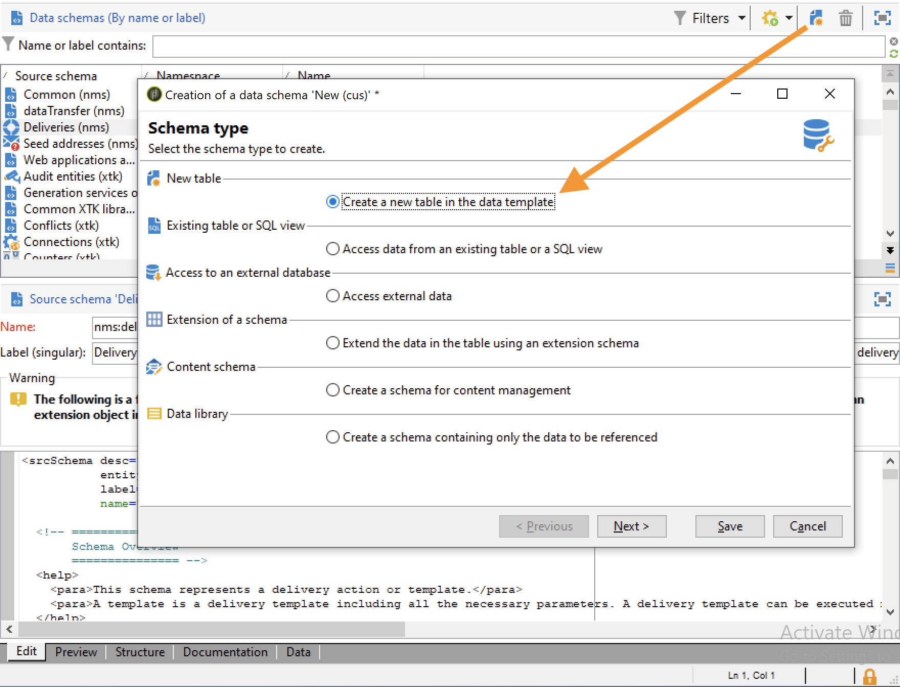
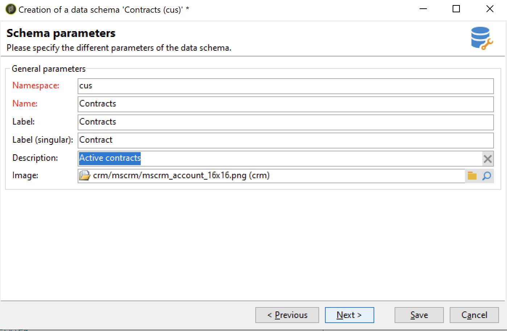
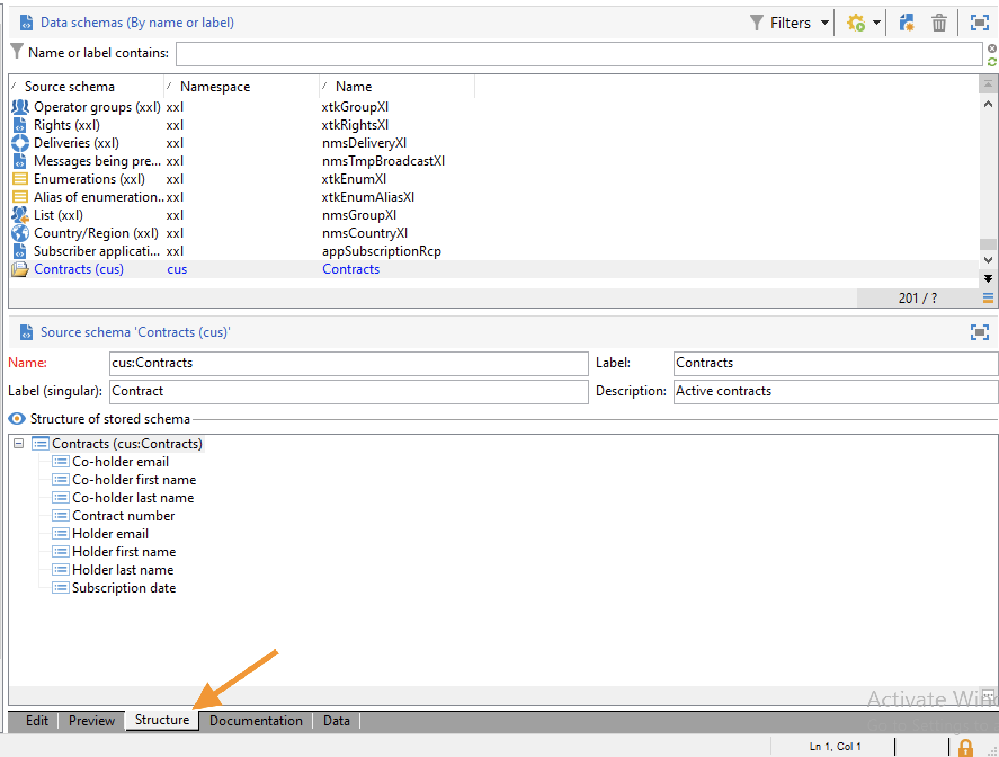

# Create a new schema{#create-new-schema}

To edit, create and configure the schemas, click the **[!UICONTROL Administration > Configuration > Data schemas]** node of the Adobe Campaign client console.

>[!NOTE]
>
>Built-in data schemas can only be deleted by an administrator of your Adobe Campaign console.



The **[!UICONTROL Edit]** tab shows the XML content of a schema:


>[!NOTE]
>
>The "Name" edit control lets you enter the schema key made up of the name and namespace. The "name" and "namespace" attributes of the root element of the schema are automatically updated in the XML editing zone of the schema. Note that some namespaces are internal only. [Learn more](schemas.md#reserved-namespaces)

The **[!UICONTROL Preview]** tab automatically generates the extended schema:


>[!NOTE]
>
>When the source schema is saved, generation of the extended schema is automatically launched.

If you need to check the complete structure of a schema, you can use the **[!UICONTROL Preview]** tab. If the schema has been extended, you will then be able to visualize all its extensions. As a complement, the **[!UICONTROL Documentation]** tab displays all the schema attributes and elements, and their properties (SQL Field, type/length, label, description). The **[!UICONTROL Documentation]** tab only applies to generated schemas. 

## Use case: create a contract table {#example--creating-a-contract-table}

In the following example, you create a new table for **contracts** in the database. This table lets you store first and last names and email addresses of holders and co-holders, for each contract.

To do this, you need to create the schema of the table and update the database structure to generate the corresponding table. Detailed steps are listed below.

1. Edit the **[!UICONTROL Administration > Configuration > Data schemas]** node of the Adobe Campaign tree and click **[!UICONTROL New]**.
1. Choose the **[!UICONTROL Create a new table in the data template]** option and click **[!UICONTROL Next]** .

   

1. Specify a name for the table and a namespace.

   

   >[!NOTE]
   >
   >By default, schemas created by users are stored in the 'cus' namespace. For more on this, refer to [Identification of a schema](extend-schema.md#identification-of-a-schema).

1. Create the content of the table. We recommend using the dedicated assistant to make sure no settings are missing. To do this, click the **[!UICONTROL Insert]** button and choose the type of setting to be added.

   

1. Define the settings for the contract table.

   As a best practice, create the table in the Cloud database by adding the `dataSource="nms:extAccount:ffda"` attribute. This attribute is added by default when creating a new table.

   ```
   <srcSchema created="YYYY-MM-DD HH:MM:SS.TZ" desc="Active contracts" img="crm:crm/mscrm/mscrm_account_16x16.png"
           label="Contracts" labelSingular="Contract" lastModified="YYYY-MM-DD HH:MM:SS.TZ"
           mappingType="sql" name="Contracts" namespace="cus" xtkschema="xtk:srcSchema">
      <element dataSource="nms:extAccount:ffda" desc="Active contracts" img="crm:crm/mscrm/mscrm_account_16x16.png"
           label="Contracts" labelSingular="Contract" name="Contracts">
           <attribute name="holderName" label="Holder last name" type="string"/>
           <attribute name="holderFirstName" label="Holder first name" type="string"/>
           <attribute name="holderEmail" label="Holder email" type="string"/>
           <attribute name="co-holderName" label="Co-holder last name" type="string"/>           
           <attribute name="co-holderFirstName" label="Co-holder first name" type="string"/>           
           <attribute name="co-holderEmail" label="Co-holder email" type="string"/>    
           <attribute name="date" label="Subscription date" type="date"/>     
           <attribute name="noContract" label="Contract number" type="long"/> 
      </element>
   </srcSchema>
   ```

   Add the type of contract enumeration.

   ```
   <srcSchema created="AA-MM-DD HH:MM:SS.TZ" desc="Active contracts" img="crm:crm/mscrm/mscrm_account_16x16.png" label="Contracts" labelSingular="Contract" AA-MM-DD HH:MM:SS.TZ"mappingType="sql" name="Contracts" namespace="cus" xtkschema="xtk:srcSchema">
      <enumeration basetype="byte" name="typeContract">
         <value label="Home" name="home" value="0"/>
         <value label="Car" name="car" value="1"/>
         <value label="Health" name="health" value="2"/>
         <value label="Pension fund" name="pension fund" value="2"/>
      </enumeration>
      <element dataSource="nms:extAccount:ffda" desc="Active contracts" img="crm:crm/mscrm/mscrm_account_16x16.png"
           label="Contracts" labelSingular="Contract" name="Contracts">
           <attribute name="holderName" label="Holder last name" type="string"/>
           <attribute name="holderFirstName" label="Holder first name" type="string"/>
           <attribute name="holderEmail" label="Holder email" type="string"/>
           <attribute name="co-holderName" label="Co-holder last name" type="string"/>           
           <attribute name="co-holderFirstName" label="Co-holder first name" type="string"/>           
           <attribute name="co-holderEmail" label="Co-holder email" type="string"/>    
           <attribute name="date" label="Subscription date" type="date"/>     
           <attribute name="noContract" label="Contract number" type="long"/> 
      </element>
   </srcSchema>
   ```

1. Save the schema and click the **[!UICONTROL Structure]** tab to generate the structure:

   

1. Update the database structure to create the table which the schema will be linked to. For more on this, refer to [this section](update-database-structure.md).
