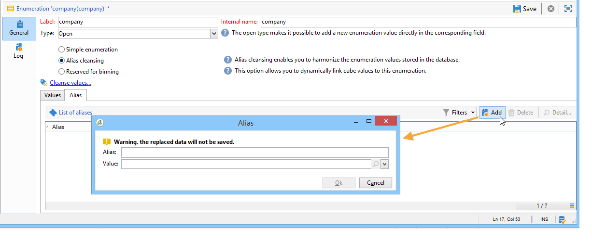

# Manage enumerations {#manage-enumerations}

An enumeration (also called an itemized list) is a predefined list of values you can use to fill in certain fields. Enumerations help standardize field values, making data entry more consistent and simplifying queries.

When available, the values appear in a drop-down list. You can either select a value directly or start typing—predictive input suggests matching values and completes them automatically.

Some console fields are configured with enumerations. If an enumeration is **open**, you can also add new values directly in the field.

## Access enumerations

The values used in these fields are managed centrally. You can add, edit, update or delete them from the Explorer tree, under **Administration** `>` **Platform** `>` **Enumerations**.

* The upper section offers a list of fields for which an enumeration has been defined.
* The lower section lists the available values.

When an enumeration is **[!UICONTROL Open]**, users can enter a new value directly in the corresponding field in the user interface. 

When an enumeration is  **[!UICONTROL Closed]**, new values can only be added from the **Enumeration** menu.

## Add a new value

To create a new enumeration value, click the **[!UICONTROL Add]** button.

Enter the label of the value.

## Alias cleansing {#alias-cleansing}

In the enumeration fields, you can enter values other than enumeration values. These can either be stored as they are or be cleansed.

>[!CAUTION]
>
>Data cleansing is a critical process that impacts the data in the database. Adobe Campaign carries out mass data updates, which may lead to some values being deleted. This operation is therefore reserved for expert users.

The entered value is then either:

* Added to the itemized list values: in this case the **[!UICONTROL Open]** option must be selected,
* or automatically replaced by its corresponding alias: in this case, this case must then be defined in the **[!UICONTROL Alias]** tab of the itemized list,
* or is stored in the list of aliases: an alias be assigned to it later on.

### Create an alias {#creating-an-alias}

The option **[!UICONTROL Alias cleansing]** makes it possible to use aliases for the selected itemized list. When this option is selected, the **[!UICONTROL Alias]** tab is displayed at the bottom of the window. 

To create an alias, follow these steps:

1. Browse to the enumeration to update ant click **[!UICONTROL Add]**.

    

1. Enter the alias you want to convert and the value to be applied and click **[!UICONTROL Ok]**.

1. Check parameters before confirming this operation.

>[!CAUTION]
>
>Once this step is confirmed, the previous values may not be recovered: they are replaced.

Thus, when a user enters the value **NEILSEN** in a "company" field (in the Adobe Campaign console or in a form), it is automatically replaced by the value **NIELSEN Ltd**. The value replacement is performed by the **Alias cleansing** workflow. Refer to [Run data cleansing](#running-data-cleansing).

### Convert values into aliases {#values-into-aliases}

You can convert existing values into aliases. To perform this, follow these steps:

1. Right-click in the list of values and choose **[!UICONTROL Convert values into aliases...]**. 

1. Choose the values to convert and click **[!UICONTROL Next]**.

1. Click **[!UICONTROL Start]** to run the conversion.

Once execution is complete, the alias is added to the list of aliases.

### Retrieve alias hits {#alias-hits}

When users enter values that are not included in the enumeration, they are stored in the **[!UICONTROL Alias]** tab.

The **Alias cleansing** technical workflow recovers these values every night to update the enumeration. Refer to [Run data cleansing](#running-data-cleansing)

If needed, the **[!UICONTROL Hits]** column can display the number of times this value was entered. However, calculating this value can be both time and memory consuming. For more on this, refer to [Calculate entry occurrences](#calculating-entry-occurrences).

### Run data cleansing {#run-data-cleansing}

Data cleansing is performed by the **[!UICONTROL Alias cleansing]** technical workflow. The configurations defined for enumerations are applied during execution. Refer to [Alias cleansing workflow](#alias-cleansing-workflow).

Cleansing can be triggered via the **[!UICONTROL Cleanse values...]** link.

The **[!UICONTROL Advanced parameters...]** link lets you set the date starting from which collected values are taken into account.

Click the **[!UICONTROL Start]** button to run data cleansing.

### Calculate entry occurrences {#entry-occurrences}

The **[!UICONTROL Alias]** sub-tab of an itemized list can display the number of occurrences of an alias among all the values entered. This information is an estimate and will be displayed in the **[!UICONTROL Hits]** column.

>[!CAUTION]
>
>Calculating alias entry occurrences can take a long time. That's why caution should be applied when using this function.

You can run hit calculation manually via the **[!UICONTROL Cleanse values...]** link. To do this, click the **[!UICONTROL Advanced parameters...]** link and select the desired option(s).

* **[!UICONTROL Update the number of alias hits]**: this lets you update hits which have already been calculated, based on the entered date.
* **[!UICONTROL Recalculate the number of alias hits from the start]**: lets you run calculation on the entire Adobe Campaign platform.

You can also create a dedicated workflow in order for the calculation to run automatically for a given period, once a week for example.

To do this, create a copy of the **[!UICONTROL Alias cleansing]** workflow, change the scheduler and use the following settings in the **[!UICONTROL Enumeration value cleansing]** activity:

* **-updateHits** to update the number of alias hits,
* **-updateHits:full** to recalculate all alias hits.

### Alias cleansing workflow {#alias-cleansing-workflow}

The **Alias cleansing** workflow runs enumerations value cleansing. By default, it is executed on a daily basis.

It is accessed via the **[!UICONTROL Administration > Production > Technical workflows]** node.

